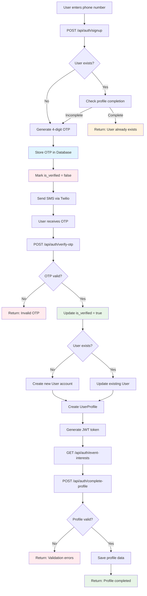
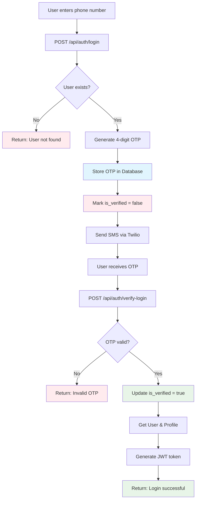
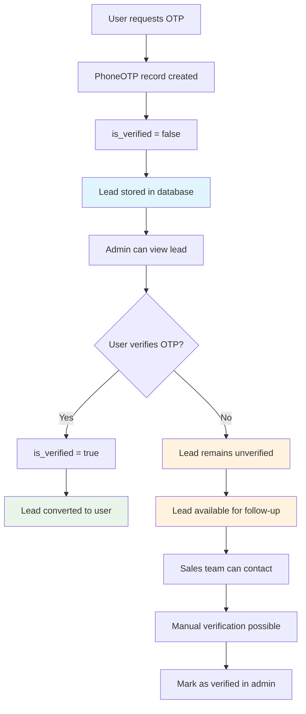
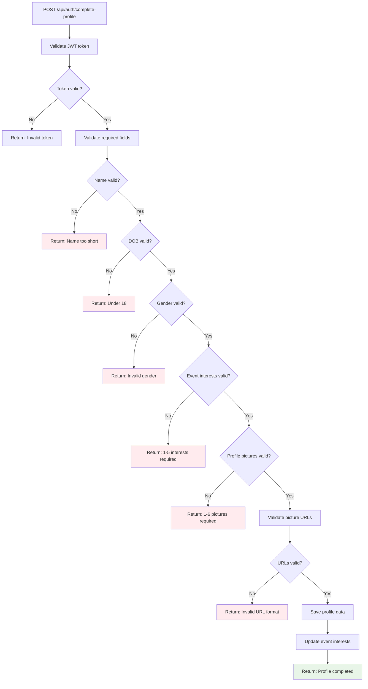
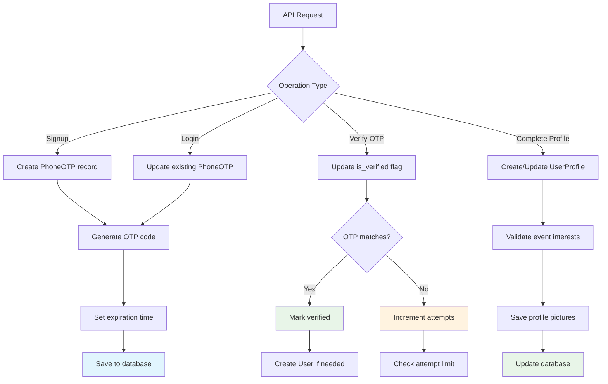

# 📱 Phone Authentication System Documentation

## 📋 Table of Contents
- [Quick Reference](#quick-reference)
- [Overview](#overview)
- [Authentication Flow](#authentication-flow)
- [API Endpoints](#api-endpoints)
- [Database Models](#database-models)
- [Configuration](#configuration)
- [Testing](#testing)
- [Troubleshooting](#troubleshooting)
- [Deployment](#deployment)

## 🚀 Quick Reference

### 🔗 Essential URLs
- **API Docs**: http://localhost:8000/api/docs/
- **Django Admin**: http://localhost:8000/django/admin/ (admin/admin123)
- **Root API**: http://localhost:8000/api/

### 📱 Authentication Flow

#### Signup
```bash
# 1. Send OTP
curl -X POST "http://localhost:8000/api/auth/signup" \
  -H "Content-Type: application/json" \
  -d '{"phone_number": "+916205829376"}'

# 2. Verify OTP (check logs for 4-digit code)
curl -X POST "http://localhost:8000/api/auth/verify-otp" \
  -H "Content-Type: application/json" \
  -d '{"phone_number": "+916205829376", "otp_code": "1097"}'

# 3. Complete Profile (use JWT from step 2)
curl -X POST "http://localhost:8000/api/auth/complete-profile" \
  -H "Content-Type: application/json" \
  -H "Authorization: Bearer YOUR_JWT_TOKEN" \
  -d '{
    "phone_number": "+916205829376",
    "name": "Gaurav Kumar",
    "email": "gaurav@loopinsocial.in",
    "birth_date": "1995-01-01",
    "gender": "male",
    "event_interests": [1, 2, 3],
    "profile_pictures": ["https://example.com/pic1.jpg", "https://example.com/pic2.jpg"]
  }'
```

#### Login
```bash
# 1. Send OTP
curl -X POST "http://localhost:8000/api/auth/login" \
  -H "Content-Type: application/json" \
  -d '{"phone_number": "+916205829376"}'

# 2. Verify OTP (4-digit code)
curl -X POST "http://localhost:8000/api/auth/verify-login" \
  -H "Content-Type: application/json" \
  -d '{"phone_number": "+916205829376", "otp_code": "1097"}'
```

#### Get Event Interests
```bash
# Get available event interests for profile completion
curl -X GET "http://localhost:8000/api/auth/event-interests"
```

### ⚙️ Configuration

#### Test Mode (Current)
```bash
TWILIO_TEST_MODE=true  # OTP visible in logs
```

#### Production Mode
```bash
TWILIO_TEST_MODE=false  # Real SMS delivery
```

### 🧪 Test Data
- **Phone**: +916205829376
- **Current OTP**: Check logs (in test mode)
- **Admin**: admin/admin123

### 🔧 Debug Commands

#### Check OTP (4-digit)
```bash
docker exec loopinbackend-web-1 python -c "
import os; os.environ.setdefault('DJANGO_SETTINGS_MODULE', 'loopin_backend.settings.dev')
import django; django.setup()
from users.models import PhoneOTP
otp = PhoneOTP.objects.filter(phone_number='+916205829376').first()
print(f'OTP: {otp.otp_code if otp else None}')
"
```

#### Check User
```bash
docker exec loopinbackend-web-1 python -c "
import os; os.environ.setdefault('DJANGO_SETTINGS_MODULE', 'loopin_backend.settings.dev')
import django; django.setup()
from django.contrib.auth.models import User
user = User.objects.filter(username='+916205829376').first()
print(f'User exists: {user is not None}')
"
```

---

## 🎯 Overview

The LoopinBackend implements a phone number-based authentication system using Twilio for SMS OTP verification. This system allows users to:

- Sign up using only their phone number
- Verify their identity via SMS OTP
- Complete their profile with additional information
- Login using phone number + OTP
- Manage user profiles separately for normal users and admin users

### Key Features
- ✅ Phone number-based authentication
- ✅ 4-digit SMS OTP verification via Twilio
- ✅ JWT token-based sessions
- ✅ Separate user management (Normal users vs Admin users)
- ✅ Comprehensive profile completion workflow
- ✅ Dynamic event interests management
- ✅ Profile picture validation (1-6 images)
- ✅ Age verification (18+ requirement)
- ✅ Gender selection validation
- ✅ India timezone support
- ✅ Test mode for development

## 🔄 Authentication Flow

### Complete Signup Flow with Lead Tracking


### Complete Login Flow with Lead Tracking


### Lead Management Flow


### Profile Completion Validation Flow


### Database Operations Flow


## 🌐 API Endpoints

### Base URL
```
http://localhost:8000
```

### Authentication Endpoints

#### 1. Signup with Phone
```http
POST /api/auth/signup
Content-Type: application/json

{
  "phone_number": "+916205829376"
}
```

**Response:**
```json
{
  "success": true,
  "message": "OTP sent successfully to your phone number",
  "data": {
    "phone_number": "+916205829376"
  },
  "token": null
}
```

#### 2. Verify Signup OTP
```http
POST /api/auth/verify-otp
Content-Type: application/json

{
  "phone_number": "+916205829376",
  "otp_code": "1097"
}
```

**Validation Rules:**
- OTP must be exactly 4 digits
- Only numeric characters allowed
- Case-sensitive matching

**Response:**
```json
{
  "success": true,
  "message": "OTP verified successfully. Please complete your profile.",
  "token": "eyJhbGciOiJIUzI1NiIsInR5cCI6IkpXVCJ9...",
  "data": {
    "user_id": 4,
    "phone_number": "+916205829376",
    "needs_profile_completion": true
  }
}
```

#### 3. Complete User Profile
```http
POST /api/auth/complete-profile
Content-Type: application/json
Authorization: Bearer <JWT_TOKEN>

{
  "phone_number": "+916205829376",
  "name": "Gaurav Kumar",
  "email": "gaurav@loopinsocial.in",
  "birth_date": "1995-01-01",
  "gender": "male",
  "event_interests": [1, 2, 3],
  "profile_pictures": [
    "https://example.com/pic1.jpg",
    "https://example.com/pic2.jpg"
  ],
  "bio": "Backend Developer",
  "location": "Delhi, India"
}
```

**Validation Rules:**
- **Name**: Minimum 3 characters, letters/spaces/hyphens/apostrophes only
- **Birth Date**: User must be 18+ years old
- **Gender**: Must be "male", "female", or "other"
- **Event Interests**: Select 1-5 interests (IDs from event-interests endpoint)
- **Profile Pictures**: 1-6 valid image URLs required
- **Email**: Valid email format

**Response:**
```json
{
  "success": true,
  "message": "Profile completed successfully",
  "data": {
    "user_id": 4,
    "profile_id": 2,
    "name": "Gaurav Kumar",
    "email": "gaurav@loopinsocial.in",
    "phone_number": "+916205829376"
  }
}
```

#### 4. Login with Phone
```http
POST /api/auth/login
Content-Type: application/json

{
  "phone_number": "+916205829376"
}
```

**Response:**
```json
{
  "success": true,
  "message": "OTP sent successfully to your phone number",
  "data": {
    "phone_number": "+916205829376"
  }
}
```

#### 5. Verify Login OTP
```http
POST /api/auth/verify-login
Content-Type: application/json

{
  "phone_number": "+916205829376",
  "otp_code": "1097"
}
```

**Validation Rules:**
- OTP must be exactly 4 digits
- Only numeric characters allowed

**Response:**
```json
{
  "success": true,
  "message": "Login successful",
  "token": "eyJhbGciOiJIUzI1NiIsInR5cCI6IkpXVCJ9...",
  "data": {
    "user_id": 4,
    "phone_number": "+916205829376",
    "name": "Gaurav Kumar",
    "email": "gaurav@loopinsocial.in",
    "is_verified": true
  }
}
```

#### 6. Get Event Interests
```http
GET /api/auth/event-interests
```

**Response:**
```json
{
  "success": true,
  "message": "Event interests retrieved successfully",
  "data": [
    {
      "id": 1,
      "name": "Music & Concerts",
      "description": "Live music, concerts, and musical events"
    },
    {
      "id": 2,
      "name": "Sports & Fitness",
      "description": "Sports events, fitness activities, and competitions"
    }
  ]
}
```

#### 7. Get User Profile
```http
GET /api/auth/profile
Authorization: Bearer <JWT_TOKEN>
```

**Response:**
```json
{
  "id": 2,
  "name": "Gaurav Kumar",
  "email": "gaurav@loopinsocial.in",
  "phone_number": "+916205829376",
  "bio": "Backend Developer",
  "location": "Delhi, India",
  "birth_date": "1995-01-01",
  "avatar": "https://example.com/avatar.jpg",
  "is_verified": true,
  "is_active": true,
  "created_at": "2025-10-03T10:15:23.435393+00:00",
  "updated_at": "2025-10-03T10:17:32.077460+00:00"
}
```

#### 8. Logout
```http
POST /api/auth/logout
```

**Response:**
```json
{
  "success": true,
  "message": "Logged out successfully"
}
```

## 🗄️ Database Models

### UserProfile Model
```python
class UserProfile(models.Model):
    """Extended user profile model for normal users"""
    user = models.OneToOneField(User, on_delete=models.CASCADE, related_name='profile')
    
    # Basic profile information
    name = models.CharField(max_length=100, blank=True, help_text="Full name of the user")
    email = models.EmailField(blank=True, help_text="Primary email address")
    phone_number = models.CharField(max_length=15, blank=True, help_text="Contact phone number")
    
    # Additional profile details
    bio = models.TextField(max_length=500, blank=True, help_text="User biography")
    location = models.CharField(max_length=100, blank=True, help_text="User location")
    birth_date = models.DateField(null=True, blank=True, help_text="Date of birth")
    avatar = models.URLField(blank=True, help_text="Profile picture URL")
    
    # New required fields
    gender = models.CharField(
        max_length=10, 
        choices=[('male', 'Male'), ('female', 'Female'), ('other', 'Other')],
        blank=True, 
        help_text="User gender"
    )
    event_interests = models.ManyToManyField(
        'EventInterest', 
        blank=True, 
        help_text="User's event interests (1-5 selections required)"
    )
    profile_pictures = models.JSONField(
        default=list, 
        blank=True, 
        help_text="List of profile picture URLs (1-6 pictures required)"
    )
    
    # Timestamps
    created_at = models.DateTimeField(auto_now_add=True)
    updated_at = models.DateTimeField(auto_now=True)
    
    # Profile status
    is_verified = models.BooleanField(default=False, help_text="Whether the user profile is verified")
    is_active = models.BooleanField(default=True, help_text="Whether the user profile is active")
```

### PhoneOTP Model
```python
class PhoneOTP(models.Model):
    """Model for storing phone number OTP verification"""
    phone_number = models.CharField(max_length=15, unique=True)
    otp_code = models.CharField(max_length=4)  # Changed to 4 digits
    is_verified = models.BooleanField(default=False)
    created_at = models.DateTimeField(auto_now_add=True)
    expires_at = models.DateTimeField()
    attempts = models.IntegerField(default=0)
    
    def generate_otp(self):
        """Generate a 4-digit OTP"""
        self.otp_code = ''.join(random.choices(string.digits, k=4))
        self.expires_at = timezone.now() + timedelta(minutes=10)
        self.attempts = 0
        self.is_verified = False
```

### EventInterest Model
```python
class EventInterest(models.Model):
    """Model for event interests/categories"""
    name = models.CharField(max_length=100, unique=True, help_text="Name of the event interest")
    description = models.TextField(blank=True, help_text="Description of the event interest")
    is_active = models.BooleanField(default=True, help_text="Whether this interest is active")
    created_at = models.DateTimeField(auto_now_add=True)
    updated_at = models.DateTimeField(auto_now=True)
    
    def __str__(self):
        return self.name
    
    class Meta:
        verbose_name = "Event Interest"
        verbose_name_plural = "Event Interests"
        ordering = ['name']
```

### User Separation
- **Normal Users**: Stored in `UserProfile` model (non-staff, non-superusers)
- **Admin Users**: Stored in Django's built-in `User` model (staff/superusers)

## ⚙️ Configuration

### Environment Variables (.env)
```bash
# Django Settings
SECRET_KEY="django-insecure-rq1k3nfrru@\$ds6bwf\$t&3hk*s7bg5ef3it&o@s*6_jbbbfp(j"
DEBUG=True
DJANGO_SETTINGS_MODULE=loopin_backend.settings.dev

# Database Configuration
DB_NAME=loopin_user
DB_USER=postgres
DB_PASSWORD=postgres123
DATABASE_URL="postgresql://postgres:postgres123@db:5432/loopin_user"

# JWT Settings
JWT_SECRET_KEY="django-insecure-rq1k3nfrru@\$ds6bwf\$t&3hk*s7bg5ef3it&o@s*6_jbbbfp(j"
JWT_ALGORITHM=HS256
JWT_ACCESS_TOKEN_EXPIRE_MINUTES=30

# CORS Settings
ALLOWED_HOSTS=localhost,127.0.0.1,0.0.0.0
CORS_ALLOWED_ORIGINS=http://localhost:3000,http://127.0.0.1:3000

# Twilio Configuration
TWILIO_ACCOUNT_SID=your-twilio-account-sid
TWILIO_AUTH_TOKEN=your-twilio-auth-token
TWILIO_VERIFY_SID=your-twilio-verify-sid
TWILIO_VERIFY_SECRET=your-twilio-verify-secret
TWILIO_PHONE_NUMBER=+15005550006

# Twilio Test Mode (set to false for production)
TWILIO_TEST_MODE=true
```

### Django Settings
- **Timezone**: Asia/Kolkata (India)
- **Database**: PostgreSQL
- **Static Files**: Served via FastAPI
- **Media Files**: Served via FastAPI

## 🧪 Testing

### Test Mode vs Production Mode

#### Test Mode (Development)
```bash
TWILIO_TEST_MODE=true
```
- OTP codes are generated but not sent via SMS
- OTP codes are visible in application logs
- Perfect for development and testing

#### Production Mode
```bash
TWILIO_TEST_MODE=false
```
- OTP codes are sent via actual SMS
- Requires valid Twilio credentials
- Requires verified phone numbers (for trial accounts)

### Testing Commands

#### Complete Signup Flow
```bash
# Step 1: Send OTP
curl -X POST "http://localhost:8000/api/auth/signup" \
  -H "Content-Type: application/json" \
  -d '{"phone_number": "+916205829376"}'

# Step 2: Verify OTP (check logs for 4-digit OTP code)
curl -X POST "http://localhost:8000/api/auth/verify-otp" \
  -H "Content-Type: application/json" \
  -d '{"phone_number": "+916205829376", "otp_code": "1097"}'

# Step 3: Get Event Interests (optional, for frontend)
curl -X GET "http://localhost:8000/api/auth/event-interests"

# Step 4: Complete Profile (use JWT token from step 2)
curl -X POST "http://localhost:8000/api/auth/complete-profile" \
  -H "Content-Type: application/json" \
  -H "Authorization: Bearer YOUR_JWT_TOKEN" \
  -d '{
    "phone_number": "+916205829376",
    "name": "Gaurav Kumar",
    "email": "gaurav@loopinsocial.in",
    "birth_date": "1995-01-01",
    "gender": "male",
    "event_interests": [1, 2, 3],
    "profile_pictures": ["https://example.com/pic1.jpg", "https://example.com/pic2.jpg"],
    "bio": "Backend Developer",
    "location": "Delhi, India"
  }'
```

#### Complete Login Flow
```bash
# Step 1: Send OTP
curl -X POST "http://localhost:8000/api/auth/login" \
  -H "Content-Type: application/json" \
  -d '{"phone_number": "+916205829376"}'

# Step 2: Verify OTP (4-digit code)
curl -X POST "http://localhost:8000/api/auth/verify-login" \
  -H "Content-Type: application/json" \
  -d '{"phone_number": "+916205829376", "otp_code": "1097"}'
```

#### Validation Testing
```bash
# Test 3-digit OTP (should fail)
curl -X POST "http://localhost:8000/api/auth/verify-otp" \
  -H "Content-Type: application/json" \
  -d '{"phone_number": "+916205829376", "otp_code": "123"}'

# Test 5-digit OTP (should fail)
curl -X POST "http://localhost:8000/api/auth/verify-otp" \
  -H "Content-Type: application/json" \
  -d '{"phone_number": "+916205829376", "otp_code": "12345"}'

# Test invalid profile data (should fail)
curl -X POST "http://localhost:8000/api/auth/complete-profile" \
  -H "Authorization: Bearer YOUR_JWT_TOKEN" \
  -d '{
    "name": "Ab",
    "birth_date": "2010-01-01",
    "gender": "invalid",
    "event_interests": [],
    "profile_pictures": []
  }'
```

### Test User Credentials
- **Phone Number**: +916205829376
- **Current OTP**: Check application logs (4-digit code in test mode)
- **Event Interests**: 10 categories available (Music, Sports, Food, etc.)
- **Sample Profile Data**:
  - Name: Gaurav Kumar (3+ characters)
  - Birth Date: 1995-01-01 (18+ years old)
  - Gender: male/female/other
  - Event Interests: [1, 2, 3] (1-5 selections)
  - Profile Pictures: ["https://example.com/pic1.jpg"] (1-6 URLs)

## 🛠️ Troubleshooting

### Common Issues

#### 1. SMS Not Delivered
**Problem**: OTP sent successfully but not received on phone

**Solutions**:
- Check if using **test credentials** instead of **live credentials**
- Verify phone number in Twilio console (for trial accounts)
- Check Twilio account status and restrictions
- Ensure phone number format is correct (+country_code_number)

#### 2. Test vs Live Credentials
**Problem**: "Resource not accessible with Test Account Credentials"

**Solution**: Replace test credentials with live credentials:
```bash
# Get live credentials from Twilio Console
TWILIO_ACCOUNT_SID=your_live_account_sid
TWILIO_AUTH_TOKEN=your_live_auth_token
```

#### 3. Trial Account Restrictions
**Problem**: SMS only works for verified numbers

**Solutions**:
- Verify your phone number in Twilio Console
- Upgrade to paid Twilio account
- Use test mode for development

#### 4. JWT Token Issues
**Problem**: Token expired or invalid

**Solutions**:
- Check token expiration (default: 30 days)
- Ensure proper Authorization header format: `Bearer <token>`
- Generate new token via login flow

### Debug Commands

#### Check OTP Status
```bash
docker exec loopinbackend-web-1 python manage.py shell -c "
from users.models import PhoneOTP
otp = PhoneOTP.objects.filter(phone_number='+916205829376').first()
print(f'OTP: {otp.otp_code if otp else None}')
print(f'Expires: {otp.expires_at if otp else None}')
print(f'Verified: {otp.is_verified if otp else None}')
"
```

#### Check User Status
```bash
docker exec loopinbackend-web-1 python manage.py shell -c "
from django.contrib.auth.models import User
from users.models import UserProfile
user = User.objects.filter(username='+916205829376').first()
if user:
    profile = UserProfile.objects.filter(user=user).first()
    print(f'User: {user.username}')
    print(f'Profile: {profile.name if profile else None}')
    print(f'Verified: {profile.is_verified if profile else None}')
"
```

## 🚀 Deployment

### Production Checklist

#### 1. Twilio Configuration
- [ ] Use live Twilio credentials (not test credentials)
- [ ] Set `TWILIO_TEST_MODE=false`
- [ ] Configure valid Twilio phone number
- [ ] Verify receiving phone numbers (for trial accounts)

#### 2. Security Settings
- [ ] Change default SECRET_KEY
- [ ] Set `DEBUG=False`
- [ ] Configure proper ALLOWED_HOSTS
- [ ] Set up HTTPS/SSL certificates
- [ ] Configure CORS for production domains

#### 3. Database
- [ ] Use production PostgreSQL database
- [ ] Run migrations: `python manage.py migrate`
- [ ] Create superuser: `python manage.py createsuperuser`

#### 4. Environment Variables
```bash
# Production .env
DEBUG=False
SECRET_KEY=your_production_secret_key
DATABASE_URL=your_production_database_url
TWILIO_TEST_MODE=false
TWILIO_ACCOUNT_SID=your_live_account_sid
TWILIO_AUTH_TOKEN=your_live_auth_token
```

### Docker Deployment
```bash
# Build and run
docker-compose down
docker-compose build --no-cache
docker-compose up -d

# Check status
docker-compose ps
docker-compose logs web
```

## 📚 Additional Resources

### Useful URLs
- **API Documentation**: http://localhost:8000/api/docs/
- **Django Admin**: http://localhost:8000/django/admin/
- **Admin Credentials**: admin / admin123

### File Structure
```
loopin_backend/
├── users/
│   ├── models.py          # UserProfile, PhoneOTP, EventInterest models
│   ├── auth_router.py     # Phone authentication endpoints (FastAPI)
│   ├── services.py        # Twilio SMS service
│   ├── schemas.py         # Pydantic request/response models with validation
│   ├── admin.py           # Django admin configuration
│   └── migrations/        # Database migrations
├── api/
│   ├── main.py            # FastAPI main application
│   └── routers/           # Additional FastAPI routers
├── loopin_backend/
│   ├── settings/          # Django settings
│   └── asgi.py            # ASGI configuration (Django + FastAPI)
└── PHONE_AUTHENTICATION.md # This documentation
```

### Technology Stack
- **FastAPI**: REST API endpoints with automatic documentation
- **Django**: Database models, admin interface, ORM
- **PostgreSQL**: Database (Supabase cloud)
- **Twilio**: SMS OTP delivery
- **JWT**: Authentication tokens
- **Pydantic**: Request/response validation
- **Docker**: Containerization
- **ASGI**: Async web server (Gunicorn + Uvicorn)

### Support
For issues or questions:
1. Check application logs: `docker-compose logs web`
2. Verify Twilio account status
3. Test with different phone numbers
4. Use test mode for development

---

**Last Updated**: October 6, 2025  
**Version**: 2.0.0  
**Author**: LoopinBackend Development Team

### Recent Updates (v2.0.0)
- ✅ **4-digit OTP**: Changed from 6-digit to exactly 4 digits
- ✅ **Enhanced Validation**: Comprehensive profile validation with user-friendly errors
- ✅ **Event Interests**: Dynamic interest management with 10 pre-loaded categories
- ✅ **Profile Pictures**: Support for 1-6 profile images with URL validation
- ✅ **Age Verification**: 18+ requirement with automatic age calculation
- ✅ **Gender Selection**: Required field with validation
- ✅ **Improved Error Handling**: Clear, actionable error messages
- ✅ **New Endpoint**: GET /api/auth/event-interests for dynamic data
- ✅ **Database Migration**: Updated models with new fields
- ✅ **Admin Interface**: Enhanced Django admin for event interests management
