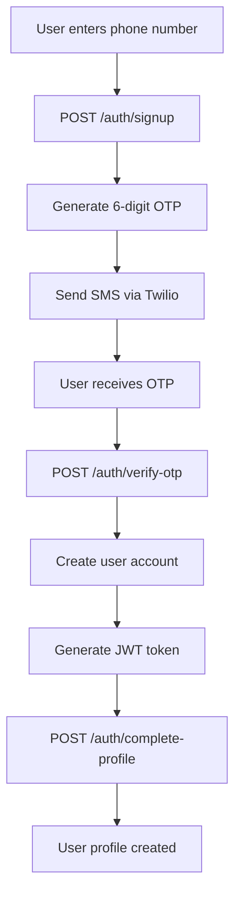
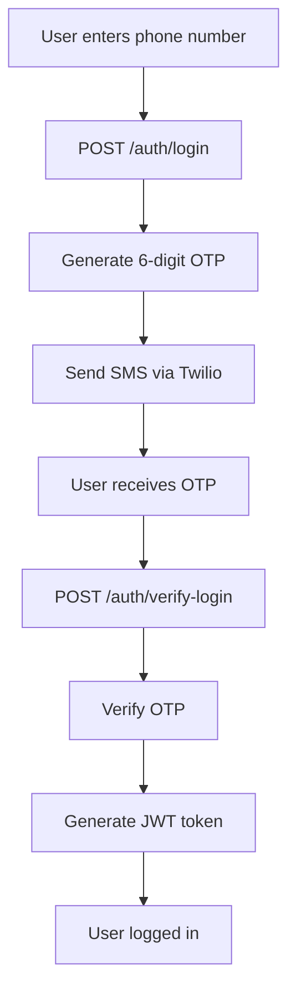

# 📱 Phone Authentication System Documentation

## 📋 Table of Contents
- [Quick Reference](#quick-reference)
- [Overview](#overview)
- [Authentication Flow](#authentication-flow)
- [API Endpoints](#api-endpoints)
- [Database Models](#database-models)
- [Configuration](#configuration)
- [Testing](#testing)
- [Troubleshooting](#troubleshooting)
- [Deployment](#deployment)

## 🚀 Quick Reference

### 🔗 Essential URLs
- **API Docs**: http://localhost:8000/api/docs/
- **Django Admin**: http://localhost:8000/django/admin/ (admin/admin123)
- **Root API**: http://localhost:8000/api/

### 📱 Authentication Flow

#### Signup
```bash
# 1. Send OTP
curl -X POST "http://localhost:8000/auth/signup" \
  -H "Content-Type: application/json" \
  -d '{"phone_number": "+916205829376"}'

# 2. Verify OTP (check logs for code)
curl -X POST "http://localhost:8000/auth/verify-otp" \
  -H "Content-Type: application/json" \
  -d '{"phone_number": "+916205829376", "otp_code": "123456"}'

# 3. Complete Profile (use JWT from step 2)
curl -X POST "http://localhost:8000/auth/complete-profile" \
  -H "Content-Type: application/json" \
  -H "Authorization: Bearer YOUR_JWT_TOKEN" \
  -d '{"phone_number": "+916205829376", "name": "Gaurav Kumar", "email": "gaurav@loopinsocial.in"}'
```

#### Login
```bash
# 1. Send OTP
curl -X POST "http://localhost:8000/auth/login" \
  -H "Content-Type: application/json" \
  -d '{"phone_number": "+916205829376"}'

# 2. Verify OTP
curl -X POST "http://localhost:8000/auth/verify-login" \
  -H "Content-Type: application/json" \
  -d '{"phone_number": "+916205829376", "otp_code": "123456"}'
```

### ⚙️ Configuration

#### Test Mode (Current)
```bash
TWILIO_TEST_MODE=true  # OTP visible in logs
```

#### Production Mode
```bash
TWILIO_TEST_MODE=false  # Real SMS delivery
```

### 🧪 Test Data
- **Phone**: +916205829376
- **Current OTP**: Check logs (in test mode)
- **Admin**: admin/admin123

### 🔧 Debug Commands

#### Check OTP
```bash
docker exec loopinbackend-web-1 python -c "
import os; os.environ.setdefault('DJANGO_SETTINGS_MODULE', 'loopin_backend.settings.dev')
import django; django.setup()
from users.models import PhoneOTP
otp = PhoneOTP.objects.filter(phone_number='+916205829376').first()
print(f'OTP: {otp.otp_code if otp else None}')
"
```

#### Check User
```bash
docker exec loopinbackend-web-1 python -c "
import os; os.environ.setdefault('DJANGO_SETTINGS_MODULE', 'loopin_backend.settings.dev')
import django; django.setup()
from django.contrib.auth.models import User
user = User.objects.filter(username='+916205829376').first()
print(f'User exists: {user is not None}')
"
```

---

## 🎯 Overview

The LoopinBackend implements a phone number-based authentication system using Twilio for SMS OTP verification. This system allows users to:

- Sign up using only their phone number
- Verify their identity via SMS OTP
- Complete their profile with additional information
- Login using phone number + OTP
- Manage user profiles separately for normal users and admin users

### Key Features
- ✅ Phone number-based authentication
- ✅ SMS OTP verification via Twilio
- ✅ JWT token-based sessions
- ✅ Separate user management (Normal users vs Admin users)
- ✅ Profile completion workflow
- ✅ India timezone support
- ✅ Test mode for development

## 🔄 Authentication Flow

### Signup Flow


### Login Flow


## 🌐 API Endpoints

### Base URL
```
http://localhost:8000
```

### Authentication Endpoints

#### 1. Signup with Phone
```http
POST /auth/signup
Content-Type: application/json

{
  "phone_number": "+916205829376"
}
```

**Response:**
```json
{
  "success": true,
  "message": "OTP sent successfully to your phone number",
  "data": {
    "phone_number": "+916205829376"
  },
  "token": null
}
```

#### 2. Verify Signup OTP
```http
POST /auth/verify-otp
Content-Type: application/json

{
  "phone_number": "+916205829376",
  "otp_code": "123456"
}
```

**Response:**
```json
{
  "success": true,
  "message": "OTP verified successfully. Please complete your profile.",
  "token": "eyJhbGciOiJIUzI1NiIsInR5cCI6IkpXVCJ9...",
  "data": {
    "user_id": 4,
    "phone_number": "+916205829376",
    "needs_profile_completion": true
  }
}
```

#### 3. Complete User Profile
```http
POST /auth/complete-profile
Content-Type: application/json
Authorization: Bearer <JWT_TOKEN>

{
  "phone_number": "+916205829376",
  "name": "Gaurav Kumar",
  "email": "gaurav@loopinsocial.in",
  "bio": "Backend Developer",
  "location": "Delhi, India",
  "birth_date": "1995-01-01",
  "avatar": "https://example.com/avatar.jpg"
}
```

**Response:**
```json
{
  "success": true,
  "message": "Profile completed successfully",
  "data": {
    "user_id": 4,
    "profile_id": 2,
    "name": "Gaurav Kumar",
    "email": "gaurav@loopinsocial.in",
    "phone_number": "+916205829376"
  }
}
```

#### 4. Login with Phone
```http
POST /auth/login
Content-Type: application/json

{
  "phone_number": "+916205829376"
}
```

**Response:**
```json
{
  "success": true,
  "message": "OTP sent successfully to your phone number",
  "data": {
    "phone_number": "+916205829376"
  }
}
```

#### 5. Verify Login OTP
```http
POST /auth/verify-login
Content-Type: application/json

{
  "phone_number": "+916205829376",
  "otp_code": "123456"
}
```

**Response:**
```json
{
  "success": true,
  "message": "Login successful",
  "token": "eyJhbGciOiJIUzI1NiIsInR5cCI6IkpXVCJ9...",
  "data": {
    "user_id": 4,
    "phone_number": "+916205829376",
    "name": "Gaurav Kumar",
    "email": "gaurav@loopinsocial.in",
    "is_verified": true
  }
}
```

#### 6. Get User Profile
```http
GET /auth/profile
Authorization: Bearer <JWT_TOKEN>
```

**Response:**
```json
{
  "id": 2,
  "name": "Gaurav Kumar",
  "email": "gaurav@loopinsocial.in",
  "phone_number": "+916205829376",
  "bio": "Backend Developer",
  "location": "Delhi, India",
  "birth_date": "1995-01-01",
  "avatar": "https://example.com/avatar.jpg",
  "is_verified": true,
  "is_active": true,
  "created_at": "2025-10-03T10:15:23.435393+00:00",
  "updated_at": "2025-10-03T10:17:32.077460+00:00"
}
```

#### 7. Logout
```http
POST /auth/logout
```

**Response:**
```json
{
  "success": true,
  "message": "Logged out successfully"
}
```

## 🗄️ Database Models

### UserProfile Model
```python
class UserProfile(models.Model):
    """Extended user profile model for normal users"""
    user = models.OneToOneField(User, on_delete=models.CASCADE, related_name='profile')
    
    # Basic profile information
    name = models.CharField(max_length=100, blank=True)
    email = models.EmailField(blank=True)
    phone_number = models.CharField(max_length=15, blank=True)
    
    # Additional profile details
    bio = models.TextField(max_length=500, blank=True)
    location = models.CharField(max_length=100, blank=True)
    birth_date = models.DateField(null=True, blank=True)
    avatar = models.URLField(blank=True)
    
    # Timestamps
    created_at = models.DateTimeField(auto_now_add=True)
    updated_at = models.DateTimeField(auto_now=True)
    
    # Profile status
    is_verified = models.BooleanField(default=False)
    is_active = models.BooleanField(default=True)
```

### PhoneOTP Model
```python
class PhoneOTP(models.Model):
    """Model for storing phone number OTP verification"""
    phone_number = models.CharField(max_length=15, unique=True)
    otp_code = models.CharField(max_length=6)
    is_verified = models.BooleanField(default=False)
    created_at = models.DateTimeField(auto_now_add=True)
    expires_at = models.DateTimeField()
    attempts = models.IntegerField(default=0)
```

### User Separation
- **Normal Users**: Stored in `UserProfile` model (non-staff, non-superusers)
- **Admin Users**: Stored in Django's built-in `User` model (staff/superusers)

## ⚙️ Configuration

### Environment Variables (.env)
```bash
# Django Settings
SECRET_KEY="django-insecure-rq1k3nfrru@\$ds6bwf\$t&3hk*s7bg5ef3it&o@s*6_jbbbfp(j"
DEBUG=True
DJANGO_SETTINGS_MODULE=loopin_backend.settings.dev

# Database Configuration
DB_NAME=loopin_user
DB_USER=postgres
DB_PASSWORD=postgres123
DATABASE_URL="postgresql://postgres:postgres123@db:5432/loopin_user"

# JWT Settings
JWT_SECRET_KEY="django-insecure-rq1k3nfrru@\$ds6bwf\$t&3hk*s7bg5ef3it&o@s*6_jbbbfp(j"
JWT_ALGORITHM=HS256
JWT_ACCESS_TOKEN_EXPIRE_MINUTES=30

# CORS Settings
ALLOWED_HOSTS=localhost,127.0.0.1,0.0.0.0
CORS_ALLOWED_ORIGINS=http://localhost:3000,http://127.0.0.1:3000

# Twilio Configuration
TWILIO_ACCOUNT_SID=your-twilio-account-sid
TWILIO_AUTH_TOKEN=your-twilio-auth-token
TWILIO_VERIFY_SID=your-twilio-verify-sid
TWILIO_VERIFY_SECRET=your-twilio-verify-secret
TWILIO_PHONE_NUMBER=+15005550006

# Twilio Test Mode (set to false for production)
TWILIO_TEST_MODE=true
```

### Django Settings
- **Timezone**: Asia/Kolkata (India)
- **Database**: PostgreSQL
- **Static Files**: Served via FastAPI
- **Media Files**: Served via FastAPI

## 🧪 Testing

### Test Mode vs Production Mode

#### Test Mode (Development)
```bash
TWILIO_TEST_MODE=true
```
- OTP codes are generated but not sent via SMS
- OTP codes are visible in application logs
- Perfect for development and testing

#### Production Mode
```bash
TWILIO_TEST_MODE=false
```
- OTP codes are sent via actual SMS
- Requires valid Twilio credentials
- Requires verified phone numbers (for trial accounts)

### Testing Commands

#### Complete Signup Flow
```bash
# Step 1: Send OTP
curl -X POST "http://localhost:8000/auth/signup" \
  -H "Content-Type: application/json" \
  -d '{"phone_number": "+916205829376"}'

# Step 2: Verify OTP (check logs for OTP code)
curl -X POST "http://localhost:8000/auth/verify-otp" \
  -H "Content-Type: application/json" \
  -d '{"phone_number": "+916205829376", "otp_code": "123456"}'

# Step 3: Complete Profile (use JWT token from step 2)
curl -X POST "http://localhost:8000/auth/complete-profile" \
  -H "Content-Type: application/json" \
  -H "Authorization: Bearer YOUR_JWT_TOKEN" \
  -d '{
    "phone_number": "+916205829376",
    "name": "Gaurav Kumar",
    "email": "gaurav@loopinsocial.in",
    "bio": "Backend Developer",
    "location": "Delhi, India",
    "birth_date": "1995-01-01"
  }'
```

#### Complete Login Flow
```bash
# Step 1: Send OTP
curl -X POST "http://localhost:8000/auth/login" \
  -H "Content-Type: application/json" \
  -d '{"phone_number": "+916205829376"}'

# Step 2: Verify OTP
curl -X POST "http://localhost:8000/auth/verify-login" \
  -H "Content-Type: application/json" \
  -d '{"phone_number": "+916205829376", "otp_code": "123456"}'
```

### Test User Credentials
- **Phone Number**: +916205829376
- **Current OTP**: Check application logs (in test mode)

## 🛠️ Troubleshooting

### Common Issues

#### 1. SMS Not Delivered
**Problem**: OTP sent successfully but not received on phone

**Solutions**:
- Check if using **test credentials** instead of **live credentials**
- Verify phone number in Twilio console (for trial accounts)
- Check Twilio account status and restrictions
- Ensure phone number format is correct (+country_code_number)

#### 2. Test vs Live Credentials
**Problem**: "Resource not accessible with Test Account Credentials"

**Solution**: Replace test credentials with live credentials:
```bash
# Get live credentials from Twilio Console
TWILIO_ACCOUNT_SID=your_live_account_sid
TWILIO_AUTH_TOKEN=your_live_auth_token
```

#### 3. Trial Account Restrictions
**Problem**: SMS only works for verified numbers

**Solutions**:
- Verify your phone number in Twilio Console
- Upgrade to paid Twilio account
- Use test mode for development

#### 4. JWT Token Issues
**Problem**: Token expired or invalid

**Solutions**:
- Check token expiration (default: 30 days)
- Ensure proper Authorization header format: `Bearer <token>`
- Generate new token via login flow

### Debug Commands

#### Check OTP Status
```bash
docker exec loopinbackend-web-1 python manage.py shell -c "
from users.models import PhoneOTP
otp = PhoneOTP.objects.filter(phone_number='+916205829376').first()
print(f'OTP: {otp.otp_code if otp else None}')
print(f'Expires: {otp.expires_at if otp else None}')
print(f'Verified: {otp.is_verified if otp else None}')
"
```

#### Check User Status
```bash
docker exec loopinbackend-web-1 python manage.py shell -c "
from django.contrib.auth.models import User
from users.models import UserProfile
user = User.objects.filter(username='+916205829376').first()
if user:
    profile = UserProfile.objects.filter(user=user).first()
    print(f'User: {user.username}')
    print(f'Profile: {profile.name if profile else None}')
    print(f'Verified: {profile.is_verified if profile else None}')
"
```

## 🚀 Deployment

### Production Checklist

#### 1. Twilio Configuration
- [ ] Use live Twilio credentials (not test credentials)
- [ ] Set `TWILIO_TEST_MODE=false`
- [ ] Configure valid Twilio phone number
- [ ] Verify receiving phone numbers (for trial accounts)

#### 2. Security Settings
- [ ] Change default SECRET_KEY
- [ ] Set `DEBUG=False`
- [ ] Configure proper ALLOWED_HOSTS
- [ ] Set up HTTPS/SSL certificates
- [ ] Configure CORS for production domains

#### 3. Database
- [ ] Use production PostgreSQL database
- [ ] Run migrations: `python manage.py migrate`
- [ ] Create superuser: `python manage.py createsuperuser`

#### 4. Environment Variables
```bash
# Production .env
DEBUG=False
SECRET_KEY=your_production_secret_key
DATABASE_URL=your_production_database_url
TWILIO_TEST_MODE=false
TWILIO_ACCOUNT_SID=your_live_account_sid
TWILIO_AUTH_TOKEN=your_live_auth_token
```

### Docker Deployment
```bash
# Build and run
docker-compose down
docker-compose build --no-cache
docker-compose up -d

# Check status
docker-compose ps
docker-compose logs web
```

## 📚 Additional Resources

### Useful URLs
- **API Documentation**: http://localhost:8000/api/docs/
- **Django Admin**: http://localhost:8000/django/admin/
- **Admin Credentials**: admin / admin123

### File Structure
```
loopin_backend/
├── users/
│   ├── models.py          # UserProfile, PhoneOTP models
│   ├── auth_router.py     # Phone authentication endpoints
│   ├── services.py        # Twilio SMS service
│   ├── schemas.py         # Pydantic request/response models
│   └── admin.py           # Django admin configuration
├── api/
│   └── main.py            # FastAPI main application
├── loopin_backend/
│   ├── settings/          # Django settings
│   └── asgi.py            # ASGI configuration
└── PHONE_AUTHENTICATION.md # This documentation
```

### Support
For issues or questions:
1. Check application logs: `docker-compose logs web`
2. Verify Twilio account status
3. Test with different phone numbers
4. Use test mode for development

---

**Last Updated**: October 3, 2025  
**Version**: 1.0.0  
**Author**: LoopinBackend Development Team
