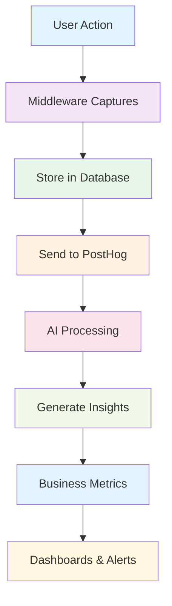

# 📊 Analytics Intelligence System Documentation

## Table of Contents
1. [📚 Documentation Guide](#-documentation-guide)
2. [What is Analytics?](#what-is-analytics)
3. [Why Do We Need Analytics?](#why-do-we-need-analytics)
4. [How Our Analytics System Works](#how-our-analytics-system-works)
5. [What Data We Collect](#what-data-we-collect)
6. [AI-Powered Insights](#ai-powered-insights)
7. [Business Metrics We Track](#business-metrics-we-track)
8. [Privacy & Security](#privacy--security)
9. [For Developers](#for-developers)
10. [For Business Users](#for-business-users)
11. [API Documentation](#api-documentation)
12. [Troubleshooting](#troubleshooting)
13. [Future Enhancements](#future-enhancements)
14. [📚 Additional Resources](#-additional-resources)

---

## 📚 Documentation Guide

### **📖 Choose Your Documentation Path**

This analytics system has comprehensive documentation designed for different audiences and use cases:

#### **🎯 For First-Time Users**
- **Start Here**: [INDEX.md](INDEX.md) - Complete overview and navigation guide
- **Then Read**: This README.md for comprehensive understanding

#### **👥 For Business Users & Stakeholders**
- **Main Guide**: [README.md](README.md) - This file (business benefits, metrics, insights)
- **Quick Reference**: [QUICK_REFERENCE.md](QUICK_REFERENCE.md) - Daily operations and monitoring

#### **👨‍💻 For Developers & Technical Team**
- **Technical Deep Dive**: [TECHNICAL_DOCS.md](TECHNICAL_DOCS.md) - Complete implementation details
- **Quick Commands**: [QUICK_REFERENCE.md](QUICK_REFERENCE.md) - Common operations and troubleshooting
- **API Reference**: [api.py](api.py) - FastAPI endpoints and models

#### **🚀 For Daily Operations**
- **Quick Reference**: [QUICK_REFERENCE.md](QUICK_REFERENCE.md) - Essential commands and operations
- **Troubleshooting**: This README.md troubleshooting section

### **📋 Documentation Files Overview**

| File | Purpose | Audience | When to Use |
|------|---------|----------|-------------|
| **[INDEX.md](INDEX.md)** | Documentation hub and navigation | Everyone | First-time users, system overview |
| **[README.md](README.md)** | Main comprehensive guide | Business + Technical | Understanding system capabilities |
| **[TECHNICAL_DOCS.md](TECHNICAL_DOCS.md)** | Deep technical implementation | Developers | Implementation, architecture, deployment |
| **[QUICK_REFERENCE.md](QUICK_REFERENCE.md)** | Daily operations guide | Developers + Power Users | Common tasks, troubleshooting, commands |

### **🔗 Quick Links**

- **📊 System Overview**: [INDEX.md](INDEX.md#system-overview)
- **🚀 Quick Start**: [QUICK_REFERENCE.md](QUICK_REFERENCE.md#-quick-start)
- **🏗️ Architecture**: [TECHNICAL_DOCS.md](TECHNICAL_DOCS.md#system-architecture)
- **📈 Key Metrics**: [QUICK_REFERENCE.md](QUICK_REFERENCE.md#-key-metrics)
- **🔧 Configuration**: [TECHNICAL_DOCS.md](TECHNICAL_DOCS.md#configuration)
- **🚨 Troubleshooting**: [QUICK_REFERENCE.md](QUICK_REFERENCE.md#-troubleshooting)
- **📊 API Reference**: [TECHNICAL_DOCS.md](TECHNICAL_DOCS.md#api-reference)

---

## What is Analytics?

### 🎯 Simple Explanation
Analytics is like having a **smart assistant** that watches everything happening in your app and tells you:
- How many people are using your app
- What they're doing when they use it
- What they like and don't like
- What might happen in the future
- How to make your app better

### 🧠 Technical Explanation
Analytics is a comprehensive data collection, processing, and analysis system that:
- Captures user interactions and system events
- Processes data using AI and machine learning
- Generates insights and predictions
- Provides real-time business intelligence
- Enables data-driven decision making

---

## Why Do We Need Analytics?

### 📈 Business Benefits

#### **For Event Hosts**
- **Know Your Audience**: Understand who attends your events
- **Optimize Pricing**: See what price points work best
- **Improve Events**: Learn what makes events successful
- **Predict Attendance**: Know how many people will show up

#### **For Platform Growth**
- **User Retention**: Keep users coming back
- **Revenue Optimization**: Increase ticket sales
- **Product Development**: Build features users actually want
- **Risk Management**: Spot problems before they become big issues

#### **For Users**
- **Better Recommendations**: Get events you'll actually enjoy
- **Personalized Experience**: App learns your preferences
- **Smooth Experience**: Fewer bugs and faster performance

### 🎯 Key Questions Analytics Answers

1. **Who are our users?**
   - Demographics, behavior patterns, preferences

2. **How do users behave?**
   - What they click, how long they stay, what they buy

3. **What's working well?**
   - Successful events, popular features, high-converting pages

4. **What needs improvement?**
   - Drop-off points, failed payments, user complaints

5. **What will happen next?**
   - User churn prediction, event attendance forecasting

---

## How Our Analytics System Works

### 🔄 Data Flow Process



### 🏗️ System Architecture

#### **1. Data Collection Layer**
- **Middleware**: Automatically captures every user action
- **Signals**: Tracks important events (login, payment, attendance)
- **Custom Events**: Manual tracking for specific actions

#### **2. Processing Layer**
- **AI Services**: Analyzes data using machine learning
- **Background Tasks**: Processes data without slowing down the app
- **Real-time Processing**: Immediate analysis for critical events

#### **3. Intelligence Layer**
- **Insights Generation**: Creates actionable recommendations
- **Predictions**: Forecasts user behavior and business outcomes
- **Anomaly Detection**: Identifies unusual patterns

#### **4. Presentation Layer**
- **Dashboards**: Visual representation of data
- **Alerts**: Notifications when important things happen
- **Reports**: Detailed analysis for decision making

---

## What Data We Collect

### 📊 Types of Data

#### **User Interaction Data**
```json
{
  "event_type": "page_view",
  "event_name": "event_details_page",
  "user_id": "12345",
  "session_id": "abc-def-ghi",
  "timestamp": "2024-01-15T10:30:00Z",
  "device": "mobile",
  "browser": "chrome",
  "location": "Mumbai, India"
}
```

#### **Business Event Data**
```json
{
  "event_type": "conversion",
  "event_name": "ticket_purchased",
  "user_id": "12345",
  "event_id": "event_789",
  "amount": 500.00,
  "currency": "INR",
  "payment_method": "razorpay"
}
```

#### **System Performance Data**
```json
{
  "component": "api",
  "operation": "create_event",
  "response_time_ms": 250,
  "status_code": 200,
  "memory_usage_mb": 45.2
}
```

### 🔒 Data Privacy

#### **What We Collect**
- ✅ User actions and interactions
- ✅ Device and browser information
- ✅ Event attendance and preferences
- ✅ Payment and transaction data
- ✅ App performance metrics

#### **What We DON'T Collect**
- ❌ Personal messages or private content
- ❌ Credit card numbers or sensitive financial data
- ❌ Location data beyond city level
- ❌ Personal photos or files

#### **How We Protect Data**
- 🔐 **Encryption**: All data encrypted in transit and at rest
- 🔐 **Anonymization**: Personal data anonymized before analysis
- 🔐 **Access Control**: Only authorized personnel can access data
- 🔐 **Retention Policies**: Data automatically deleted after specified time

---

## AI-Powered Insights

### 🤖 How AI Helps Us

#### **Sentiment Analysis**
- **What it does**: Understands if users are happy, frustrated, or neutral
- **How it works**: Analyzes text from reviews, comments, and feedback
- **Example**: "This event was amazing!" → Positive sentiment (0.8/1.0)

#### **User Behavior Analysis**
- **What it does**: Learns patterns in how users interact with the app
- **How it works**: Tracks clicks, time spent, navigation patterns
- **Example**: User always checks events on weekends → "Weekend Explorer" persona

#### **Predictive Analytics**
- **What it does**: Predicts what users will do next
- **How it works**: Uses historical data to forecast future behavior
- **Example**: User likely to attend music events → Recommend music events

#### **Anomaly Detection**
- **What it does**: Spots unusual patterns that might indicate problems
- **How it works**: Compares current data to historical patterns
- **Example**: Payment failure rate suddenly spikes → Alert team immediately

### 🎭 User Personas (AI-Generated)

#### **Social Explorer**
- **Characteristics**: Loves meeting new people, attends social events
- **Behavior**: High engagement, shares events, brings friends
- **Recommendations**: Social events, networking opportunities

#### **Event Regular**
- **Characteristics**: Attends events frequently, knows what they like
- **Behavior**: Consistent attendance, specific preferences
- **Recommendations**: Similar events, loyalty rewards

#### **Passive Observer**
- **Characteristics**: Browses events but rarely attends
- **Behavior**: High page views, low conversions
- **Recommendations**: Free events, easy-to-attend options

#### **Power User**
- **Characteristics**: Heavy app usage, creates and attends events
- **Behavior**: High activity, uses all features
- **Recommendations**: Premium features, early access

---

## Business Metrics We Track

### 📊 Key Performance Indicators (KPIs)

#### **User Engagement**
- **Daily Active Users (DAU)**: How many people use the app each day
- **Session Length**: How long users stay in the app
- **Page Views**: How many pages users visit
- **Retention Rate**: How many users come back after first visit

#### **Business Performance**
- **Conversion Rate**: Percentage of users who buy tickets
- **Revenue Per User**: Average money earned per user
- **Event Success Rate**: Percentage of events that sell out
- **User Satisfaction**: Rating based on reviews and feedback

### ⚠️ Key Risk Indicators (KRIs)

#### **Payment Issues**
- **Payment Failure Rate**: Percentage of failed transactions
- **Refund Rate**: Percentage of refunded tickets
- **Chargeback Rate**: Percentage of disputed payments

#### **User Experience**
- **App Crash Rate**: How often the app crashes
- **Loading Time**: How long pages take to load
- **Error Rate**: How often users encounter errors

#### **Business Risks**
- **Churn Rate**: Percentage of users who stop using the app
- **Event Cancellation Rate**: How often events get cancelled
- **Host Dropout Rate**: How often hosts stop creating events

### 🎯 Key Results (KRs)

#### **Growth Metrics**
- **Monthly Active Users**: Users who used the app in the last month
- **Event Creation Growth**: Month-over-month increase in events
- **Revenue Growth**: Month-over-month increase in revenue

#### **Quality Metrics**
- **User Verification Rate**: Percentage of verified users
- **Profile Completion Rate**: How complete user profiles are
- **Event Rating**: Average rating of events

---

## Privacy & Security

### 🔒 Our Privacy Promise

#### **Data Minimization**
- We only collect data we actually need
- We delete data when it's no longer useful
- We anonymize data before analysis

#### **User Control**
- Users can see what data we have about them
- Users can request data deletion
- Users can opt out of certain data collection

#### **Transparency**
- Clear privacy policy explaining what we collect
- Regular privacy audits and reviews
- Open communication about data practices

### 🛡️ Security Measures

#### **Technical Security**
- **Encryption**: All data encrypted with industry-standard methods
- **Access Control**: Multi-factor authentication for data access
- **Monitoring**: Continuous monitoring for security threats
- **Backups**: Regular, secure backups of all data

#### **Operational Security**
- **Staff Training**: All team members trained on data protection
- **Access Logs**: Detailed logs of who accessed what data
- **Incident Response**: Clear procedures for security incidents
- **Regular Audits**: Regular security and privacy audits

---

## For Developers

### 🛠️ Technical Architecture

> **💡 For detailed technical implementation, see [TECHNICAL_DOCS.md](TECHNICAL_DOCS.md#database-schema)**

#### **Database Models**
```python
# Core analytics models
class UserEvent(BaseAnalyticsModel):
    user = ForeignKey(User)
    event_type = CharField()  # page_view, api_call, user_action
    event_name = CharField()  # specific event identifier
    metadata = JSONField()    # additional context data
    sentiment_score = FloatField()  # AI-analyzed sentiment
    engagement_level = CharField()  # calculated engagement

class BusinessMetric(BaseAnalyticsModel):
    metric_type = CharField()  # kpi, kri, kr
    metric_name = CharField()  # unique identifier
    value = DecimalField()     # current value
    previous_value = DecimalField()  # previous period
    change_percentage = FloatField()  # % change
    warning_threshold = DecimalField()  # alert threshold
```

#### **AI Services**
> **💡 For complete AI services implementation, see [TECHNICAL_DOCS.md](TECHNICAL_DOCS.md#ai-services)**

```python
# Sentiment analysis
sentiment_service = SentimentAnalysisService()
result = sentiment_service.analyze_text_sentiment("Great event!")
# Returns: {'sentiment': 'positive', 'score': 0.8, 'confidence': 0.9}

# User behavior analysis
behavior_service = UserBehaviorAnalysisService()
analysis = behavior_service.analyze_user_behavior(user, days=30)
# Returns: engagement_score, activity_patterns, predictions
```

#### **Background Tasks**
> **💡 For complete task implementation, see [TECHNICAL_DOCS.md](TECHNICAL_DOCS.md#background-tasks)**

```python
# Process user events for AI analysis
process_user_events_batch.delay(event_ids=[1, 2, 3])

# Generate user behavior insights
generate_user_behavior_insights.delay(user_id=123)

# Calculate daily metrics
process_daily_metrics_calculation.delay('2024-01-15')
```

### 🔧 Configuration

> **💡 For complete configuration guide, see [TECHNICAL_DOCS.md](TECHNICAL_DOCS.md#configuration) and [QUICK_REFERENCE.md](QUICK_REFERENCE.md#-configuration)**

#### **Environment Variables**
```env
# Analytics
ANALYTICS_ENABLED=true
ANALYTICS_RETENTION_DAYS=365
ANALYTICS_BATCH_SIZE=1000

# AI Services
OPENAI_API_KEY=your-openai-key
AI_SERVICES_ENABLED=true

# Celery/Redis
CELERY_BROKER_URL=redis://localhost:6379/0
CELERY_RESULT_BACKEND=redis://localhost:6379/0
```

#### **Django Settings**
```python
# Middleware
MIDDLEWARE = [
    'analytics.middleware.AnalyticsMiddleware',
    'posthog.integrations.django.PosthogContextMiddleware',
]

# Installed apps
INSTALLED_APPS = [
    'analytics',
    'posthog',
]

# Celery configuration
CELERY_BEAT_SCHEDULE = {
    'process-daily-metrics': {
        'task': 'analytics.tasks.process_daily_metrics_calculation',
        'schedule': 60.0 * 60.0,  # Every hour
    },
}
```

### 📝 Usage Examples

> **💡 For more examples and common operations, see [QUICK_REFERENCE.md](QUICK_REFERENCE.md#-common-operations)**

#### **Track Custom Events**
```python
from analytics.models import UserEvent

# Track a custom event
UserEvent.objects.create(
    user=request.user,
    event_type='user_action',
    event_name='button_clicked',
    action='click',
    metadata={'button_id': 'signup_cta', 'page': 'landing'}
)
```

#### **Generate Insights**
```python
from analytics.tasks import generate_user_behavior_insights

# Queue user analysis
generate_user_behavior_insights.delay(user_id=123)
```

#### **Calculate Metrics**
```python
from analytics.metrics import MetricsProcessor

# Process daily metrics
results = MetricsProcessor.process_daily_metrics()
```

---

## For Business Users

### 📊 Understanding Your Dashboard

#### **Analytics Overview**
- **Total Events**: Number of events created
- **Active Users**: Users who used the app today
- **Revenue**: Money earned from ticket sales
- **Conversion Rate**: Percentage of users who buy tickets

#### **User Behavior Insights**
- **Engagement Score**: How active users are (0-1 scale)
- **Activity Patterns**: When users are most active
- **Preferences**: What types of events users like
- **Risk Factors**: Users who might stop using the app

#### **Business Metrics**
- **KPIs**: Key performance indicators (green = good, red = needs attention)
- **KRIs**: Key risk indicators (alerts when problems occur)
- **KRs**: Key results (goals and achievements)

### 🎯 Making Data-Driven Decisions

#### **Event Optimization**
- **Popular Times**: Schedule events when users are most active
- **Pricing Strategy**: Use conversion data to optimize ticket prices
- **Event Types**: Focus on event categories with high attendance
- **Location**: Choose venues in areas with high user density

#### **User Retention**
- **Churn Prediction**: Identify users likely to leave
- **Engagement Strategies**: Target low-engagement users
- **Personalization**: Send relevant event recommendations
- **Feedback Analysis**: Address common complaints

#### **Revenue Growth**
- **Conversion Optimization**: Improve signup and payment flows
- **Upselling Opportunities**: Recommend premium features
- **Market Expansion**: Identify new user segments
- **Pricing Optimization**: Test different price points

### 📈 Key Reports to Monitor

#### **Daily Reports**
- User activity and engagement
- Event creation and attendance
- Payment success rates
- System performance

#### **Weekly Reports**
- User retention and churn
- Event success rates
- Revenue trends
- User feedback analysis

#### **Monthly Reports**
- Growth metrics and trends
- User behavior patterns
- Business performance
- Strategic recommendations

---

## API Documentation

> **💡 For complete API reference with all endpoints, see [TECHNICAL_DOCS.md](TECHNICAL_DOCS.md#api-reference) and [QUICK_REFERENCE.md](QUICK_REFERENCE.md#-api-endpoints)**

### 🚀 Analytics API Endpoints

#### **Analytics Overview**
```http
GET /api/analytics/overview?days=7
```
**Response:**
```json
{
  "total_events": 150,
  "total_users": 1250,
  "total_revenue": 45000.00,
  "active_users_today": 89,
  "conversion_rate": 12.5,
  "avg_session_length": 8.5,
  "top_insights": [
    {
      "type": "churn_risk",
      "title": "High Churn Risk Detected",
      "priority": "high",
      "confidence": 0.85
    }
  ],
  "alerts": [
    {
      "metric_name": "payment_failure_rate",
      "value": 15.2,
      "threshold": 10.0,
      "severity": "warning"
    }
  ]
}
```

#### **User Behavior Analysis**
```http
POST /api/analytics/user-behavior
Content-Type: application/json

{
  "user_id": 123,
  "days": 30
}
```
**Response:**
```json
{
  "user_id": 123,
  "engagement_score": 0.75,
  "activity_patterns": {
    "peak_hours": [19, 20, 21],
    "peak_days": [5, 6],
    "session_length": 12.5,
    "events_per_session": 8.2
  },
  "preferences": {
    "event_types": {"music": 15, "food": 8, "sports": 5},
    "actions": {"view_event": 45, "request_event": 12}
  },
  "risk_factors": [],
  "persona_suggestions": ["social_explorer"],
  "predictions": {
    "churn_risk": 0.15,
    "conversion_probability": 0.82,
    "engagement_trend": "increasing"
  }
}
```

#### **Sentiment Analysis**
```http
POST /api/analytics/sentiment
Content-Type: application/json

{
  "text": "This event was absolutely amazing! Can't wait for the next one."
}
```
**Response:**
```json
{
  "sentiment": "positive",
  "score": 0.85,
  "confidence": 0.92,
  "details": {
    "textblob_polarity": 0.8,
    "vader_compound": 0.9,
    "openai_sentiment": {
      "sentiment": "positive",
      "intensity": 8,
      "emotions": ["excitement", "satisfaction"]
    }
  }
}
```

#### **Custom Event Tracking**
```http
POST /api/analytics/events/track
Content-Type: application/json

{
  "event_name": "custom_button_click",
  "event_type": "user_action",
  "metadata": {
    "button_id": "signup_cta",
    "page": "landing",
    "campaign": "summer_2024"
  }
}
```

### 🔧 API Authentication

All analytics API endpoints require authentication:
```http
Authorization: Bearer your-jwt-token
```

### 📊 Response Formats

#### **Success Response**
```json
{
  "success": true,
  "data": { ... },
  "timestamp": "2024-01-15T10:30:00Z"
}
```

#### **Error Response**
```json
{
  "success": false,
  "error": "User not found",
  "error_code": "USER_NOT_FOUND",
  "timestamp": "2024-01-15T10:30:00Z"
}
```

---

## Troubleshooting

> **💡 For comprehensive troubleshooting guide, see [QUICK_REFERENCE.md](QUICK_REFERENCE.md#-troubleshooting)**

### 🐛 Common Issues

#### **Analytics Not Working**
**Problem**: No data appearing in analytics
**Solutions**:
1. Check if analytics is enabled: `ANALYTICS_ENABLED=true`
2. Verify middleware is installed in Django settings
3. Check database connections
4. Ensure PostHog API key is correct

#### **AI Services Not Responding**
**Problem**: Sentiment analysis or insights not generating
**Solutions**:
1. Verify OpenAI API key is set
2. Check Celery workers are running
3. Ensure Redis is accessible
4. Check AI services are enabled

#### **Slow Performance**
**Problem**: App running slowly due to analytics
**Solutions**:
1. Reduce analytics batch size
2. Enable async processing
3. Optimize database queries
4. Use Redis caching

#### **Missing Data**
**Problem**: Some events not being tracked
**Solutions**:
1. Check signal handlers are registered
2. Verify middleware is in correct order
3. Check for JavaScript errors
4. Ensure proper error handling


## Future Enhancements

### 🚀 Planned Features

#### **Advanced AI**
- **Deep Learning Models**: More accurate predictions
- **Natural Language Processing**: Better text analysis
- **Computer Vision**: Image sentiment analysis
- **Reinforcement Learning**: Self-improving recommendations

#### **Real-time Analytics**
- **Live Dashboards**: Real-time data updates
- **Instant Alerts**: Immediate notifications
- **Stream Processing**: Real-time data processing
- **WebSocket Updates**: Live data streaming

#### **Enhanced Personalization**
- **Dynamic Personas**: Evolving user profiles
- **Contextual Recommendations**: Location and time-based suggestions
- **Behavioral Triggers**: Automated user engagement
- **Predictive UI**: Interface that adapts to users

#### **Advanced Reporting**
- **Custom Dashboards**: User-defined analytics views
- **Automated Reports**: Scheduled insights delivery
- **Data Export**: Multiple format support
- **API Integrations**: Third-party tool connections

### 🎯 Long-term Vision

#### **Intelligent Automation**
- **Auto-optimization**: System improves itself
- **Predictive Maintenance**: Prevent issues before they occur
- **Smart Notifications**: Context-aware alerts
- **Automated Decision Making**: AI-driven business decisions

#### **Advanced Analytics**
- **Cohort Analysis**: User group behavior tracking
- **Funnel Optimization**: Conversion path improvement
- **A/B Testing**: Automated experiment management
- **Causal Analysis**: Understanding cause and effect

---

## 📚 Additional Resources

### 📖 Documentation Links

#### **📚 Complete Documentation Suite**
- **[INDEX.md](INDEX.md)** - Documentation hub and navigation guide
- **[README.md](README.md)** - This comprehensive guide (business + technical)
- **[TECHNICAL_DOCS.md](TECHNICAL_DOCS.md)** - Deep technical implementation details
- **[QUICK_REFERENCE.md](QUICK_REFERENCE.md)** - Daily operations and commands

#### **🔧 Code Implementation Files**
- **[models.py](models.py)** - Database models and schema
- **[ai_services.py](ai_services.py)** - AI services implementation
- **[api.py](api.py)** - FastAPI endpoints and request/response models
- **[tasks.py](tasks.py)** - Background task processing
- **[signals.py](signals.py)** - Event tracking and signals
- **[metrics.py](metrics.py)** - Business metrics calculation
- **[middleware.py](middleware.py)** - Data collection middleware
- **[admin.py](admin.py)** - Django admin interface
- **[views.py](views.py)** - Django views and dashboards
- **[urls.py](urls.py)** - URL configuration
- **[apps.py](apps.py)** - Django app configuration
- **[tracker.py](tracker.py)** - Analytics tracking utilities

### 🛠️ Tools and Technologies
- **PostHog**: Real-time analytics platform
- **OpenAI**: AI and machine learning services
- **Celery**: Background task processing
- **Redis**: Caching and task queuing
- **Django**: Web framework
- **FastAPI**: API framework


### 🎯 Next Steps

1. **📖 New to Analytics?** → Start with [INDEX.md](INDEX.md) for system overview
2. **👥 Business User?** → Read this README.md for business benefits and insights
3. **👨‍💻 Developer?** → Jump to [TECHNICAL_DOCS.md](TECHNICAL_DOCS.md) for implementation details
4. **🚀 Need Quick Help?** → Use [QUICK_REFERENCE.md](QUICK_REFERENCE.md) for commands and troubleshooting
5. **📊 Want to Implement?** → Check [api.py](api.py) for API endpoints and [models.py](models.py) for database schema

---

*This documentation is regularly updated. Last updated: January 2024*
