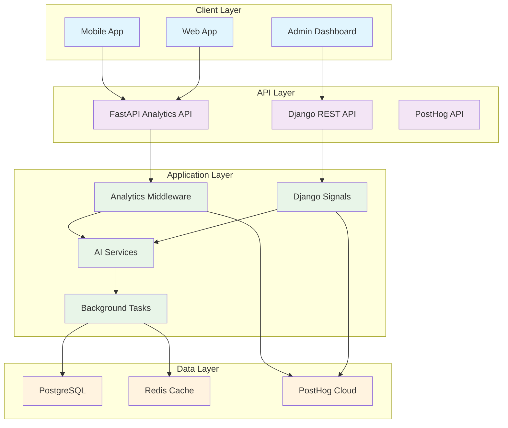
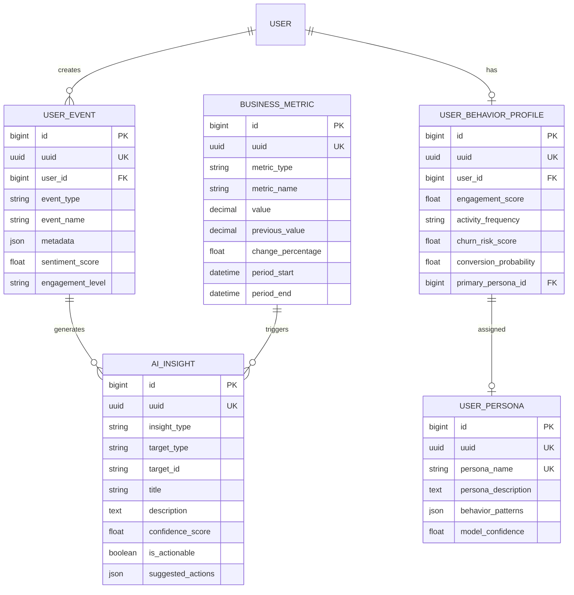

# 🔧 Analytics System - Technical Documentation

## Table of Contents
1. [System Architecture](#system-architecture)
2. [Database Schema](#database-schema)
3. [API Reference](#api-reference)
4. [AI Services](#ai-services)
5. [Background Tasks](#background-tasks)
6. [Configuration](#configuration)
7. [Deployment](#deployment)
8. [Testing](#testing)
9. [Performance Optimization](#performance-optimization)
10. [Monitoring & Debugging](#monitoring--debugging)

---

## System Architecture

### 🏗️ High-Level Architecture



### 🔄 Data Flow

1. **Data Collection**: Middleware captures user interactions
2. **Event Processing**: Signals trigger event creation
3. **AI Analysis**: Background tasks process events for insights
4. **Storage**: Data stored in PostgreSQL and Redis
5. **External Sync**: Events sent to PostHog for real-time analytics
6. **API Access**: FastAPI endpoints provide data access

---

## Database Schema

### 📊 Core Models

#### **BaseAnalyticsModel**
```python
class BaseAnalyticsModel(TimeStampedModel):
    uuid = UUIDField(default=uuid.uuid4, unique=True, editable=False)
    source = CharField(max_length=50, choices=SOURCE_CHOICES, default='api')
    parent_uuid = UUIDField(null=True, blank=True)
    lineage_depth = PositiveIntegerField(default=0)
    retention_days = PositiveIntegerField(default=365)
    is_archived = BooleanField(default=False)
    archived_at = DateTimeField(null=True, blank=True)
```

#### **UserEvent**
```python
class UserEvent(BaseAnalyticsModel):
    # User and session
    user = ForeignKey(User, on_delete=SET_NULL, null=True, blank=True)
    session_id = CharField(max_length=100, db_index=True)
    anonymous_id = CharField(max_length=100, blank=True)
    
    # Event classification
    event_type = CharField(max_length=50, choices=EVENT_TYPE_CHOICES, db_index=True)
    event_name = CharField(max_length=100, db_index=True)
    page_url = URLField(blank=True)
    action = CharField(max_length=100, blank=True)
    
    # Context and metadata
    metadata = JSONField(default=dict, blank=True)
    user_agent = TextField(blank=True)
    ip_address = GenericIPAddressField(null=True, blank=True)
    referrer = URLField(blank=True)
    
    # Performance metrics
    response_time_ms = PositiveIntegerField(null=True, blank=True)
    status_code = PositiveIntegerField(null=True, blank=True)
    
    # Behavioral context
    device_type = CharField(max_length=20, blank=True)
    browser = CharField(max_length=50, blank=True)
    os = CharField(max_length=50, blank=True)
    
    # AI-processed fields
    sentiment_score = FloatField(null=True, blank=True, validators=[MinValueValidator(-1.0), MaxValueValidator(1.0)])
    intent_classification = CharField(max_length=50, blank=True)
    engagement_level = CharField(max_length=20, choices=ENGAGEMENT_LEVEL_CHOICES, blank=True)
    
    # Business context
    revenue_impact = DecimalField(max_digits=10, decimal_places=2, null=True, blank=True)
    conversion_value = DecimalField(max_digits=10, decimal_places=2, null=True, blank=True)
```

#### **BusinessMetric**
```python
class BusinessMetric(BaseAnalyticsModel):
    # Metric classification
    metric_type = CharField(max_length=20, choices=METRIC_TYPE_CHOICES, db_index=True)
    metric_name = CharField(max_length=100, db_index=True)
    metric_category = CharField(max_length=50, db_index=True)
    metric_subcategory = CharField(max_length=50, blank=True)
    
    # Metric values
    value = DecimalField(max_digits=15, decimal_places=4)
    previous_value = DecimalField(max_digits=15, decimal_places=4, null=True, blank=True)
    target_value = DecimalField(max_digits=15, decimal_places=4, null=True, blank=True)
    
    # Change metrics
    change_percentage = FloatField(null=True, blank=True)
    change_direction = CharField(max_length=10, choices=CHANGE_DIRECTION_CHOICES, blank=True)
    
    # Time period
    period_start = DateTimeField()
    period_end = DateTimeField()
    period_type = CharField(max_length=20, choices=PERIOD_TYPE_CHOICES)
    
    # Context and metadata
    context = JSONField(default=dict, blank=True)
    dimensions = JSONField(default=dict, blank=True)
    
    # Alert thresholds
    warning_threshold = DecimalField(max_digits=15, decimal_places=4, null=True, blank=True)
    critical_threshold = DecimalField(max_digits=15, decimal_places=4, null=True, blank=True)
    is_alert_triggered = BooleanField(default=False)
```

#### **AIInsight**
```python
class AIInsight(BaseAnalyticsModel):
    # Insight classification
    insight_type = CharField(max_length=50, choices=INSIGHT_TYPE_CHOICES, db_index=True)
    target_type = CharField(max_length=50)
    target_id = CharField(max_length=100)
    
    # Insight content
    title = CharField(max_length=200)
    description = TextField()
    confidence_score = FloatField(validators=[MinValueValidator(0.0), MaxValueValidator(1.0)])
    
    # AI model information
    model_name = CharField(max_length=100)
    model_version = CharField(max_length=50)
    input_features = JSONField(default=list, blank=True)
    output_data = JSONField(default=dict, blank=True)
    
    # Actionability
    is_actionable = BooleanField(default=False)
    suggested_actions = JSONField(default=list, blank=True)
    priority = CharField(max_length=20, choices=PRIORITY_CHOICES, default='medium')
    
    # Status and validation
    status = CharField(max_length=20, choices=STATUS_CHOICES, default='pending')
    validated_at = DateTimeField(null=True, blank=True)
    validation_notes = TextField(blank=True)
```

### 🔗 Model Relationships



---

## API Reference

### 🚀 FastAPI Endpoints

#### **Analytics Overview**
```python
@router.get("/overview", response_model=AnalyticsOverviewResponse)
async def get_analytics_overview(
    user: User = Depends(get_current_user),
    days: int = Query(default=7, ge=1, le=30)
):
    """
    Get comprehensive analytics overview
    
    Returns:
        - Total events, users, revenue
        - Active users today
        - Conversion rate
        - Average session length
        - Top insights
        - Active alerts
    """
```

#### **User Behavior Analysis**
```python
@router.post("/user-behavior", response_model=UserBehaviorResponse)
async def analyze_user_behavior(
    request: UserBehaviorRequest,
    background_tasks: BackgroundTasks,
    user: User = Depends(get_current_user)
):
    """
    Analyze user behavior patterns
    
    Parameters:
        - user_id: Target user ID
        - days: Analysis period (1-365 days)
    
    Returns:
        - Engagement score
        - Activity patterns
        - User preferences
        - Risk factors
        - Persona suggestions
        - Predictions
    """
```

#### **Metrics Calculation**
```python
@router.post("/metrics/calculate", response_model=MetricsResponse)
async def calculate_metrics(
    request: MetricsRequest,
    background_tasks: BackgroundTasks,
    admin_user: User = Depends(get_admin_user)
):
    """
    Calculate business metrics
    
    Parameters:
        - date: Target date (optional, defaults to today)
        - metric_types: List of metric types (kpi, kri, kr)
    
    Returns:
        - KPIs, KRIs, KRs
        - Alert count
        - Processing status
    """
```

#### **AI Insights**
```python
@router.post("/insights", response_model=InsightResponse)
async def get_ai_insights(
    request: InsightRequest,
    user: User = Depends(get_current_user)
):
    """
    Get AI-generated insights
    
    Parameters:
        - insight_types: List of insight types
        - priority: Filter by priority level
        - limit: Maximum number of insights
    
    Returns:
        - List of insights
        - Total count
        - Pagination info
    """
```

#### **Sentiment Analysis**
```python
@router.post("/sentiment", response_model=SentimentAnalysisResponse)
async def analyze_sentiment(
    request: SentimentAnalysisRequest,
    user: User = Depends(get_current_user)
):
    """
    Analyze text sentiment
    
    Parameters:
        - text: Text to analyze (1-10000 characters)
    
    Returns:
        - Sentiment classification
        - Sentiment score (-1 to 1)
        - Confidence level
        - Detailed analysis
    """
```

### 📊 Request/Response Models

#### **Pydantic Models**
```python
class AnalyticsOverviewResponse(BaseModel):
    total_events: int
    total_users: int
    total_revenue: float
    active_users_today: int
    conversion_rate: float
    avg_session_length: float
    top_insights: List[Dict[str, Any]]
    alerts: List[Dict[str, Any]]

class UserBehaviorRequest(BaseModel):
    user_id: int
    days: int = Field(default=30, ge=1, le=365)

class UserBehaviorResponse(BaseModel):
    user_id: int
    engagement_score: float
    activity_patterns: Dict[str, Any]
    preferences: Dict[str, Any]
    risk_factors: List[str]
    persona_suggestions: List[str]
    predictions: Dict[str, Any]

class SentimentAnalysisRequest(BaseModel):
    text: str = Field(..., min_length=1, max_length=10000)

class SentimentAnalysisResponse(BaseModel):
    sentiment: str
    score: float
    confidence: float
    details: Dict[str, Any]
```

### 🔐 Authentication

All endpoints require JWT authentication:
```python
async def get_current_user(token: str = Depends(security)) -> User:
    """Get current authenticated user"""
    # JWT token validation logic
    pass

async def get_admin_user(user: User = Depends(get_current_user)) -> User:
    """Ensure user is admin"""
    if not user.is_staff:
        raise HTTPException(status_code=403, detail="Admin access required")
    return user
```

---

## AI Services

### 🤖 Service Architecture

#### **AIServiceManager**
```python
class AIServiceManager:
    """Central manager for all AI services"""
    
    def __init__(self):
        self.openai_client = None
        self.sentiment_analyzer = None
    
    def initialize(self):
        """Initialize AI services"""
        self._setup_openai()
        self._setup_nltk()
    
    def _setup_openai(self):
        """Setup OpenAI client"""
        openai.api_key = os.getenv('OPENAI_API_KEY')
        self.openai_client = openai.OpenAI(api_key=openai.api_key)
    
    def _setup_nltk(self):
        """Setup NLTK resources"""
        nltk.download('vader_lexicon', quiet=True)
        self.sentiment_analyzer = SentimentIntensityAnalyzer()
```

#### **SentimentAnalysisService**
```python
class SentimentAnalysisService:
    """Service for sentiment analysis and emotional insights"""
    
    def analyze_text_sentiment(self, text: str) -> Dict[str, Any]:
        """
        Analyze sentiment using multiple methods
        
        Methods used:
        - TextBlob: Polarity and subjectivity
        - VADER: Compound sentiment score
        - OpenAI: Advanced sentiment analysis
        
        Returns:
            - sentiment: 'positive', 'negative', 'neutral'
            - score: Aggregated score (-1 to 1)
            - confidence: Confidence level (0 to 1)
            - details: Raw results from all methods
        """
```

#### **UserBehaviorAnalysisService**
```python
class UserBehaviorAnalysisService:
    """Service for analyzing user behavior patterns"""
    
    def analyze_user_behavior(self, user: User, days: int = 30) -> Dict[str, Any]:
        """
        Comprehensive user behavior analysis
        
        Analysis includes:
        - Engagement score calculation
        - Activity pattern recognition
        - Preference extraction
        - Risk factor identification
        - Persona suggestion
        - Behavior predictions
        
        Returns:
            - engagement_score: Overall engagement (0-1)
            - activity_patterns: Peak hours, session length, etc.
            - preferences: Event types, actions, devices
            - risk_factors: List of identified risks
            - persona_suggestions: Suggested user personas
            - predictions: Churn risk, conversion probability
        """
```

#### **PredictiveAnalyticsService**
```python
class PredictiveAnalyticsService:
    """Service for predictive analytics and recommendations"""
    
    def predict_event_attendance(self, user: User, event_id: int) -> Dict[str, Any]:
        """
        Predict if user will attend an event
        
        Factors considered:
        - User engagement score
        - Past attendance history
        - Event request patterns
        - Behavioral preferences
        
        Returns:
            - probability: Attendance probability (0-1)
            - confidence: Prediction confidence (0-1)
            - factors: Contributing factors
        """
    
    def detect_anomalies(self, metric_name: str, days: int = 7) -> List[Dict[str, Any]]:
        """
        Detect anomalies in business metrics
        
        Method: Z-score analysis
        Threshold: |z-score| > 2.0 for anomaly
        
        Returns:
            List of anomaly objects with:
            - metric: BusinessMetric object
            - z_score: Statistical deviation
            - severity: 'high' or 'medium'
            - expected_value: Expected value
            - actual_value: Actual value
        """
```

#### **UserClusteringService**
```python
class UserClusteringService:
    """Service for clustering users based on behavior"""
    
    def cluster_users(self, n_clusters: int = 5) -> Dict[str, Any]:
        """
        Cluster users using K-means algorithm
        
        Features used:
        - Engagement score
        - Churn risk score
        - Conversion probability
        - Preference count
        - Activity frequency
        
        Returns:
            - clusters: Dictionary of cluster data
            - inertia: K-means inertia score
            - silhouette_score: Cluster quality metric
        """
```

### 🧠 AI Model Integration

#### **OpenAI Integration**
```python
def _analyze_with_openai(self, text: str) -> Dict[str, Any]:
    """Analyze sentiment using OpenAI"""
    prompt = f"""
    Analyze the sentiment of this text and provide:
    1. Overall sentiment (positive, negative, neutral)
    2. Emotional intensity (1-10 scale)
    3. Key emotions detected
    4. Confidence level (0-1)
    
    Text: "{text}"
    
    Respond in JSON format.
    """
    
    response = self.openai_client.chat.completions.create(
        model="gpt-3.5-turbo",
        messages=[{"role": "user", "content": prompt}],
        max_tokens=200,
        temperature=0.3
    )
    
    return json.loads(response.choices[0].message.content)
```

#### **Scikit-learn Integration**
```python
def cluster_users(self, n_clusters: int = 5) -> Dict[str, Any]:
    """Perform K-means clustering"""
    # Prepare features
    features = []
    for profile in UserBehaviorProfile.objects.all():
        feature_vector = [
            profile.engagement_score,
            profile.churn_risk_score,
            profile.conversion_probability,
            len(profile.preferred_event_types),
            len(profile.preferred_times),
            len(profile.preferred_locations)
        ]
        features.append(feature_vector)
    
    # Normalize features
    scaler = StandardScaler()
    features_scaled = scaler.fit_transform(features)
    
    # Perform clustering
    kmeans = KMeans(n_clusters=n_clusters, random_state=42)
    cluster_labels = kmeans.fit_predict(features_scaled)
    
    return {
        'clusters': self._analyze_clusters(cluster_labels, kmeans),
        'inertia': kmeans.inertia_,
        'silhouette_score': silhouette_score(features_scaled, cluster_labels)
    }
```

---

## Background Tasks

### ⚡ Celery Configuration

#### **Task Definition**
```python
@shared_task(bind=True, max_retries=3)
def process_user_events_batch(self, event_ids: List[int]):
    """
    Process a batch of user events for AI analysis
    
    Tasks performed:
    - Sentiment analysis of event metadata
    - Intent classification
    - Engagement level calculation
    - Batch processing for efficiency
    """
```

#### **Task Scheduling**
```python
CELERY_BEAT_SCHEDULE = {
    'process-daily-metrics': {
        'task': 'analytics.tasks.process_daily_metrics_calculation',
        'schedule': 60.0 * 60.0,  # Every hour
    },
    'generate-user-insights': {
        'task': 'analytics.tasks.generate_predictive_insights',
        'schedule': 60.0 * 60.0 * 6,  # Every 6 hours
    },
    'detect-anomalies': {
        'task': 'analytics.tasks.detect_anomalies_batch',
        'schedule': 60.0 * 30,  # Every 30 minutes
    },
    'cleanup-analytics-data': {
        'task': 'analytics.tasks.cleanup_old_analytics_data',
        'schedule': 60.0 * 60.0 * 24,  # Daily
    },
}
```

#### **Task Routing**
```python
app.conf.task_routes = {
    'analytics.tasks.*': {'queue': 'analytics'},
    'analytics.tasks.process_daily_metrics_calculation': {'queue': 'metrics'},
    'analytics.tasks.generate_user_behavior_insights': {'queue': 'ai_processing'},
    'analytics.tasks.perform_user_clustering': {'queue': 'ai_processing'},
    'analytics.tasks.generate_predictive_insights': {'queue': 'ai_processing'},
    'analytics.tasks.detect_anomalies_batch': {'queue': 'anomaly_detection'},
}
```

### 🔄 Task Types

#### **Event Processing Tasks**
```python
@shared_task(bind=True, max_retries=3)
def process_user_events_batch(self, event_ids: List[int]):
    """Process events for AI analysis"""
    events = UserEvent.objects.filter(id__in=event_ids)
    
    for event in events:
        # Sentiment analysis
        if event.sentiment_score is None and event.metadata:
            sentiment_service = SentimentAnalysisService()
            text_content = event.metadata.get('message', '')
            if text_content:
                result = sentiment_service.analyze_text_sentiment(text_content)
                event.sentiment_score = result['score']
                event.save(update_fields=['sentiment_score'])
        
        # Intent classification
        if not event.intent_classification:
            intent = classify_event_intent(event)
            if intent:
                event.intent_classification = intent
                event.save(update_fields=['intent_classification'])
        
        # Engagement level
        if not event.engagement_level:
            engagement = calculate_engagement_level(event)
            if engagement:
                event.engagement_level = engagement
                event.save(update_fields=['engagement_level'])
```

#### **AI Processing Tasks**
```python
@shared_task(bind=True, max_retries=3)
def generate_user_behavior_insights(self, user_id: int):
    """Generate AI insights for a specific user"""
    user = User.objects.get(id=user_id)
    
    # Analyze behavior
    behavior_service = UserBehaviorAnalysisService()
    analysis = behavior_service.analyze_user_behavior(user)
    
    # Create behavior profile
    behavior_profile, created = UserBehaviorProfile.objects.get_or_create(
        user=user,
        defaults={
            'engagement_score': analysis['engagement_score'],
            'churn_risk_score': analysis['predictions']['churn_risk'],
            'conversion_probability': analysis['predictions']['conversion_probability'],
            'last_analysis_at': timezone.now(),
        }
    )
    
    # Generate insights
    insights_created = 0
    
    # Churn risk insight
    if analysis['predictions']['churn_risk'] > 0.7:
        AIInsight.objects.create(
            insight_type='churn_risk',
            target_type='user',
            target_id=str(user_id),
            title='High Churn Risk Detected',
            description=f'User shows signs of potential churn',
            confidence_score=analysis['predictions']['churn_risk'],
            is_actionable=True,
            suggested_actions=['send_retention_email', 'offer_discount'],
            priority='high'
        )
        insights_created += 1
    
    return {'user_id': user_id, 'insights_created': insights_created}
```

#### **Metrics Calculation Tasks**
```python
@shared_task(bind=True, max_retries=3)
def process_daily_metrics_calculation(self, date_str: str = None):
    """Calculate all daily metrics"""
    if date_str:
        date = datetime.strptime(date_str, '%Y-%m-%d').date()
    else:
        date = timezone.now().date()
    
    # Process all metrics
    results = MetricsProcessor.process_daily_metrics(date)
    
    # Check for alerts
    alerts = MetricsProcessor.check_alert_thresholds()
    
    return {
        'date': date.isoformat(),
        'metrics_processed': len(results.get('kpis', {})) + len(results.get('kris', {})) + len(results.get('krs', {})),
        'alerts_triggered': len(alerts),
        'alerts': alerts
    }
```

---

## Configuration

### ⚙️ Environment Variables

#### **Analytics Configuration**
```env
# Analytics
ANALYTICS_ENABLED=true
ANALYTICS_RETENTION_DAYS=365
ANALYTICS_BATCH_SIZE=1000

# AI Services
OPENAI_API_KEY=your-openai-api-key
AI_SERVICES_ENABLED=true

# PostHog
POSTHOG_API_KEY=your-posthog-api-key
POSTHOG_HOST=https://us.i.posthog.com

# Celery/Redis
CELERY_BROKER_URL=redis://localhost:6379/0
CELERY_RESULT_BACKEND=redis://localhost:6379/0
```

#### **Django Settings**
```python
# Installed Apps
INSTALLED_APPS = [
    'analytics',
    'posthog',
]

# Middleware
MIDDLEWARE = [
    'analytics.middleware.AnalyticsMiddleware',
    'posthog.integrations.django.PosthogContextMiddleware',
]

# Analytics Configuration
ANALYTICS_ENABLED = config('ANALYTICS_ENABLED', default=True, cast=bool)
ANALYTICS_RETENTION_DAYS = config('ANALYTICS_RETENTION_DAYS', default=365, cast=int)
ANALYTICS_BATCH_SIZE = config('ANALYTICS_BATCH_SIZE', default=1000, cast=int)

# AI Services Configuration
OPENAI_API_KEY = config('OPENAI_API_KEY', default='')
AI_SERVICES_ENABLED = config('AI_SERVICES_ENABLED', default=True, cast=bool)

# Celery Configuration
CELERY_BROKER_URL = config('CELERY_BROKER_URL', default='redis://localhost:6379/0')
CELERY_RESULT_BACKEND = config('CELERY_RESULT_BACKEND', default='redis://localhost:6379/0')
CELERY_TASK_SERIALIZER = 'json'
CELERY_RESULT_SERIALIZER = 'json'
CELERY_ACCEPT_CONTENT = ['json']
CELERY_TIMEZONE = TIME_ZONE
CELERY_ENABLE_UTC = True
```

### 🔧 Celery Configuration

#### **Celery App Setup**
```python
# loopin_backend/celery.py
import os
from celery import Celery

os.environ.setdefault('DJANGO_SETTINGS_MODULE', 'loopin_backend.settings')

app = Celery('loopin_backend')
app.config_from_object('django.conf:settings', namespace='CELERY')
app.autodiscover_tasks()

# Task configuration
app.conf.task_time_limit = 300  # 5 minutes
app.conf.task_soft_time_limit = 240  # 4 minutes
app.conf.worker_prefetch_multiplier = 1
app.conf.worker_max_tasks_per_child = 1000
app.conf.result_expires = 3600  # 1 hour
app.conf.task_acks_late = True
```

#### **Worker Configuration**
```bash
# Start Celery worker
celery -A loopin_backend worker --loglevel=info --queues=analytics,ai_processing,metrics,anomaly_detection

# Start Celery beat (scheduler)
celery -A loopin_backend beat --loglevel=info

# Start Celery flower (monitoring)
celery -A loopin_backend flower
```

---

## Deployment

### 🚀 Production Deployment

#### **Docker Configuration**
```dockerfile
# Dockerfile for analytics
FROM python:3.12-slim

WORKDIR /app

# Install dependencies
COPY requirements.txt .
RUN pip install -r requirements.txt

# Copy application
COPY . .

# Set environment variables
ENV ANALYTICS_ENABLED=true
ENV CELERY_BROKER_URL=redis://redis:6379/0

# Run application
CMD ["gunicorn", "loopin_backend.wsgi:application", "--bind", "0.0.0.0:8000"]
```

#### **Docker Compose**
```yaml
version: '3.8'

services:
  web:
    build: .
    ports:
      - "8000:8000"
    environment:
      - ANALYTICS_ENABLED=true
      - CELERY_BROKER_URL=redis://redis:6379/0
    depends_on:
      - redis
      - postgres

  celery:
    build: .
    command: celery -A loopin_backend worker --loglevel=info
    environment:
      - CELERY_BROKER_URL=redis://redis:6379/0
    depends_on:
      - redis
      - postgres

  celery-beat:
    build: .
    command: celery -A loopin_backend beat --loglevel=info
    environment:
      - CELERY_BROKER_URL=redis://redis:6379/0
    depends_on:
      - redis
      - postgres

  redis:
    image: redis:7-alpine
    ports:
      - "6379:6379"

  postgres:
    image: postgres:15
    environment:
      - POSTGRES_DB=loopin
      - POSTGRES_USER=postgres
      - POSTGRES_PASSWORD=password
    volumes:
      - postgres_data:/var/lib/postgresql/data

volumes:
  postgres_data:
```

#### **Environment-Specific Settings**
```python
# settings/production.py
DEBUG = False
ALLOWED_HOSTS = ['your-domain.com']

# Analytics
ANALYTICS_ENABLED = True
ANALYTICS_RETENTION_DAYS = 365
ANALYTICS_BATCH_SIZE = 1000

# AI Services
OPENAI_API_KEY = os.getenv('OPENAI_API_KEY')
AI_SERVICES_ENABLED = True

# Celery
CELERY_BROKER_URL = os.getenv('CELERY_BROKER_URL')
CELERY_RESULT_BACKEND = os.getenv('CELERY_RESULT_BACKEND')

# PostHog
POSTHOG_API_KEY = os.getenv('POSTHOG_API_KEY')
POSTHOG_HOST = os.getenv('POSTHOG_HOST', 'https://us.i.posthog.com')
```

### 📊 Monitoring Setup

#### **Health Checks**
```python
@router.get("/health")
async def analytics_health_check():
    """Check analytics system health"""
    try:
        # Check database connectivity
        recent_events = UserEvent.objects.filter(
            created_at__gte=timezone.now() - timedelta(hours=1)
        ).count()
        
        # Check AI services
        ai_manager = AIServiceManager()
        ai_status = 'healthy' if ai_manager.openai_client else 'degraded'
        
        # Check PostHog connectivity
        posthog_status = 'healthy' if posthog.api_key else 'disabled'
        
        return {
            'status': 'healthy',
            'timestamp': timezone.now().isoformat(),
            'components': {
                'database': 'healthy',
                'ai_services': ai_status,
                'posthog': posthog_status,
                'recent_events': recent_events
            }
        }
    except Exception as e:
        return {
            'status': 'unhealthy',
            'error': str(e),
            'timestamp': timezone.now().isoformat()
        }
```

#### **Logging Configuration**
```python
LOGGING = {
    'version': 1,
    'disable_existing_loggers': False,
    'formatters': {
        'verbose': {
            'format': '{levelname} {asctime} {module} {process:d} {thread:d} {message}',
            'style': '{',
        },
    },
    'handlers': {
        'file': {
            'level': 'INFO',
            'class': 'logging.FileHandler',
            'filename': 'analytics.log',
            'formatter': 'verbose',
        },
        'console': {
            'level': 'DEBUG',
            'class': 'logging.StreamHandler',
            'formatter': 'verbose',
        },
    },
    'loggers': {
        'analytics': {
            'handlers': ['file', 'console'],
            'level': 'INFO',
            'propagate': True,
        },
    },
}
```

---

## Testing

### 🧪 Test Structure

#### **Unit Tests**
```python
# tests/test_models.py
from django.test import TestCase
from analytics.models import UserEvent, BusinessMetric, AIInsight

class UserEventModelTest(TestCase):
    def setUp(self):
        self.user = User.objects.create_user(
            username='testuser',
            email='test@example.com'
        )
    
    def test_user_event_creation(self):
        event = UserEvent.objects.create(
            user=self.user,
            event_type='page_view',
            event_name='test_page',
            session_id='test_session'
        )
        
        self.assertEqual(event.user, self.user)
        self.assertEqual(event.event_type, 'page_view')
        self.assertIsNotNone(event.uuid)
        self.assertEqual(event.source, 'api')

class BusinessMetricModelTest(TestCase):
    def test_metric_creation(self):
        metric = BusinessMetric.objects.create(
            metric_type='kpi',
            metric_name='test_metric',
            value=100.0,
            period_start=timezone.now(),
            period_end=timezone.now(),
            period_type='day'
        )
        
        self.assertEqual(metric.metric_type, 'kpi')
        self.assertEqual(float(metric.value), 100.0)
        self.assertIsNotNone(metric.uuid)
```

#### **Integration Tests**
```python
# tests/test_ai_services.py
from django.test import TestCase
from analytics.ai_services import SentimentAnalysisService, UserBehaviorAnalysisService

class SentimentAnalysisServiceTest(TestCase):
    def setUp(self):
        self.service = SentimentAnalysisService()
    
    def test_positive_sentiment(self):
        result = self.service.analyze_text_sentiment("I love this event!")
        
        self.assertEqual(result['sentiment'], 'positive')
        self.assertGreater(result['score'], 0)
        self.assertGreater(result['confidence'], 0)
    
    def test_negative_sentiment(self):
        result = self.service.analyze_text_sentiment("This event was terrible!")
        
        self.assertEqual(result['sentiment'], 'negative')
        self.assertLess(result['score'], 0)
        self.assertGreater(result['confidence'], 0)
    
    def test_neutral_sentiment(self):
        result = self.service.analyze_text_sentiment("The event was okay.")
        
        self.assertEqual(result['sentiment'], 'neutral')
        self.assertAlmostEqual(result['score'], 0, delta=0.1)

class UserBehaviorAnalysisServiceTest(TestCase):
    def setUp(self):
        self.user = User.objects.create_user(
            username='testuser',
            email='test@example.com'
        )
        self.service = UserBehaviorAnalysisService()
    
    def test_behavior_analysis(self):
        # Create some test events
        UserEvent.objects.create(
            user=self.user,
            event_type='page_view',
            event_name='event_page',
            session_id='test_session'
        )
        
        analysis = self.service.analyze_user_behavior(self.user)
        
        self.assertIn('engagement_score', analysis)
        self.assertIn('activity_patterns', analysis)
        self.assertIn('preferences', analysis)
        self.assertIn('risk_factors', analysis)
        self.assertIn('predictions', analysis)
```

#### **API Tests**
```python
# tests/test_api.py
from django.test import TestCase
from django.contrib.auth.models import User
from rest_framework.test import APIClient
from rest_framework import status

class AnalyticsAPITest(TestCase):
    def setUp(self):
        self.user = User.objects.create_user(
            username='testuser',
            email='test@example.com',
            password='testpass123'
        )
        self.client = APIClient()
        self.client.force_authenticate(user=self.user)
    
    def test_analytics_overview(self):
        response = self.client.get('/api/analytics/overview')
        
        self.assertEqual(response.status_code, status.HTTP_200_OK)
        self.assertIn('total_events', response.data)
        self.assertIn('total_users', response.data)
        self.assertIn('active_users_today', response.data)
    
    def test_sentiment_analysis(self):
        data = {'text': 'I love this event!'}
        response = self.client.post('/api/analytics/sentiment', data)
        
        self.assertEqual(response.status_code, status.HTTP_200_OK)
        self.assertEqual(response.data['sentiment'], 'positive')
        self.assertGreater(response.data['score'], 0)
    
    def test_user_behavior_analysis(self):
        data = {'user_id': self.user.id, 'days': 30}
        response = self.client.post('/api/analytics/user-behavior', data)
        
        self.assertEqual(response.status_code, status.HTTP_200_OK)
        self.assertIn('engagement_score', response.data)
        self.assertIn('activity_patterns', response.data)
```

#### **Task Tests**
```python
# tests/test_tasks.py
from django.test import TestCase
from unittest.mock import patch, MagicMock
from analytics.tasks import process_user_events_batch, generate_user_behavior_insights

class AnalyticsTasksTest(TestCase):
    def setUp(self):
        self.user = User.objects.create_user(
            username='testuser',
            email='test@example.com'
        )
    
    @patch('analytics.tasks.SentimentAnalysisService')
    def test_process_user_events_batch(self, mock_sentiment_service):
        # Create test events
        event1 = UserEvent.objects.create(
            user=self.user,
            event_type='page_view',
            event_name='test_page',
            session_id='test_session'
        )
        
        # Mock sentiment service
        mock_service = MagicMock()
        mock_service.analyze_text_sentiment.return_value = {
            'sentiment': 'positive',
            'score': 0.8,
            'confidence': 0.9
        }
        mock_sentiment_service.return_value = mock_service
        
        # Run task
        result = process_user_events_batch([event1.id])
        
        self.assertEqual(result['processed'], 1)
        self.assertEqual(result['errors'], 0)
    
    def test_generate_user_behavior_insights(self):
        # Create test events
        UserEvent.objects.create(
            user=self.user,
            event_type='page_view',
            event_name='event_page',
            session_id='test_session'
        )
        
        # Run task
        result = generate_user_behavior_insights(self.user.id)
        
        self.assertEqual(result['user_id'], self.user.id)
        self.assertIn('insights_created', result)
```

### 🔍 Test Coverage

#### **Coverage Configuration**
```python
# .coveragerc
[run]
source = analytics
omit = 
    */migrations/*
    */tests/*
    */venv/*
    */env/*

[report]
exclude_lines =
    pragma: no cover
    def __repr__
    raise AssertionError
    raise NotImplementedError
```

#### **Running Tests**
```bash
# Run all tests
python manage.py test analytics

# Run with coverage
coverage run --source='.' manage.py test analytics
coverage report
coverage html

# Run specific test
python manage.py test analytics.tests.test_models.UserEventModelTest

# Run with verbose output
python manage.py test analytics --verbosity=2
```

---

## Performance Optimization

### ⚡ Optimization Strategies

#### **Database Optimization**
```python
# Indexes for UserEvent
class UserEvent(BaseAnalyticsModel):
    class Meta:
        indexes = [
            models.Index(fields=['user', 'created_at']),
            models.Index(fields=['session_id', 'created_at']),
            models.Index(fields=['event_type', 'created_at']),
            models.Index(fields=['event_name', 'created_at']),
            models.Index(fields=['sentiment_score']),
            models.Index(fields=['engagement_level']),
        ]

# Query optimization
def get_user_events_optimized(user_id, days=30):
    """Optimized query for user events"""
    end_date = timezone.now()
    start_date = end_date - timedelta(days=days)
    
    return UserEvent.objects.filter(
        user_id=user_id,
        created_at__range=[start_date, end_date]
    ).select_related('user').only(
        'id', 'event_type', 'event_name', 'created_at', 'sentiment_score'
    ).order_by('-created_at')
```

#### **Caching Strategy**
```python
# Redis caching for frequent queries
from django.core.cache import cache

def get_analytics_overview_cached(days=7):
    """Cached analytics overview"""
    cache_key = f"analytics_overview_{days}"
    cached_data = cache.get(cache_key)
    
    if cached_data is None:
        # Calculate analytics data
        data = calculate_analytics_overview(days)
        
        # Cache for 5 minutes
        cache.set(cache_key, data, 300)
        return data
    
    return cached_data

def get_user_behavior_cached(user_id, days=30):
    """Cached user behavior analysis"""
    cache_key = f"user_behavior_{user_id}_{days}"
    cached_data = cache.get(cache_key)
    
    if cached_data is None:
        # Perform analysis
        service = UserBehaviorAnalysisService()
        data = service.analyze_user_behavior(User.objects.get(id=user_id), days)
        
        # Cache for 1 hour
        cache.set(cache_key, data, 3600)
        return data
    
    return cached_data
```

#### **Batch Processing**
```python
# Batch operations for better performance
def bulk_create_user_events(events_data):
    """Bulk create user events"""
    events = []
    for data in events_data:
        events.append(UserEvent(**data))
    
    # Bulk create in batches
    batch_size = 1000
    for i in range(0, len(events), batch_size):
        batch = events[i:i + batch_size]
        UserEvent.objects.bulk_create(batch, ignore_conflicts=True)

def bulk_update_sentiment_scores(event_ids, sentiment_data):
    """Bulk update sentiment scores"""
    updates = []
    for event_id, sentiment in sentiment_data.items():
        updates.append(UserEvent(
            id=event_id,
            sentiment_score=sentiment['score'],
            engagement_level=sentiment['engagement']
        ))
    
    UserEvent.objects.bulk_update(
        updates, 
        ['sentiment_score', 'engagement_level'],
        batch_size=1000
    )
```

#### **Async Processing**
```python
# Async task processing
@shared_task(bind=True)
def process_large_dataset(self, dataset_id):
    """Process large dataset asynchronously"""
    dataset = Dataset.objects.get(id=dataset_id)
    
    # Process in chunks
    chunk_size = 1000
    total_processed = 0
    
    for chunk in dataset.get_chunks(chunk_size):
        try:
            # Process chunk
            process_chunk(chunk)
            total_processed += len(chunk)
            
            # Update progress
            self.update_state(
                state='PROGRESS',
                meta={'processed': total_processed, 'total': dataset.total_records}
            )
            
        except Exception as e:
            logger.error(f"Error processing chunk: {e}")
            continue
    
    return {'processed': total_processed, 'status': 'completed'}
```

### 📊 Performance Monitoring

#### **Query Performance**
```python
# Django Debug Toolbar integration
if DEBUG:
    INSTALLED_APPS += ['debug_toolbar']
    MIDDLEWARE += ['debug_toolbar.middleware.DebugToolbarMiddleware']

# Query logging
LOGGING = {
    'loggers': {
        'django.db.backends': {
            'level': 'DEBUG',
            'handlers': ['console'],
        },
    },
}
```

#### **Memory Usage**
```python
# Memory monitoring
import psutil
import os

def get_memory_usage():
    """Get current memory usage"""
    process = psutil.Process(os.getpid())
    memory_info = process.memory_info()
    
    return {
        'rss': memory_info.rss / 1024 / 1024,  # MB
        'vms': memory_info.vms / 1024 / 1024,  # MB
        'percent': process.memory_percent()
    }

# Monitor memory in tasks
@shared_task(bind=True)
def memory_intensive_task(self):
    """Task with memory monitoring"""
    start_memory = get_memory_usage()
    
    # Perform memory-intensive operations
    result = perform_heavy_processing()
    
    end_memory = get_memory_usage()
    
    logger.info(f"Memory usage: {start_memory['rss']:.2f}MB -> {end_memory['rss']:.2f}MB")
    
    return result
```

#### **Response Time Monitoring**
```python
# Response time middleware
class ResponseTimeMiddleware:
    def __init__(self, get_response):
        self.get_response = get_response
    
    def __call__(self, request):
        start_time = time.time()
        
        response = self.get_response(request)
        
        end_time = time.time()
        response_time = end_time - start_time
        
        # Log slow requests
        if response_time > 1.0:  # 1 second threshold
            logger.warning(f"Slow request: {request.path} took {response_time:.2f}s")
        
        # Add response time header
        response['X-Response-Time'] = f"{response_time:.3f}s"
        
        return response
```

---

## Monitoring & Debugging

### 🔍 Monitoring Setup

#### **Application Monitoring**
```python
# Prometheus metrics
from prometheus_client import Counter, Histogram, Gauge

# Metrics
REQUEST_COUNT = Counter('analytics_requests_total', 'Total analytics requests', ['method', 'endpoint'])
REQUEST_DURATION = Histogram('analytics_request_duration_seconds', 'Request duration')
ACTIVE_USERS = Gauge('analytics_active_users', 'Number of active users')
EVENT_COUNT = Counter('analytics_events_total', 'Total events processed', ['event_type'])

# Middleware integration
class PrometheusMiddleware:
    def __init__(self, get_response):
        self.get_response = get_response
    
    def __call__(self, request):
        start_time = time.time()
        
        response = self.get_response(request)
        
        # Record metrics
        REQUEST_COUNT.labels(
            method=request.method,
            endpoint=request.path
        ).inc()
        
        REQUEST_DURATION.observe(time.time() - start_time)
        
        return response
```

#### **Error Tracking**
```python
# Sentry integration
import sentry_sdk
from sentry_sdk.integrations.django import DjangoIntegration
from sentry_sdk.integrations.celery import CeleryIntegration

sentry_sdk.init(
    dsn="your-sentry-dsn",
    integrations=[
        DjangoIntegration(),
        CeleryIntegration(),
    ],
    traces_sample_rate=1.0,
    send_default_pii=True
)

# Custom error handling
def handle_analytics_error(func):
    """Decorator for analytics error handling"""
    def wrapper(*args, **kwargs):
        try:
            return func(*args, **kwargs)
        except Exception as e:
            logger.error(f"Analytics error in {func.__name__}: {e}")
            sentry_sdk.capture_exception(e)
            raise
    return wrapper
```

#### **Health Checks**
```python
# Comprehensive health check
@router.get("/health/detailed")
async def detailed_health_check():
    """Detailed system health check"""
    health_status = {
        'status': 'healthy',
        'timestamp': timezone.now().isoformat(),
        'components': {}
    }
    
    # Database health
    try:
        UserEvent.objects.count()
        health_status['components']['database'] = 'healthy'
    except Exception as e:
        health_status['components']['database'] = f'unhealthy: {str(e)}'
        health_status['status'] = 'unhealthy'
    
    # Redis health
    try:
        from django.core.cache import cache
        cache.set('health_check', 'ok', 10)
        cache.get('health_check')
        health_status['components']['redis'] = 'healthy'
    except Exception as e:
        health_status['components']['redis'] = f'unhealthy: {str(e)}'
        health_status['status'] = 'unhealthy'
    
    # AI services health
    try:
        ai_manager = AIServiceManager()
        if ai_manager.openai_client:
            health_status['components']['ai_services'] = 'healthy'
        else:
            health_status['components']['ai_services'] = 'degraded'
    except Exception as e:
        health_status['components']['ai_services'] = f'unhealthy: {str(e)}'
    
    # PostHog health
    try:
        if posthog.api_key:
            health_status['components']['posthog'] = 'healthy'
        else:
            health_status['components']['posthog'] = 'disabled'
    except Exception as e:
        health_status['components']['posthog'] = f'unhealthy: {str(e)}'
    
    return health_status
```

### 🐛 Debugging Tools

#### **Debug Logging**
```python
# Debug logging configuration
LOGGING = {
    'version': 1,
    'disable_existing_loggers': False,
    'formatters': {
        'detailed': {
            'format': '{levelname} {asctime} {module} {funcName} {lineno} {message}',
            'style': '{',
        },
    },
    'handlers': {
        'analytics_file': {
            'level': 'DEBUG',
            'class': 'logging.FileHandler',
            'filename': 'logs/analytics.log',
            'formatter': 'detailed',
        },
        'analytics_console': {
            'level': 'INFO',
            'class': 'logging.StreamHandler',
            'formatter': 'detailed',
        },
    },
    'loggers': {
        'analytics': {
            'handlers': ['analytics_file', 'analytics_console'],
            'level': 'DEBUG',
            'propagate': False,
        },
        'analytics.ai_services': {
            'handlers': ['analytics_file'],
            'level': 'DEBUG',
            'propagate': False,
        },
        'analytics.tasks': {
            'handlers': ['analytics_file'],
            'level': 'DEBUG',
            'propagate': False,
        },
    },
}
```

#### **Debug Commands**
```python
# management/commands/debug_analytics.py
from django.core.management.base import BaseCommand
from analytics.models import UserEvent, BusinessMetric, AIInsight
from analytics.ai_services import SentimentAnalysisService

class Command(BaseCommand):
    help = 'Debug analytics system'
    
    def add_arguments(self, parser):
        parser.add_argument('--check-data', action='store_true', help='Check data integrity')
        parser.add_argument('--test-ai', action='store_true', help='Test AI services')
        parser.add_argument('--check-metrics', action='store_true', help='Check metrics calculation')
    
    def handle(self, *args, **options):
        if options['check_data']:
            self.check_data_integrity()
        
        if options['test_ai']:
            self.test_ai_services()
        
        if options['check_metrics']:
            self.check_metrics_calculation()
    
    def check_data_integrity(self):
        """Check data integrity"""
        self.stdout.write("Checking data integrity...")
        
        # Check for orphaned events
        orphaned_events = UserEvent.objects.filter(user__isnull=True).count()
        if orphaned_events > 0:
            self.stdout.write(
                self.style.WARNING(f"Found {orphaned_events} orphaned events")
            )
        
        # Check for missing UUIDs
        events_without_uuid = UserEvent.objects.filter(uuid__isnull=True).count()
        if events_without_uuid > 0:
            self.stdout.write(
                self.style.ERROR(f"Found {events_without_uuid} events without UUID")
            )
        
        self.stdout.write(self.style.SUCCESS("Data integrity check completed"))
    
    def test_ai_services(self):
        """Test AI services"""
        self.stdout.write("Testing AI services...")
        
        # Test sentiment analysis
        sentiment_service = SentimentAnalysisService()
        test_text = "This is a test message for sentiment analysis."
        
        try:
            result = sentiment_service.analyze_text_sentiment(test_text)
            self.stdout.write(
                self.style.SUCCESS(f"Sentiment analysis: {result['sentiment']} ({result['score']:.2f})")
            )
        except Exception as e:
            self.stdout.write(
                self.style.ERROR(f"Sentiment analysis failed: {e}")
            )
    
    def check_metrics_calculation(self):
        """Check metrics calculation"""
        self.stdout.write("Checking metrics calculation...")
        
        from analytics.metrics import MetricsProcessor
        
        try:
            results = MetricsProcessor.process_daily_metrics()
            self.stdout.write(
                self.style.SUCCESS(f"Metrics calculated: {len(results.get('kpis', {}))} KPIs, {len(results.get('kris', {}))} KRIs")
            )
        except Exception as e:
            self.stdout.write(
                self.style.ERROR(f"Metrics calculation failed: {e}")
            )
```

#### **Debug API Endpoint**
```python
@router.get("/debug/info")
async def debug_info(admin_user: User = Depends(get_admin_user)):
    """Debug information endpoint"""
    debug_info = {
        'timestamp': timezone.now().isoformat(),
        'system_info': {
            'python_version': sys.version,
            'django_version': django.get_version(),
            'analytics_version': '1.0.0',
        },
        'database_stats': {
            'user_events': UserEvent.objects.count(),
            'business_metrics': BusinessMetric.objects.count(),
            'ai_insights': AIInsight.objects.count(),
        },
        'ai_services': {
            'openai_available': bool(os.getenv('OPENAI_API_KEY')),
            'nltk_available': bool(AIServiceManager().sentiment_analyzer),
        },
        'celery_stats': {
            'active_tasks': get_celery_active_tasks(),
            'queue_lengths': get_celery_queue_lengths(),
        },
        'cache_stats': {
            'redis_available': check_redis_connection(),
            'cache_hits': get_cache_stats(),
        }
    }
    
    return debug_info
```

---

*This technical documentation provides comprehensive information for developers working with the analytics system. For business users, refer to the main README.md file.*
