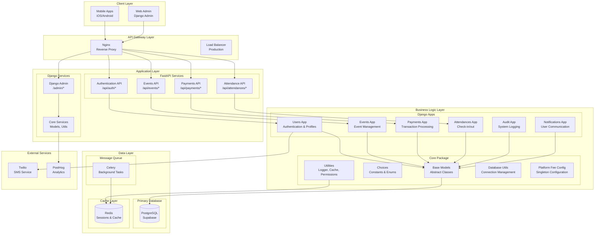
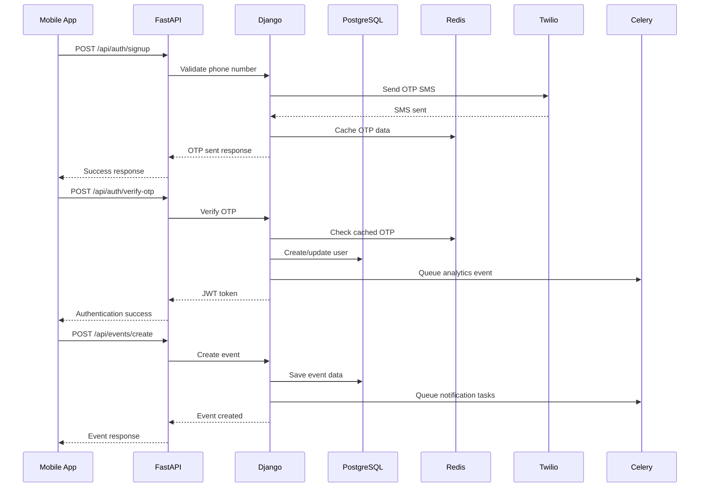

# 🏗️ Loopin Backend Architecture Overview

This document provides a comprehensive technical architecture overview of the Loopin Backend system, detailing the system design, component interactions, and architectural decisions.

## 📋 Table of Contents

### 🏗️ System Architecture
- [High-Level Architecture](#-high-level-architecture)
- [Component Architecture](#-component-architecture)
- [Data Flow Architecture](#-data-flow-architecture)
- [Security Architecture](#-security-architecture)

### 🔧 Technical Components
- [Core Package Structure](#-core-package-structure)
- [Django Apps Architecture](#-django-apps-architecture)
- [API Layer Architecture](#-api-layer-architecture)
- [Database Architecture](#-database-architecture)

### 🚀 Infrastructure & Deployment
- [Container Architecture](#-container-architecture)
- [Service Architecture](#-service-architecture)
- [Monitoring Architecture](#-monitoring-architecture)
- [Scaling Architecture](#-scaling-architecture)

### 📊 Data & Integration
- [Data Architecture](#-data-architecture)
- [External Service Integration](#-external-service-integration)
- [Event-Driven Architecture](#-event-driven-architecture)
- [Caching Architecture](#-caching-architecture)

## 🏗️ System Architecture

### High-Level Architecture



### Component Architecture

#### **API Gateway Layer**
- **Nginx**: Reverse proxy, static file serving, load balancing
- **Load Balancer**: Production traffic distribution
- **SSL Termination**: HTTPS handling

#### **Application Layer**
- **FastAPI**: High-performance API endpoints for mobile apps
- **Django**: Admin interface, ORM, business logic
- **ASGI**: Asynchronous request handling

#### **Business Logic Layer**
- **Django Apps**: Modular business logic components
- **Core Package**: Shared utilities and base classes
- **Service Layer**: Business logic abstraction

#### **Data Layer**
- **PostgreSQL**: Primary data storage (Supabase)
- **Redis**: Caching and session storage
- **Celery**: Asynchronous task processing

### Data Flow Architecture



### Security Architecture

#### **Authentication & Authorization**
- **Phone-based Authentication**: OTP verification via Twilio
- **JWT Tokens**: Stateless authentication
- **Role-based Access**: Django permissions system
- **API Rate Limiting**: Nginx-based protection

#### **Data Security**
- **Encryption at Rest**: Database encryption (Supabase)
- **Encryption in Transit**: HTTPS/TLS
- **PII Protection**: Data anonymization for analytics
- **Audit Logging**: Complete action tracking

#### **Infrastructure Security**
- **Container Security**: Docker best practices
- **Network Isolation**: Docker networks
- **Secret Management**: Environment variables
- **Access Control**: Service-to-service authentication

## 🔧 Technical Components

### Core Package Structure

```
core/
├── __init__.py
├── models.py              # System-wide models (PlatformFeeConfig)
├── admin.py               # Django admin configurations
├── base_models.py         # Abstract base models
├── choices.py             # Application constants
├── db_utils.py            # Database utilities
├── exceptions.py          # Custom exceptions
├── permissions.py         # Permission utilities
├── utils/
│   ├── __init__.py
│   ├── logger.py          # Logging utilities
│   ├── cache.py           # Caching utilities
│   ├── validators.py      # Data validators
│   ├── decorators.py      # Custom decorators
│   └── helpers.py         # Helper functions
├── middleware/
│   ├── __init__.py
│   ├── auth_middleware.py  # Authentication middleware
│   ├── exception_handler.py # Exception handling
│   └── request_logging.py # Request logging
└── signals/
    ├── __init__.py
    ├── notification_events.py # Notification signals
    └── user_activity.py    # User activity signals
```

### Django Apps Architecture

#### **App Structure Standardization**
Each Django app follows a consistent structure:

```
app_name/
├── __init__.py
├── apps.py                # App configuration with verbose_name
├── models.py              # Data models
├── views.py               # Django views
├── serializers.py         # DRF serializers
├── urls.py                # URL patterns
├── admin.py               # Admin interface
├── permissions.py         # App-specific permissions
├── signals.py             # App-specific signals
├── tasks.py               # Celery tasks
├── tests/
│   ├── __init__.py
│   ├── test_models.py
│   ├── test_views.py
│   └── test_serializers.py
└── docs/
    └── README.md          # App documentation
```

#### **App Responsibilities**

| App | Purpose | Key Models | API Endpoints |
|-----|---------|------------|---------------|
| **core** | System-wide configuration | PlatformFeeConfig | Django Admin |
| **users** | User authentication & profiles | UserProfile, PhoneOTP, EventInterest | `/api/auth/*` |
| **events** | Event management | Event, Venue, EventRequest, EventInvite | `/api/events/*` |
| **attendances** | Check-in/check-out | AttendanceRecord, TicketSecret | `/api/attendances/*` |
| **payments** | Payment processing | PaymentOrder, PaymentTransaction | `/api/payments/*` |
| **audit** | System auditing | AuditLog, AuditLogSummary | Internal |
| **notifications** | User communication | Notification, NotificationTemplate | `/api/notifications/*` |

### API Layer Architecture

#### **FastAPI Router Organization**

```
api/
├── __init__.py
├── main.py                # FastAPI app initialization
├── dependencies.py        # Shared dependencies
├── middleware.py          # Custom middleware
├── exceptions.py          # Custom exceptions
├── routers/
│   ├── __init__.py
│   ├── auth.py            # Authentication endpoints
│   ├── users.py           # User management endpoints
│   ├── events.py          # Event management endpoints
│   ├── attendances.py     # Attendance endpoints
│   ├── payments.py        # Payment endpoints
│   ├── notifications.py   # Notification endpoints
│   └── health.py          # Health check endpoints
├── schemas/
│   ├── __init__.py
│   ├── auth.py            # Authentication schemas
│   ├── users.py           # User schemas
│   ├── events.py          # Event schemas
│   └── common.py          # Common schemas
└── docs/
    └── README.md          # API documentation
```

#### **API Design Principles**
- **RESTful Design**: Standard HTTP methods and status codes
- **Resource-based URLs**: Clear, hierarchical URL structure
- **Consistent Response Format**: Standardized JSON responses
- **Error Handling**: Comprehensive error responses
- **API Versioning**: Future-proof API design

### Database Architecture

#### **Database Design Principles**
- **Normalization**: Proper database normalization
- **Indexing Strategy**: Optimized query performance
- **Foreign Key Constraints**: Data integrity
- **Soft Deletes**: Data preservation
- **Audit Trail**: Complete change tracking
- **Singleton Pattern**: System-wide configuration (PlatformFeeConfig)
- **Relationship Consistency**: AttendanceRecord links to UserProfile (not User) for proper data modeling

#### **Core Models**

**PlatformFeeConfig (Singleton)**
- **Purpose**: System-wide platform fee configuration
- **Pattern**: Singleton (only one instance with id=1)
- **Access Control**: Superuser-only modification with password confirmation
- **Caching**: 1-hour TTL with automatic invalidation on updates
- **Usage**: All financial calculations (payouts, payments, analytics)
- **Default Value**: 10% platform fee
- **Business Logic**: Additive fee model (buyer pays base + fee, host earns full base)

**Key Features:**
- Admin-controlled via Django Admin interface
- Three-tier caching: config object, percentage, decimal multiplier
- Automatic cache invalidation on configuration changes
- Used across all financial modules for consistency
- Validation: 0-100% range with proper error handling

#### **Connection Management**
- **Connection Pooling**: Efficient database connections
- **Transaction Management**: ACID compliance
- **Migration Strategy**: Version-controlled schema changes
- **Backup Strategy**: Regular data backups

## 🚀 Infrastructure & Deployment

### Container Architecture

#### **Docker Services**
```yaml
services:
  web:                    # Django + FastAPI application
  postgres:              # PostgreSQL database
  redis:                 # Redis cache and message broker
  celery:                # Background task worker
  celery-beat:           # Scheduled task scheduler
  flower:                # Celery monitoring
  nginx:                 # Reverse proxy (production)
```

#### **Container Orchestration**
- **Development**: Docker Compose with hot reload
- **Production**: Docker Compose with Nginx + Gunicorn
- **Scaling**: Horizontal scaling with load balancers

### Service Architecture

#### **Service Communication**
- **Synchronous**: HTTP/REST API calls
- **Asynchronous**: Celery task queues
- **Event-driven**: Django signals
- **Caching**: Redis-based caching

#### **Service Dependencies**
- **Database**: PostgreSQL primary dependency
- **Cache**: Redis for sessions and caching
- **External Services**: Twilio, PostHog integration
- **Message Queue**: Celery for background tasks

### Monitoring Architecture

#### **Application Monitoring**
- **Health Checks**: Service health endpoints
- **Logging**: Structured logging with levels
- **Metrics**: Performance and business metrics
- **Alerting**: Automated alert system

#### **Infrastructure Monitoring**
- **Container Health**: Docker health checks
- **Resource Usage**: CPU, memory, disk monitoring
- **Network Monitoring**: Traffic and latency
- **Database Monitoring**: Query performance

## 📊 Data & Integration

### Data Architecture

#### **Data Flow Patterns**
- **CRUD Operations**: Standard database operations
- **Event Sourcing**: Audit trail and change tracking
- **CQRS**: Command Query Responsibility Segregation
- **Data Validation**: Multi-layer validation
- **Configuration Management**: Singleton pattern for system-wide settings

#### **Data Storage Strategy**
- **Primary Storage**: PostgreSQL for transactional data
- **Cache Storage**: Redis for frequently accessed data (platform fee config cached for 1 hour)
- **File Storage**: Local/cloud storage for media files
- **Analytics Storage**: PostHog for user analytics
- **Configuration Storage**: PlatformFeeConfig singleton in PostgreSQL with Redis caching

#### **Key Architectural Changes**
- **Platform Fee Configuration**: Moved from hardcoded 10% to configurable singleton model
  - Admin-controlled via Django Admin (superuser-only)
  - Cached for performance (1-hour TTL)
  - Automatic cache invalidation on updates
  - Used by all financial calculations (payouts, payments, analytics)
- **Waitlist System**: Automatic promotion with 3.5-4 hour randomized window
  - No admin approval required
  - Promotion happens during normal API traffic
  - Tracked via `waitlist_started_at` and `waitlist_promote_at` fields
- **Attendance Record Relationship**: Foreign key changed from `User` to `UserProfile`
  - Ensures proper data consistency
  - Migration handles orphaned records automatically

### External Service Integration

#### **Service Integration Patterns**
- **API Integration**: RESTful service communication
- **Webhook Integration**: Event-driven external updates
- **Queue Integration**: Asynchronous service calls
- **Circuit Breaker**: Fault tolerance patterns
- **Configuration Service**: Singleton pattern for system-wide settings

#### **External Services**
- **Twilio**: SMS service for OTP delivery
- **PostHog**: User analytics and event tracking
- **Supabase**: Database hosting and management
- **Future Services**: Payment gateways, email services

#### **Internal Configuration Services**
- **Platform Fee Config**: Singleton model for dynamic fee management
  - Admin interface for fee adjustments
  - Cached configuration for performance
  - Used across all financial modules

### Event-Driven Architecture

#### **Event Types**
- **User Events**: Registration, login, profile updates
- **Business Events**: Event creation, payment processing
- **System Events**: Error logging, performance metrics
- **Integration Events**: External service notifications

#### **Event Processing**
- **Synchronous**: Immediate event processing
- **Asynchronous**: Background event processing
- **Event Sourcing**: Complete event history
- **Event Replay**: Event reconstruction

### Caching Architecture

#### **Caching Strategy**
- **Application Cache**: Django cache framework
- **Database Cache**: Query result caching
- **Session Cache**: User session storage
- **CDN Cache**: Static file caching
- **Configuration Cache**: Platform fee config cached for 1 hour

#### **Cache Invalidation**
- **Time-based**: TTL-based expiration (1 hour for platform fee config)
- **Event-based**: Cache invalidation on data changes (automatic on PlatformFeeConfig updates)
- **Manual**: Explicit cache clearing
- **Pattern-based**: Wildcard cache clearing
- **Configuration Updates**: Automatic cache invalidation when platform fee is modified

## 🔄 Architectural Patterns

### Design Patterns

#### **MVC Pattern**
- **Models**: Django ORM models
- **Views**: Django views and FastAPI endpoints
- **Controllers**: Business logic controllers

#### **Repository Pattern**
- **Data Access**: Abstracted data access layer
- **Business Logic**: Separated from data access
- **Testing**: Easier unit testing

#### **Service Layer Pattern**
- **Business Logic**: Encapsulated in service classes
- **API Layer**: Thin API layer
- **Reusability**: Shared business logic

#### **Singleton Pattern**
- **PlatformFeeConfig**: System-wide configuration singleton
- **Enforcement**: Database-level (id=1) and application-level (admin interface)
- **Benefits**: Single source of truth for platform fee, prevents configuration drift
- **Caching**: Performance optimization with automatic invalidation

### Architectural Principles

#### **SOLID Principles**
- **Single Responsibility**: Each component has one purpose
- **Open/Closed**: Open for extension, closed for modification
- **Liskov Substitution**: Proper inheritance hierarchies
- **Interface Segregation**: Focused interfaces
- **Dependency Inversion**: Dependency injection

#### **Clean Architecture**
- **Domain Layer**: Core business logic
- **Application Layer**: Use cases and services
- **Infrastructure Layer**: External concerns
- **Presentation Layer**: User interfaces

## 🚀 Future Architecture Considerations

### Scalability Planning
- **Horizontal Scaling**: Multi-instance deployment
- **Database Scaling**: Read replicas and sharding
- **Cache Scaling**: Redis clustering
- **CDN Integration**: Global content delivery

### Technology Evolution
- **Microservices**: Service decomposition
- **Event Sourcing**: Complete event history
- **CQRS**: Command Query separation
- **GraphQL**: Flexible API queries

### Performance Optimization
- **Database Optimization**: Query optimization
- **Caching Strategy**: Multi-level caching
- **CDN Integration**: Static asset delivery
- **Load Balancing**: Traffic distribution

---

## 📚 Related Documentation

- **[README.md](./README.md)** - System overview and getting started
- **[SETUP_GUIDE.md](./SETUP_GUIDE.md)** - Step-by-step setup instructions
- **[DOCKER_README.md](./DOCKER_README.md)** - Docker development guide
- **[erd_doc_fixed.md](./erd_doc_fixed.md)** - Database schema and ERD diagrams

---

**This architecture overview provides the foundation for understanding, maintaining, and scaling the Loopin Backend system.** 🏗️
