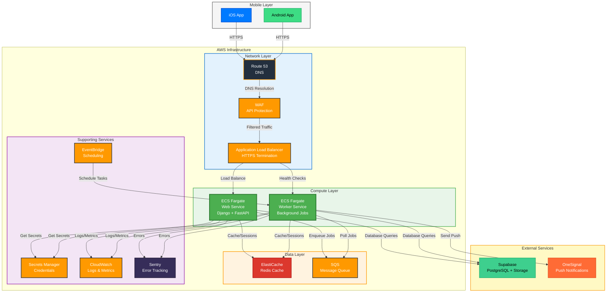
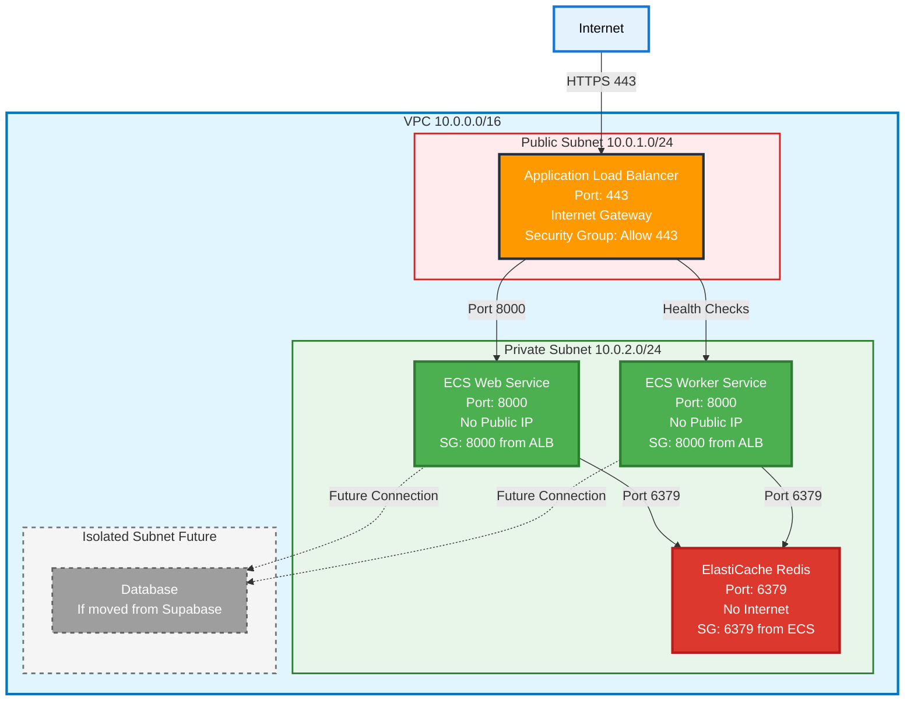
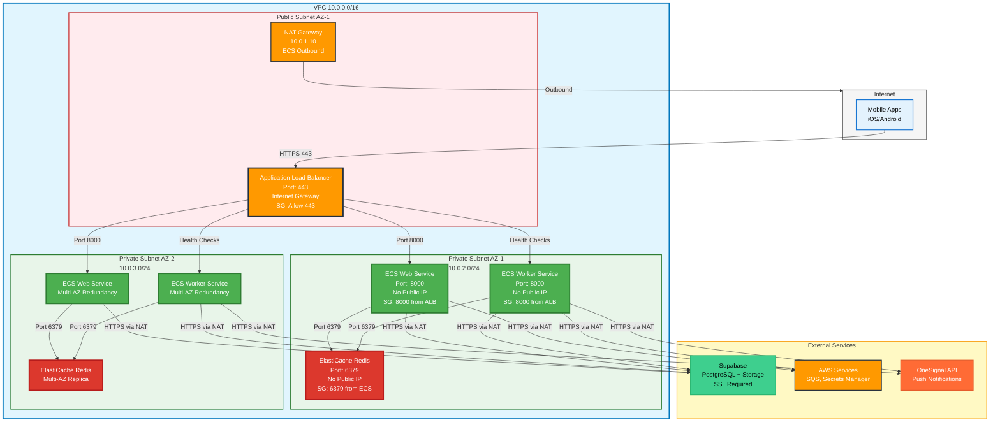
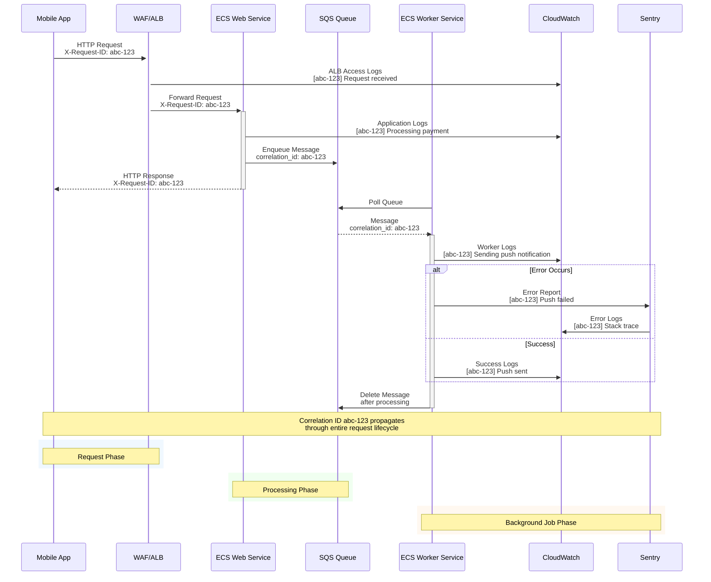
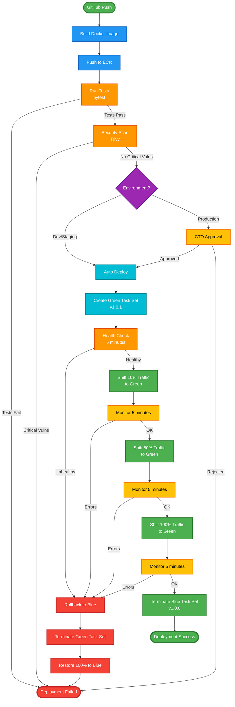

# AWS Infrastructure Strategy - Loopin Backend


**Project:** Loopin Backend (Django + FastAPI) - Mobile-First  
**Current Stack:** Supabase Premium (PostgreSQL + Storage)

---

## 🎯 Executive Summary

This document provides **infrastructure decisions** for Loopin Backend, optimized for a **mobile-first SaaS** with the following business constraints:

- **Scale:** 1K-100K active users (Year 1)
- **Release Velocity:** Weekly deployments
- **Budget:** $150-250/month (lean startup)
- **Reliability Target:** 99.9% uptime (8.76 hours downtime/year)
- **Data Retention:** 7 years (compliance)

**Key Decision:** **ECS Fargate** over Lambda/EC2/EKS because it balances operational simplicity, cost, and scalability for a containerized Django/FastAPI stack with background workers.

### System Architecture Overview



---

## 📊 Decision Matrix

### Must Have (P0 - Blockers)
| Service | Why | Cost | Risk if Missing |
|---------|-----|------|-----------------|
| **ECS Fargate** | Core compute - no alternative | $50-120/mo | Service unavailable |
| **ALB** | HTTPS termination, health checks | $16-25/mo | No load balancing, no SSL |
| **ElastiCache Redis** | Session store, cache, Celery broker | $15-30/mo | Performance degradation, session loss |
| **Secrets Manager** | Secure credential storage | $2-5/mo | Security breach risk |
| **WAF** | API protection (mobile apps are public) | $5-10/mo | DDoS, abuse, data breach |
| **CloudWatch** | Observability (logs, metrics) | $5-15/mo | Blind to production issues |
| **ACM** | Free SSL certificates | $0 | Security vulnerability |
| **Route 53** | DNS management | $1-2/mo | Service unavailable |

**Total Must Have:** $99-207/month

---

### Should Have (P1 - High Value)
| Service | Why | Cost | Tradeoff |
|---------|-----|------|----------|
| **SQS** | Reliable push/webhook queues (vs Redis) | $1-5/mo | Redis cheaper but less reliable |
| **OneSignal** | Push notifications (vs FCM complexity) | $0-9/mo | FCM free but more setup |
| **Sentry** | Error tracking (vs CloudWatch only) | $0-26/mo | CloudWatch cheaper but less actionable |
| **EventBridge** | Scheduled tasks (vs cron in containers) | $1/mo | Cron simpler but less reliable |
| **ECR** | Container registry (vs Docker Hub) | $1-2/mo | Docker Hub free but less integrated |

**Total Should Have:** $4-43/month

---

### Could Have (P2 - Nice to Have)
| Service | Why | Cost | When to Add |
|---------|-----|------|-------------|
| **CloudFront** | Global CDN | $5-15/mo | When expanding beyond India |
| **VPC Flow Logs** | Network audit | $5-10/mo | When security compliance required |
| **CloudTrail** | API audit log | $2-5/mo | When SOC2/ISO27001 needed |
| **AWS Backup** | Automated backups | $5-10/mo | When Supabase backups insufficient |

**Total Could Have:** $17-40/month (skip initially)

---

### Won't Have (P3 - Not Needed)
| Service | Why Not | Alternative |
|---------|---------|-------------|
| **RDS** | Supabase Premium provides PostgreSQL | Supabase |
| **S3** | Supabase Storage handles media | Supabase Storage |
| **DynamoDB** | PostgreSQL sufficient for relational data | Supabase PostgreSQL |
| **Lambda** | Containerized apps need persistent connections | ECS Fargate |
| **EKS** | Overkill for team size, too complex | ECS Fargate |
| **EC2** | More operational overhead than Fargate | ECS Fargate |
| **API Gateway** | ALB sufficient, no serverless needed | ALB |
| **CloudFront** | Supabase CDN sufficient for regional users | Supabase CDN |

---

## 🏗️ Architecture Decision: Why ECS Fargate?

### Comparison Matrix

| Criteria | ECS Fargate | Lambda | EC2 | EKS |
|----------|-------------|--------|-----|-----|
| **Operational Complexity** | ⭐⭐⭐ Low | ⭐⭐⭐⭐ Very Low | ⭐⭐ Medium | ⭐ Very High |
| **Cost (1-10 tasks)** | ⭐⭐⭐ $50-120/mo | ⭐⭐⭐⭐ $20-80/mo | ⭐⭐ $30-60/mo | ⭐ $72+72/mo |
| **Cold Start** | ✅ None | ❌ 1-3s | ✅ None | ✅ None |
| **Long-Running Tasks** | ✅ Yes | ❌ 15min limit | ✅ Yes | ✅ Yes |
| **Database Connections** | ✅ Persistent pools | ❌ Stateless | ✅ Persistent pools | ✅ Persistent pools |
| **Background Workers** | ✅ Native | ❌ Complex | ✅ Native | ✅ Native |
| **Team Expertise Required** | ⭐⭐⭐ Docker | ⭐⭐⭐⭐ Serverless | ⭐⭐ Linux/OS | ⭐ Kubernetes |
| **Scaling Speed** | ⭐⭐⭐ 1-2 min | ⭐⭐⭐⭐ Instant | ⭐⭐ 5-10 min | ⭐⭐⭐ 1-2 min |
| **Vendor Lock-in** | ⭐⭐ Medium | ⭐⭐⭐ High | ⭐ Low | ⭐⭐ Medium |

**Decision: ECS Fargate** because:
1. ✅ **Django/FastAPI need persistent connections** (DB pools, Redis) - Lambda cold starts kill this
2. ✅ **Background workers are core** (Celery, SQS polling) - Lambda 15min limit is insufficient
3. ✅ **Team knows Docker** - Lower learning curve than Kubernetes
4. ✅ **Cost-effective at scale** - Fargate cheaper than EKS, similar to EC2 but less ops
5. ✅ **Auto-scaling built-in** - No need to manage ASGs like EC2

**When to Revisit:**
- If we hit 1000+ concurrent requests → Consider EKS for advanced orchestration
- If we go fully serverless → Lambda + API Gateway (requires app rewrite)
- If cost becomes issue → EC2 with Reserved Instances (more ops overhead)

---

## 🔒 Security Architecture

### Threat Model (STRIDE)

| Threat | Attack Vector | Impact | Mitigation |
|--------|---------------|--------|------------|
| **Spoofing** | API key extraction from mobile app | Unauthorized API access | WAF rate limiting, API key rotation, device fingerprinting |
| **Tampering** | Request manipulation, MITM | Data corruption, fraud | HTTPS only, request signing, input validation |
| **Repudiation** | Denial of actions | Audit trail gaps | CloudTrail, request logging, correlation IDs |
| **Information Disclosure** | Database breach, log exposure | PII leak, compliance violation | Encryption at rest/transit, secrets in Secrets Manager, log sanitization |
| **Denial of Service** | DDoS, brute force | Service unavailability | WAF, rate limiting, auto-scaling, ElastiCache |
| **Elevation of Privilege** | JWT token theft, session hijack | Unauthorized access | Short token expiry, refresh tokens, device binding |

### Zero Trust Principles

1. **Never Trust, Always Verify**
   - All API requests authenticated (JWT)
   - Device tokens validated on every push
   - Secrets rotated every 90 days

2. **Least Privilege Access**
   - ECS tasks use IAM roles (no access keys)
   - Secrets Manager: Read-only for tasks
   - SQS: Send/receive only, no admin
   - ElastiCache: Private subnet, no public access

3. **Micro-Segmentation**



4. **Encryption Everywhere**
   - TLS 1.3 for all traffic (ALB → ECS)
   - ElastiCache encryption in transit
   - Secrets Manager encryption at rest
   - Supabase connection over SSL

### Security Policies

**Password Policy:**
- Min 12 characters, complexity required
- Rotate every 90 days
- MFA required for admin accounts

**Token Policy:**
- JWT access token: 15 minutes
- JWT refresh token: 7 days
- Device tokens: Rotate on app update
- API keys: Rotate every 90 days

**Key Rotation:**
- Secrets Manager: Auto-rotate every 90 days
- JWT secret: Rotate every 180 days (with grace period)
- Supabase keys: Rotate every 90 days
- OneSignal keys: Rotate every 180 days

**RBAC:**
- Admin: Full access (CTO only)
- Developer: Read-only CloudWatch, ECS logs
- CI/CD: Push to ECR, deploy to ECS (via IAM role)

### AppSec: OWASP Mobile Top 10

| Risk | Mitigation |
|------|------------|
| **M1: Improper Platform Usage** | API keys in Secrets Manager, not hardcoded |
| **M2: Insecure Data Storage** | No sensitive data in mobile app, all server-side |
| **M3: Insecure Communication** | HTTPS only, certificate pinning (mobile app) |
| **M4: Insecure Authentication** | JWT with short expiry, refresh tokens |
| **M5: Insufficient Cryptography** | TLS 1.3, AES-256 for encryption |
| **M6: Insecure Authorization** | Role-based access, device token validation |
| **M7: Client Code Quality** | Code review, static analysis (mobile app) |
| **M8: Code Tampering** | App signing, runtime protection (mobile app) |
| **M9: Reverse Engineering** | Code obfuscation (mobile app) |
| **M10: Extraneous Functionality** | No debug endpoints in production |

### Auditing Strategy

**CloudTrail:**
- Retention: 90 days (standard), 7 years (compliance archive to S3)
- Log all API calls: ECS, Secrets Manager, SQS, ElastiCache
- Alert on: Unauthorized access, privilege escalation

**WAF Logs:**
- Retention: 30 days in CloudWatch
- Alert on: Rate limit violations, SQL injection attempts

**Application Logs:**
- Correlation ID: UUID per request (mobile app → API → worker)
- PII sanitization: No phone numbers, emails in logs
- Retention: 30 days (CloudWatch), 7 years (archive to S3 for compliance)

---

## 📐 Network Architecture

### VPC Design



**Security Groups:**

| Resource | Inbound | Outbound |
|----------|---------|----------|
| **ALB** | 443 from 0.0.0.0/0 (WAF filtered) | 8000 to ECS Web SG |
| **ECS Web** | 8000 from ALB SG | 5432 to Supabase, 6379 to Redis SG, HTTPS to internet |
| **ECS Worker** | 8000 from ALB SG (health checks) | 5432 to Supabase, 6379 to Redis SG, HTTPS to internet |
| **ElastiCache** | 6379 from ECS SG | None |

---

## 🔐 IAM Architecture

### Least Privilege Roles

**1. ECS Task Role (Web Service)**
```json
{
  "Version": "2012-10-17",
  "Statement": [
    {
      "Effect": "Allow",
      "Action": [
        "secretsmanager:GetSecretValue"
      ],
      "Resource": "arn:aws:secretsmanager:*:*:secret:loopin/*"
    },
    {
      "Effect": "Allow",
      "Action": [
        "sqs:SendMessage"
      ],
      "Resource": "arn:aws:sqs:*:*:push-notifications"
    },
    {
      "Effect": "Allow",
      "Action": [
        "logs:CreateLogStream",
        "logs:PutLogEvents"
      ],
      "Resource": "arn:aws:logs:*:*:log-group:/ecs/loopin-web:*"
    }
  ]
}
```

**2. ECS Task Role (Worker Service)**
```json
{
  "Version": "2012-10-17",
  "Statement": [
    {
      "Effect": "Allow",
      "Action": [
        "secretsmanager:GetSecretValue"
      ],
      "Resource": "arn:aws:secretsmanager:*:*:secret:loopin/*"
    },
    {
      "Effect": "Allow",
      "Action": [
        "sqs:ReceiveMessage",
        "sqs:DeleteMessage",
        "sqs:GetQueueAttributes"
      ],
      "Resource": [
        "arn:aws:sqs:*:*:push-notifications",
        "arn:aws:sqs:*:*:webhook-events",
        "arn:aws:sqs:*:*:background-jobs"
      ]
    },
    {
      "Effect": "Allow",
      "Action": [
        "logs:CreateLogStream",
        "logs:PutLogEvents"
      ],
      "Resource": "arn:aws:logs:*:*:log-group:/ecs/loopin-worker:*"
    }
  ]
}
```

**3. CI/CD Role (GitHub Actions / GitLab CI)**
```json
{
  "Version": "2012-10-17",
  "Statement": [
    {
      "Effect": "Allow",
      "Action": [
        "ecr:GetAuthorizationToken",
        "ecr:BatchCheckLayerAvailability",
        "ecr:GetDownloadUrlForLayer",
        "ecr:BatchGetImage",
        "ecr:PutImage",
        "ecr:InitiateLayerUpload",
        "ecr:UploadLayerPart",
        "ecr:CompleteLayerUpload"
      ],
      "Resource": "*"
    },
    {
      "Effect": "Allow",
      "Action": [
        "ecs:UpdateService",
        "ecs:DescribeServices"
      ],
      "Resource": "arn:aws:ecs:*:*:service/loopin-web"
    }
  ]
}
```

---

## 📊 Observability Architecture

### Logging Flow



**Correlation ID Standard:**
- Format: UUID v4
- Header: `X-Request-ID` (mobile app sets)
- Log format: `[correlation_id] message`
- Propagation: API → SQS → Worker → Sentry

---

## 🚀 CI/CD Pipeline

### Deployment Strategy: Blue/Green



**Approval Gates:**
- **Automatic:** Dev/Staging environments
- **Manual:** Production (CTO approval required)
- **Automated Tests:** Must pass before deployment
- **Security Scan:** No critical vulnerabilities

**Deployment Frequency:**
- Dev: On every push
- Staging: Daily (automated)
- Production: Weekly (manual approval)

---

## 📈 Auto-Scaling Strategy

### ECS Web Service Scaling

**Triggers:**
1. **CPU Utilization > 70%** (for 2 minutes) → Scale up
2. **Memory Utilization > 80%** (for 2 minutes) → Scale up
3. **ALB Request Count > 1000/min** (for 5 minutes) → Scale up
4. **CPU Utilization < 30%** (for 10 minutes) → Scale down
5. **ALB Request Count < 100/min** (for 15 minutes) → Scale down

**Configuration:**
- Min tasks: 1
- Max tasks: 10
- Target: 2-5 tasks (normal load)
- Scale up: +1 task per minute
- Scale down: -1 task per 5 minutes

### ECS Worker Service Scaling

**Triggers:**
1. **SQS Queue Depth > 100** (for 1 minute) → Scale up
2. **SQS Queue Depth < 10** (for 5 minutes) → Scale down

**Configuration:**
- Min tasks: 1
- Max tasks: 5
- Target: 1-3 tasks (normal load)
- Scale up: +1 task per 30 seconds
- Scale down: -1 task per 5 minutes

---

## 🎯 SLA, RTO, RPO

### Service Level Objectives (SLO)

| Service | Availability Target | RTO | RPO |
|---------|-------------------|-----|-----|
| **API (Web Service)** | 99.9% (8.76 hours/year) | 15 minutes | 0 (real-time) |
| **Push Notifications** | 99.5% (43.8 hours/year) | 1 hour | 5 minutes |
| **Background Jobs** | 99.0% (87.6 hours/year) | 4 hours | 15 minutes |
| **Database (Supabase)** | 99.95% (4.38 hours/year) | 30 minutes | 5 minutes (backup) |

**RTO (Recovery Time Objective):** Maximum acceptable downtime  
**RPO (Recovery Point Objective):** Maximum acceptable data loss

### Risk Register

| Risk | Probability | Impact | Mitigation | Owner |
|------|------------|--------|------------|-------|
| **Supabase outage** | Low | Critical | Multi-region backup, failover to RDS (if needed) | CTO |
| **ECS task failure** | Medium | High | Auto-scaling, health checks, multi-AZ | DevOps |
| **ElastiCache failure** | Low | High | Multi-AZ, daily snapshots, fallback to DB | DevOps |
| **WAF false positives** | Medium | Medium | Whitelist trusted IPs, adjust rules | DevOps |
| **Secrets Manager breach** | Low | Critical | Key rotation, audit logs, MFA | CTO |
| **DDoS attack** | Medium | High | WAF, CloudFront, auto-scaling | DevOps |
| **Vendor lock-in (OneSignal)** | Low | Medium | Abstract push service, support FCM fallback | Backend Lead |
| **Cost overrun** | Medium | Medium | Billing alerts, resource tagging, cost reviews | CTO |

---

## 💰 Cost-to-Value Analysis

### ROI by Service

| Service | Monthly Cost | Value Score | ROI |
|---------|-------------|-------------|-----|
| **ECS Fargate** | $50-120 | ⭐⭐⭐⭐⭐ Critical | High - Core service |
| **ALB** | $16-25 | ⭐⭐⭐⭐⭐ Critical | High - SSL, load balancing |
| **ElastiCache** | $15-30 | ⭐⭐⭐⭐ High | High - Performance boost |
| **WAF** | $5-10 | ⭐⭐⭐⭐⭐ Critical | High - Security essential |
| **Secrets Manager** | $2-5 | ⭐⭐⭐⭐⭐ Critical | High - Security compliance |
| **SQS** | $1-5 | ⭐⭐⭐⭐ High | Medium - Reliability vs cost |
| **OneSignal** | $0-9 | ⭐⭐⭐⭐ High | High - Free tier sufficient |
| **Sentry** | $0-26 | ⭐⭐⭐ Medium | Medium - Nice to have |
| **CloudWatch** | $5-15 | ⭐⭐⭐⭐ High | High - Observability |
| **EventBridge** | $1 | ⭐⭐⭐ Medium | High - Cheap automation |

**Total:** $95-245/month

**Cost Optimization:**
- Start with minimums, scale up based on metrics
- Use free tiers aggressively (SQS, CloudWatch, OneSignal)
- Review costs monthly, right-size quarterly

---

## 📋 Data Retention & Lifecycle

### Retention Policy

| Data Type | Retention | Archive | Delete |
|-----------|-----------|---------|--------|
| **User Data (DB)** | 7 years | N/A | After 7 years (GDPR) |
| **Application Logs** | 30 days | 7 years (S3) | After 7 years |
| **CloudWatch Logs** | 30 days | 7 years (S3) | After 7 years |
| **WAF Logs** | 30 days | 1 year (S3) | After 1 year |
| **CloudTrail** | 90 days | 7 years (S3) | After 7 years |
| **S3 Backups** | 90 days (hot) | 7 years (Glacier) | After 7 years |
| **ElastiCache Snapshots** | 7 days | N/A | After 7 days |

**Archive Strategy:**
- Move to S3 Intelligent-Tiering after retention period
- Move to Glacier after 1 year
- Delete after compliance period (7 years)

---

## 🔄 Change Management

### ITSM Process

**Change Types:**
- **Standard:** Routine changes (deployments) - Auto-approved
- **Normal:** Non-routine changes (config updates) - CTO approval
- **Emergency:** Incident fixes - Post-approval

**Change Approval:**
- **Dev/Staging:** Auto-approved
- **Production:** CTO approval required
- **Security Changes:** CTO + Security review

**Deployment Windows:**
- **Dev:** Anytime
- **Staging:** Business hours
- **Production:** Tuesday-Thursday, 2-4 PM IST (low traffic)

---

## 🧪 Testing Strategy

### Chaos Testing

**Quarterly Chaos Experiments:**
1. **Kill random ECS task** → Verify auto-scaling
2. **Simulate ElastiCache failure** → Verify fallback to DB
3. **Block SQS access** → Verify queue depth alerts
4. **Simulate Supabase outage** → Verify graceful degradation
5. **DDoS simulation** → Verify WAF protection

**Success Criteria:**
- Service recovers within RTO
- No data loss (RPO met)
- Alerts fire correctly
- Runbooks executed successfully

---

## 📝 Next Steps

1. **Week 1:** Set up AWS account, VPC, ECR, ElastiCache
2. **Week 2:** Deploy web service, configure ALB, WAF
3. **Week 3:** Set up worker service, SQS, OneSignal
4. **Week 4:** Monitoring, Sentry, documentation

**Success Metrics:**
- Infrastructure deployed in 4 weeks
- First production deployment successful
- 99.9% uptime achieved
- Cost within $150-250/month budget

---

