# Event Hosting Backend Database Documentation

This markdown file includes the **Mermaid ERD** of the event hosting backend with all tables, fields, relationships, and descriptions. It can be rendered directly on GitHub or any markdown viewer that supports Mermaid.

```mermaid
%%{init: {'theme':'base', 'themeVariables': { 'primaryColor':'#e3f2fd','primaryTextColor':'#1565c0','primaryBorderColor':'#1976d2','lineColor':'#42a5f5','secondaryColor':'#f3e5f5','tertiaryColor':'#e8f5e9','background':'#ffffff','mainBkg':'#ffffff','secondBkg':'#f5f5f5','tertiaryBkg':'#ffffff'}}}%%
erDiagram
    %% -------------------- USERS (Blue Theme) --------------------
    AUTH_USER ||--|| USER_PROFILE : "1-to-1 has profile"
    USER_PROFILE ||--o{ USER_PROFILE_EVENT_INTERESTS : "1-to-many user interests"
    USER_PROFILE_EVENT_INTERESTS ||--|| EVENT_INTEREST : "many-to-many interest mapping"
    USER_PHONE_OTP ||--|| AUTH_USER : "1-to-1 OTP verification"

    %% -------------------- EVENTS (Green Theme) --------------------
    AUTH_USER ||--o{ EVENT : "1 host can create many events"
    EVENT ||--o{ EVENT_REQUEST : "users send requests to join event"
    AUTH_USER ||--o{ EVENT_REQUEST : "1 user can request many events"
    EVENT ||--o{ EVENT_INVITE : "host can invite multiple users"
    AUTH_USER ||--o{ EVENT_INVITE : "users can receive many invites"
    EVENT ||--o{ EVENT_ATTENDEE : "event has attendees after approval/payment"
    VENUE ||--o{ EVENT : "venue hosts multiple events"

    %% -------------------- ATTENDANCE (Yellow Theme) --------------------
    EVENT ||--o{ ATTENDANCE_RECORD : "event has attendance records"
    AUTH_USER ||--o{ ATTENDANCE_RECORD : "user has attendance records"
    ATTENDANCE_RECORD ||--o{ ATTENDANCE_OTP : "attendance record has check-in OTPs"

    %% -------------------- PAYMENTS (Orange Theme) --------------------
    AUTH_USER ||--o{ PAYMENT_ORDER : "user can have many orders"
    EVENT ||--o{ PAYMENT_ORDER : "orders can be tied to events"
    PAYMENT_ORDER ||--o{ PAYMENT_TRANSACTION : "order has multiple transactions"
    PAYMENT_ORDER ||--o{ PAYMENT_WEBHOOK : "order has webhook logs"

    %% -------------------- AUDIT (Purple Theme) --------------------
    AUTH_USER ||--o{ AUDIT_LOG : "user can be actor of many logs"
    AUTH_USER ||--o{ AUDIT_LOG_SUMMARY : "user has audit summaries"

    %% -------------------- TABLE DEFINITIONS --------------------
    %% All tables include created_at and updated_at

    %% Color Definitions for Table Categories
    classDef userTables fill:#e3f2fd,stroke:#1976d2,stroke-width:2px,color:#1565c0
    classDef eventTables fill:#e8f5e9,stroke:#388e3c,stroke-width:2px,color:#2e7d32
    classDef attendanceTables fill:#fffde7,stroke:#f9a825,stroke-width:2px,color:#e65100
    classDef paymentTables fill:#fff3e0,stroke:#f57c00,stroke-width:2px,color:#e65100
    classDef auditTables fill:#f3e5f5,stroke:#7b1fa2,stroke-width:2px,color:#6a1b9a
    classDef junctionTables fill:#f5f5f5,stroke:#616161,stroke-width:2px,color:#424242

    AUTH_USER {
        BIGINT id PK "Primary key"
        UUID uuid "Public UUID"
        STRING username "Phone number used for login"
        STRING password "Hashed password"
        BOOLEAN is_active
        BOOLEAN is_staff
        BOOLEAN is_superuser
        DATETIME date_joined
        DATETIME last_login
        DATETIME created_at
        DATETIME updated_at
    }

    USER_PROFILE {
        BIGINT id PK
        BIGINT user_id FK "FK to AUTH_USER.id"
        UUID uuid "Public UUID"
        STRING name "Full name"
        STRING phone_number "Copy of auth_user.username"
        TEXT bio "User biography"
        STRING location "City/location"
        DATE birth_date
        STRING gender
        JSONB profile_pictures "Array of 1-6 picture URLs"
        BOOLEAN is_verified
        BOOLEAN is_active
        DATETIME created_at
        DATETIME updated_at
    }

    USER_PHONE_OTP {
        BIGINT id PK
        STRING phone_number "Phone number for OTP"
        STRING otp_code "OTP code"
        STRING otp_type "Type of OTP (signup, login, etc.)"
        STRING status "OTP verification status"
        BOOLEAN is_verified
        INT attempts
        DATETIME created_at
        DATETIME updated_at
        DATETIME expires_at
    }

    EVENT_INTEREST {
        BIGINT id PK
        STRING name "Interest name (e.g., Music, Travel)"
        STRING slug "URL-friendly slug"
        TEXT description
        BOOLEAN is_active
        DATETIME created_at
        DATETIME updated_at
    }

    USER_PROFILE_EVENT_INTERESTS {
        BIGINT id PK
        BIGINT userprofile_id FK "FK to USER_PROFILE"
        BIGINT eventinterest_id FK "FK to EVENT_INTEREST"
        DATETIME created_at
        DATETIME updated_at
    }

    VENUE {
        BIGINT id PK
        STRING name
        STRING address
        STRING city
        STRING venue_type "Indoor, outdoor, virtual, hybrid"
        INT capacity
        FLOAT latitude
        FLOAT longitude
        BOOLEAN is_active
        DATETIME created_at
        DATETIME updated_at
    }

    EVENT {
        BIGINT id PK
        BIGINT host_id FK "FK to AUTH_USER"
        STRING title
        TEXT description
        DATETIME start_time
        DATETIME end_time
        BIGINT venue_id FK "FK to VENUE"
        STRING status "draft, published, cancelled, completed, postponed"
        BOOLEAN is_public
        INT max_capacity
        INT going_count
        JSONB cover_images "Array of cover image URLs"
        BOOLEAN is_active
        DATETIME created_at
        DATETIME updated_at
    }

    EVENT_REQUEST {
        BIGINT id PK
        BIGINT event_id FK "FK to EVENT"
        BIGINT requester_id FK "FK to AUTH_USER"
        STRING status "pending, accepted, declined, cancelled"
        TEXT message
        INT seats_requested
        DATETIME created_at
        DATETIME updated_at
    }

    EVENT_INVITE {
        BIGINT id PK
        BIGINT event_id FK "FK to EVENT"
        BIGINT invited_user_id FK "FK to AUTH_USER"
        STRING status "pending, accepted, declined"
        TEXT message
        DATETIME expires_at
        DATETIME created_at
        DATETIME updated_at
    }

    EVENT_ATTENDEE {
        BIGINT id PK
        BIGINT event_id FK "FK to EVENT"
        BIGINT user_id FK "FK to AUTH_USER"
        STRING status "going, not_going, checked_in, cancelled"
        DATETIME checked_in_at
        INT seats
        DATETIME created_at
        DATETIME updated_at
    }

    ATTENDANCE_RECORD {
        BIGINT id PK
        BIGINT event_id FK "FK to EVENT"
        BIGINT user_id FK "FK to AUTH_USER"
        STRING status "going, not_going, checked_in, cancelled"
        STRING payment_status "unpaid, paid, refunded"
        STRING ticket_secret "Unique ticket secret"
        INT seats
        DATETIME checked_in_at
        DATETIME checked_out_at
        TEXT notes
        DATETIME created_at
        DATETIME updated_at
    }

    ATTENDANCE_OTP {
        BIGINT id PK
        BIGINT attendance_record_id FK "FK to ATTENDANCE_RECORD"
        STRING otp_code "Check-in OTP code"
        BOOLEAN is_used
        DATETIME expires_at
        DATETIME created_at
        DATETIME updated_at
    }

    PAYMENT_ORDER {
        BIGINT id PK
        UUID uuid
        BIGINT event_id FK "FK to EVENT"
        BIGINT user_id FK "FK to AUTH_USER"
        STRING order_id "Unique order identifier"
        DECIMAL amount
        STRING currency "INR, USD, EUR, GBP"
        STRING status "pending, completed, failed, refunded"
        STRING provider "razorpay, stripe, paypal"
        STRING provider_payment_id
        JSONB provider_response
        STRING payment_method
        STRING transaction_id
        TEXT failure_reason
        DECIMAL refund_amount
        TEXT refund_reason
        DATETIME refunded_at
        DATETIME expires_at
        DATETIME created_at
        DATETIME updated_at
    }

    PAYMENT_TRANSACTION {
        BIGINT id PK
        BIGINT payment_order_id FK "FK to PAYMENT_ORDER"
        STRING transaction_type "payment, refund, chargeback"
        DECIMAL amount
        STRING provider_transaction_id
        STRING status "pending, completed, failed"
        JSONB provider_response
        TEXT failure_reason
        DATETIME created_at
        DATETIME updated_at
    }

    PAYMENT_WEBHOOK {
        BIGINT id PK
        BIGINT payment_order_id FK "FK to PAYMENT_ORDER"
        STRING webhook_type
        JSONB payload
        STRING signature
        BOOLEAN processed
        TEXT processing_error
        DATETIME created_at
        DATETIME updated_at
    }

    NOTIFICATION {
        BIGINT id PK
        UUID uuid
        BIGINT recipient_user_id FK
        BIGINT sender_user_id FK
        STRING type "event_request, event_invite, system"
        STRING title
        TEXT message
        STRING reference_type
        BIGINT reference_id
        BOOLEAN is_read
        JSONB metadata
        DATETIME created_at
        DATETIME updated_at
    }

    AUDIT_LOG {
        BIGINT id PK
        BIGINT user_id FK "FK to AUTH_USER"
        STRING action "login, logout, create, update, delete, profile_update, password_change"
        STRING object_type
        STRING object_id
        STRING object_uuid
        STRING ip_address
        TEXT user_agent
        STRING session_key
        JSONB metadata
        JSONB old_values
        JSONB new_values
        STRING severity "low, medium, high, critical"
        BOOLEAN is_successful
        TEXT error_message
        DATETIME created_at
        DATETIME updated_at
    }

    AUDIT_LOG_SUMMARY {
        BIGINT id PK
        DATE date
        BIGINT user_id FK "FK to AUTH_USER"
        STRING action
        INT count
        INT successful_count
        INT failed_count
        DATETIME created_at
        DATETIME updated_at
    }

    %% Apply Color Classes to Tables
    class AUTH_USER,USER_PROFILE,USER_PHONE_OTP userTables
    class EVENT,EVENT_INTEREST,EVENT_REQUEST,EVENT_INVITE,EVENT_ATTENDEE,VENUE eventTables
    class ATTENDANCE_RECORD,ATTENDANCE_OTP attendanceTables
    class PAYMENT_ORDER,PAYMENT_TRANSACTION,PAYMENT_WEBHOOK paymentTables
    class AUDIT_LOG,AUDIT_LOG_SUMMARY auditTables
    class USER_PROFILE_EVENT_INTERESTS junctionTables
```

---

## 📚 **Event Hosting Backend Database Documentation**

### **1. Overview**

This database is designed to power a phone application for hosting and attending events. It supports:

- **User registration and verification** via phone/OTP
- **Detailed user profiles** with interests and preferences
- **Event hosting** with rich information (title, description, venue, capacity, etc.)
- **Event attendance workflow**: requests, invites, approvals, attendance tracking, payments
- **Comprehensive payment system** with multiple providers and transaction tracking
- **Advanced attendance management** with check-in/check-out and OTP verification
- **Complete audit logging** for security and compliance
- **Scalable, secure, maintainable, normalized schema** with extendability for future features

The database is implemented in **PostgreSQL** and designed to work seamlessly with **Django ORM** for model management and **FastAPI** for REST API endpoints.

---

### **2. Core Entities**

#### **2.1 Users**
**Tables:** `AUTH_USER`, `USER_PROFILE`, `USER_PHONE_OTP`, `USER_PROFILE_EVENT_INTERESTS`

##### **2.1.1 AUTH_USER**
- **Purpose:** Core authentication table (Django built-in)
- **Logic:** Stores user credentials and basic status flags. Every user has a record here
- **Key fields:**
  - `id`: Internal primary key
  - `uuid`: Public UUID for external references
  - `username`: Phone number used to login (unique)
  - `password`: Hashed password (not used for OTP-only users)
  - `is_active`, `is_staff`, `is_superuser`: User status flags
  - `date_joined`, `last_login`, `created_at`, `updated_at`: For auditing and tracking activity
- **Relationships:**
  - 1-to-1 with `USER_PROFILE` (every user has exactly one profile)
  - 1-to-many with `EVENT` (user can host multiple events)
  - 1-to-many with `EVENT_REQUEST`, `EVENT_INVITE`, `PAYMENT_ORDER`, `NOTIFICATION` (user actions and system communications)

##### **2.1.2 USER_PROFILE**
- **Purpose:** Extended profile information beyond authentication
- **Logic:** Separates personal info from credentials for security and modularity
- **Key fields:**
  - `name`, `phone_number`, `bio`, `location`, `birth_date`, `gender`
  - `profile_pictures`: JSON array of 1–6 pictures
  - `is_verified`: Indicates OTP verification success
  - `is_active`: Profile active status
  - `metadata`: Flexible JSON for future extensibility
  - `created_at`, `updated_at`: Track profile lifecycle
- **Relationships:**
  - 1-to-1 with `AUTH_USER`
  - M-to-M with `EVENT_INTEREST` via `USER_PROFILE_EVENT_INTERESTS` (users can have multiple interests)

##### **2.1.3 USER_PHONE_OTP**
- **Purpose:** OTP verification system for secure phone-based login
- **Logic:** Stores hashed OTPs and their expiry
- **Key fields:**
  - `otp_hash`, `otp_salt`: Securely store OTP
  - `is_verified`, `attempts`: Track success/failure and prevent brute force
  - `expires_at`: Ensures time-limited verification
- **Relationships:**
  - 1-to-1 with `AUTH_USER` (each OTP is tied to a phone/user)

##### **2.1.4 USER_PROFILE_EVENT_INTERESTS**
- **Purpose:** Map user profiles to their interests
- **Logic:** Many-to-many mapping so a user can have multiple interests (Music, Travel, Parties) and each interest can be associated with multiple users
- **Key fields:** `userprofile_id`, `eventinterest_id`
- **Relationships:**
  - M-to-M between `USER_PROFILE` and `EVENT_INTEREST`

#### **2.2 Event Interests**
**Table:** `EVENT_INTEREST`
- **Purpose:** Master list of event types or categories
- **Logic:** Standardizes event tagging; supports filtering and recommendations
- **Key fields:**
  - `name`, `slug`, `description`, `is_active`
  - `created_at`, `updated_at`: Track changes to interests
- **Relationships:**
  - M-to-M with `USER_PROFILE` via `USER_PROFILE_EVENT_INTERESTS`
  - M-to-M with `EVENT` via `EVENT_INTEREST_MAP`

#### **2.3 Venues**
**Table:** `VENUE`
- **Purpose:** Stores physical locations for events
- **Logic:** Centralized venue info allows multiple events at the same venue
- **Key fields:**
  - `name`, `address`, `latitude`, `longitude`
  - `metadata`: Extra info (accessibility, indoor/outdoor, hints)
  - `created_at`, `updated_at`
- **Relationships:**
  - 1-to-many with `EVENT` (a venue can host multiple events)

#### **2.4 Events**
**Table:** `EVENT`
- **Purpose:** Central table representing events hosted by users
- **Logic:** Contains everything a host provides: title, description, type, date/time, capacity, pricing, images, guest rules
- **Key fields:**
  - `host_user_id`: Links to host
  - `title`, `slug`, `mood`, `description`
  - `venue_id` / `venue_text`
  - `event_date`, `start_time`, `duration`
  - `capacity`, `allow_plus_one`, `allowed_genders`
  - `is_paid`, `ticket_price`, `gst_number`, `gst_percent`
  - `cover_images` (JSON array)
  - `is_published`, `is_active`
  - **Counters:** `going_count`, `requests_count` (performance optimization for quick reads)
  - `created_at`, `updated_at`
- **Relationships:**
  - 1-to-many: `EVENT_IMAGE`, `EVENT_REQUEST`, `EVENT_INVITE`, `EVENT_ATTENDEE`, `CAPACITY_RESERVATION`, `PAYMENT_ORDER`
  - M-to-M: `EVENT_INTEREST_MAP` (event can belong to multiple interests)
  - Many-to-one: `VENUE`

#### **2.5 Event Interests Mapping**
**Table:** `EVENT_INTEREST_MAP`
- **Purpose:** Connect events to multiple categories
- **Logic:** Enables searching/filtering by interest type
- **Fields:** `event_id`, `eventinterest_id`, `created_at`, `updated_at`
- **Relationships:**
  - M-to-M between `EVENT` and `EVENT_INTEREST`

#### **2.6 Event Requests**
**Table:** `EVENT_REQUEST`
- **Purpose:** Users request to join an event
- **Logic:** Host reviews request; allows approval/decline
- **Fields:** `event_id`, `requester_user_id`, `message`, `status`, `host_message`, `seats_requested`, `created_at`, `updated_at`
- **Relationships:**
  - Many-to-one: `EVENT` and `AUTH_USER`
  - 1-to-1 optional: `EVENT_ATTENDEE` if request converts to attendance

#### **2.7 Event Invites**
**Table:** `EVENT_INVITE`
- **Purpose:** Hosts can directly invite users
- **Logic:** Supports multiple invite types: direct, shareable link
- **Fields:** `host_user_id`, `invited_user_id`, `status`, `message`, `invite_type`, `expires_at`, `created_at`, `updated_at`
- **Relationships:**
  - Many-to-one: `EVENT`, `AUTH_USER`
  - 1-to-many: Users can receive multiple invites

#### **2.8 Capacity Reservations**
**Table:** `CAPACITY_RESERVATION`
- **Purpose:** Temporary holds on event seats before payment confirmation
- **Logic:** Prevents overbooking for paid events
- **Fields:** `reservation_key`, `event_id`, `user_id`, `seats_reserved`, `consumed`, `expires_at`, `created_at`, `updated_at`
- **Relationships:**
  - Many-to-one: `EVENT`, `AUTH_USER`
  - Converts to `EVENT_ATTENDEE` after payment or approval

#### **2.9 Event Attendees**
**Table:** `EVENT_ATTENDEE`
- **Purpose:** Records final confirmed participants
- **Logic:** Tracks seat count, payment status, and attendance
- **Fields:** `event_id`, `user_id`, `request_id`, `ticket_type`, `seats`, `is_paid`, `price_paid`, `platform_fee`, `status`, `checked_in_at`, `created_at`, `updated_at`
- **Relationships:**
  - Many-to-one: `EVENT`, `AUTH_USER`
  - 1-to-1: `TICKET_SECRET`

#### **2.10 Ticket Secrets**
**Table:** `TICKET_SECRET`
- **Purpose:** Each attendee has a cryptographically secure ticket code
- **Logic:** Ensures ticket redemption cannot be forged
- **Fields:** `ticket_id`, `secret_hash`, `secret_salt`, `is_redeemed`, `redeemed_at`, `created_at`, `updated_at`
- **Relationships:**
  - 1-to-1 with `EVENT_ATTENDEE`

#### **2.11 Payments**
**Table:** `PAYMENT_ORDER`
- **Purpose:** Tracks all payment transactions
- **Logic:** Supports multiple payment providers and refunds
- **Fields:** `uuid`, `order_reference`, `user_id`, `event_id`, `amount`, `currency`, `payment_provider`, `provider_payment_id`, `provider_response`, `status`, `created_at`, `updated_at`
- **Relationships:**
  - Many-to-one: `AUTH_USER` (payer), `EVENT` (optional)

#### **2.12 Notifications**
**Table:** `NOTIFICATION`
- **Purpose:** In-app notifications for users
- **Logic:** Supports system messages, invites, requests, and reminders
- **Fields:** `recipient_user_id`, `sender_user_id`, `type`, `title`, `message`, `reference_type`, `reference_id`, `is_read`, `metadata`, `created_at`, `updated_at`

#### **2.13 Event Images**
**Table:** `EVENT_IMAGE`
- **Purpose:** Store multiple images for events
- **Fields:** `event_id`, `image_url`, `position`, `created_at`, `updated_at`
- **Relationships:**
  - Many-to-one: `EVENT`

#### **2.14 Attendance Management**
**Tables:** `ATTENDANCE_RECORD`, `ATTENDANCE_OTP`

##### **2.14.1 ATTENDANCE_RECORD**
- **Purpose:** Comprehensive attendance tracking with payment and check-in management
- **Fields:** `event_id`, `user_id`, `status`, `payment_status`, `ticket_secret`, `seats`, `checked_in_at`, `checked_out_at`, `notes`
- **Logic:** Tracks user attendance with payment status and check-in/check-out timestamps
- **Relationships:** Many-to-one with `EVENT` and `AUTH_USER`

##### **2.14.2 ATTENDANCE_OTP**
- **Purpose:** OTP-based check-in system for event attendance
- **Fields:** `attendance_record_id`, `otp_code`, `is_used`, `expires_at`
- **Logic:** Generates time-limited OTPs for secure check-in verification
- **Relationships:** Many-to-one with `ATTENDANCE_RECORD`

#### **2.15 Payment System**
**Tables:** `PAYMENT_ORDER`, `PAYMENT_TRANSACTION`, `PAYMENT_WEBHOOK`

##### **2.15.1 PAYMENT_ORDER**
- **Purpose:** Central payment order management with comprehensive tracking
- **Fields:** `event_id`, `user_id`, `order_id`, `amount`, `currency`, `status`, `provider`, `provider_payment_id`, `refund_amount`, `refund_reason`, `expires_at`
- **Logic:** Tracks payment orders with provider integration and refund management
- **Relationships:** Many-to-one with `EVENT` and `AUTH_USER`

##### **2.15.2 PAYMENT_TRANSACTION**
- **Purpose:** Individual transaction tracking within payment orders
- **Fields:** `payment_order_id`, `transaction_type`, `amount`, `provider_transaction_id`, `status`, `provider_response`
- **Logic:** Records individual payment, refund, and chargeback transactions
- **Relationships:** Many-to-one with `PAYMENT_ORDER`

##### **2.15.3 PAYMENT_WEBHOOK**
- **Purpose:** Webhook tracking for payment provider notifications
- **Fields:** `payment_order_id`, `webhook_type`, `payload`, `signature`, `processed`, `processing_error`
- **Logic:** Captures and processes webhook notifications from payment providers
- **Relationships:** Many-to-one with `PAYMENT_ORDER`

#### **2.16 Audit System**
**Tables:** `AUDIT_LOG`, `AUDIT_LOG_SUMMARY`

##### **2.16.1 AUDIT_LOG**
- **Purpose:** Comprehensive audit logging for security and compliance
- **Fields:** `user_id`, `action`, `object_type`, `object_id`, `object_uuid`, `ip_address`, `user_agent`, `severity`, `is_successful`, `old_values`, `new_values`
- **Logic:** Captures all system actions with detailed context and change tracking
- **Relationships:** Many-to-one with `AUTH_USER`

##### **2.16.2 AUDIT_LOG_SUMMARY**
- **Purpose:** Daily audit log statistics and reporting
- **Fields:** `date`, `user_id`, `action`, `count`, `successful_count`, `failed_count`
- **Logic:** Provides aggregated audit statistics for reporting and analysis
- **Relationships:** Many-to-one with `AUTH_USER`

---

### **3. Real-World Logic Behind Design**

#### **Separation of Authentication and Profile:**
- Credentials are sensitive; profile info may be public
- Supports flexible future login methods (social, OTP, passwordless)

#### **Normalization & Junction Tables:**
- `USER_PROFILE_EVENT_INTERESTS` and `EVENT_INTEREST_MAP` prevent duplication and allow many-to-many mappings efficiently

#### **Event Lifecycle:**
Host creates event → users request/are invited → host approves → capacity reserved → payment processed → attendee confirmed → ticket generated → check-in tracked

#### **Scalability:**
- JSONB fields (`cover_images`, `metadata`) support dynamic properties without schema changes
- Counters (`going_count`, `requests_count`) support fast read-heavy queries

#### **Security & Audit:**
- OTP verification, hashed ticket secrets, audit log for all actions

#### **Payment & Reservations:**
- Supports free and paid events
- Platform fees tracked separately for revenue reporting

---

### **4. Relationship Summary**

| Relationship Type | Tables Involved | Description |
|------------------|-----------------|-------------|
| **1-to-1** | `AUTH_USER` → `USER_PROFILE` | Each user has one profile |
| **1-to-many** | `AUTH_USER` → `EVENT` | Host can create multiple events |
| **1-to-many** | `EVENT` → `EVENT_REQUEST` | Event receives multiple join requests |
| **1-to-many** | `EVENT` → `EVENT_INVITE` | Host can invite multiple users |
| **1-to-many** | `EVENT` → `EVENT_ATTENDEE` | Tracks confirmed participants |
| **1-to-many** | `EVENT` → `ATTENDANCE_RECORD` | Event has attendance records |
| **1-to-many** | `EVENT` → `PAYMENT_ORDER` | Event can have multiple payment orders |
| **1-to-many** | `PAYMENT_ORDER` → `PAYMENT_TRANSACTION` | Order can have multiple transactions |
| **1-to-many** | `PAYMENT_ORDER` → `PAYMENT_WEBHOOK` | Order can have multiple webhooks |
| **1-to-many** | `ATTENDANCE_RECORD` → `ATTENDANCE_OTP` | Attendance record can have multiple OTPs |
| **M-to-M** | `USER_PROFILE` ↔ `EVENT_INTEREST` | Users have multiple interests |
| **1-to-many** | `AUTH_USER` → `AUDIT_LOG` | User can have multiple audit logs |
| **1-to-many** | `AUTH_USER` → `AUDIT_LOG_SUMMARY` | User can have multiple audit summaries |

---

This documentation can be presented to both technical and non-technical audiences, as it explains:
- The purpose of each table and field
- The logic behind business flows (requests, payments, attendance, ticketing)
- The relationships between entities
- Security, scalability, and auditability considerations
