# Loopin Backend - Complete Database ERD Documentation

**Production-Ready Event Hosting Platform Database Schema**

This document provides a comprehensive, self-explanatory Entity Relationship Diagram (ERD) of the Loopin backend database. All tables, fields, relationships, and business logic are documented to reflect the current implementation.

```mermaid
%%{init: {'theme':'base', 'themeVariables': { 'primaryColor':'#e3f2fd','primaryTextColor':'#1565c0','primaryBorderColor':'#1976d2','lineColor':'#42a5f5','secondaryColor':'#f3e5f5','tertiaryColor':'#e8f5e9','background':'#ffffff','mainBkg':'#ffffff','secondBkg':'#f5f5f5','tertiaryBkg':'#ffffff'}}}%%
erDiagram
    %% ==================== RELATIONSHIPS ====================
    
    %% Users Module Relationships
    AUTH_USER ||--|| USER_PROFILE : "has profile"
    AUTH_USER ||--o{ USER_PHONE_OTP : "has OTP records"
    USER_PROFILE }o--o{ EVENT_INTEREST : "has interests (M-to-M)"
    
    %% Events Module Relationships
    AUTH_USER ||--o{ EVENT : "hosts events"
    VENUE ||--o{ EVENT : "hosts events"
    EVENT }o--o{ EVENT_INTEREST : "categorized by (M-to-M)"
    EVENT ||--o{ EVENT_REQUEST : "receives requests"
    EVENT ||--o{ EVENT_INVITE : "sends invites"
    EVENT ||--o{ EVENT_ATTENDEE : "has attendees"
    EVENT ||--o{ CAPACITY_RESERVATION : "has reservations"
    EVENT ||--o{ EVENT_IMAGE : "has images"
    AUTH_USER ||--o{ EVENT_REQUEST : "requests events"
    AUTH_USER ||--o{ EVENT_INVITE : "sends invites"
    AUTH_USER ||--o{ EVENT_INVITE : "receives invites"
    AUTH_USER ||--o{ EVENT_ATTENDEE : "attends events"
    EVENT_REQUEST ||--o| EVENT_ATTENDEE : "converts to"
    
    %% Attendance Module Relationships
    EVENT ||--o{ ATTENDANCE_RECORD : "has attendance"
    AUTH_USER ||--o{ ATTENDANCE_RECORD : "has attendance"
    ATTENDANCE_RECORD ||--o{ ATTENDANCE_OTP : "has OTPs"
    ATTENDANCE_RECORD ||--|| TICKET_SECRET : "has secret"
    
    %% Payment Module Relationships
    AUTH_USER ||--o{ PAYMENT_ORDER : "places orders"
    EVENT ||--o{ PAYMENT_ORDER : "linked to"
    PAYMENT_ORDER ||--o{ PAYMENT_TRANSACTION : "has transactions"
    PAYMENT_ORDER ||--o{ PAYMENT_WEBHOOK : "receives webhooks"
    
    %% Notification & Audit Relationships
    AUTH_USER ||--o{ NOTIFICATION : "receives notifications"
    AUTH_USER ||--o{ NOTIFICATION : "sends notifications"
    AUTH_USER ||--o{ AUDIT_LOG : "generates logs"
    AUTH_USER ||--o{ AUDIT_LOG_SUMMARY : "has summaries"

    %% ==================== TABLE DEFINITIONS ====================

    AUTH_USER {
        BIGINT id PK "Primary key, auto-increment"
        UUID uuid "Public unique identifier"
        STRING username "Phone number for authentication"
        STRING email "User email address"
        STRING password "Hashed password"
        STRING first_name "First name"
        STRING last_name "Last name"
        BOOLEAN is_active "Account active status"
        BOOLEAN is_staff "Staff access"
        BOOLEAN is_superuser "Admin access"
        DATETIME date_joined "Account creation timestamp"
        DATETIME last_login "Last login timestamp"
        DATETIME created_at "Record creation"
        DATETIME updated_at "Last update"
    }

    USER_PROFILE {
        BIGINT id PK "Primary key"
        BIGINT user_id FK "One-to-One with AUTH_USER"
        UUID uuid "Public unique identifier"
        STRING name "Full name (2-100 chars)"
        STRING phone_number "Contact number"
        TEXT bio "User biography (max 500)"
        STRING location "City/location (max 100)"
        DATE birth_date "Date of birth"
        STRING gender "male|female|other|prefer_not_to_say"
        JSONB profile_pictures "Array of 1-6 image URLs"
        JSONB metadata "Additional user data"
        BOOLEAN is_verified "Phone verified status"
        BOOLEAN is_active "Profile active"
        DATETIME created_at "Record creation"
        DATETIME updated_at "Last update"
    }

    USER_PHONE_OTP {
        BIGINT id PK "Primary key"
        STRING phone_number "Phone for OTP"
        STRING otp_code "4-digit OTP"
        STRING otp_type "signup|login|password_reset|phone_verification|transaction"
        STRING status "pending|verified|expired|failed"
        BOOLEAN is_verified "OTP verified flag"
        INT attempts "Verification attempts"
        DATETIME expires_at "OTP expiration"
        DATETIME created_at "Creation time"
        DATETIME updated_at "Last update"
    }

    EVENT_INTEREST {
        BIGINT id PK "Primary key"
        STRING name "Interest name"
        STRING slug "URL-friendly slug"
        TEXT description "Interest description"
        BOOLEAN is_active "Interest active"
        DATETIME created_at "Creation"
        DATETIME updated_at "Update"
    }

    VENUE {
        BIGINT id PK "Primary key"
        UUID uuid "Public unique identifier"
        STRING name "Venue name (max 150)"
        TEXT address "Full address"
        STRING city "City name (max 100)"
        STRING venue_type "indoor|outdoor|virtual|hybrid"
        INT capacity "Max capacity (0=unlimited)"
        DECIMAL latitude "Latitude (-90 to 90)"
        DECIMAL longitude "Longitude (-180 to 180)"
        JSONB metadata "Extra info (accessibility, hints)"
        BOOLEAN is_active "Venue active"
        DATETIME created_at "Creation"
        DATETIME updated_at "Update"
    }

    EVENT {
        BIGINT id PK "Primary key"
        BIGINT host_id FK "Event host (AUTH_USER)"
        BIGINT venue_id FK "Linked venue (nullable)"
        UUID uuid "Public unique identifier"
        STRING slug "URL-friendly slug"
        STRING title "Event title (3-200 chars)"
        TEXT description "Event details (min 10 chars)"
        STRING venue_text "Custom venue text (max 255)"
        DATETIME start_time "Event start"
        DATETIME end_time "Event end"
        INT max_capacity "Max attendees (0=unlimited)"
        INT going_count "Confirmed attendees"
        INT requests_count "Pending requests"
        BOOLEAN is_paid "Requires payment"
        DECIMAL ticket_price "Ticket price (0.00)"
        BOOLEAN allow_plus_one "Allow guests"
        STRING gst_number "Host GST number (max 50)"
        STRING allowed_genders "all|male|female|non_binary"
        JSONB cover_images "Array of 1-3 image URLs"
        STRING status "draft|published|cancelled|completed|postponed"
        BOOLEAN is_public "Public visibility"
        BOOLEAN is_active "Event active"
        DATETIME created_at "Creation"
        DATETIME updated_at "Update"
    }

    EVENT_INTEREST_MAP {
        BIGINT id PK "Primary key"
        BIGINT event_id FK "Event"
        BIGINT eventinterest_id FK "Interest"
        DATETIME created_at "Creation"
        DATETIME updated_at "Update"
    }

    EVENT_IMAGE {
        BIGINT id PK "Primary key"
        BIGINT event_id FK "Event"
        TEXT image_url "Image URL"
        INT position "Display order"
        DATETIME created_at "Creation"
        DATETIME updated_at "Update"
    }

    EVENT_REQUEST {
        BIGINT id PK "Primary key"
        BIGINT event_id FK "Requested event"
        BIGINT requester_id FK "User requesting"
        UUID uuid "Public unique identifier"
        STRING status "pending|accepted|declined|cancelled|expired"
        TEXT message "Request message"
        TEXT host_message "Host response"
        INT seats_requested "Number of seats"
        DATETIME created_at "Creation"
        DATETIME updated_at "Update"
    }

    EVENT_INVITE {
        BIGINT id PK "Primary key"
        BIGINT event_id FK "Event"
        BIGINT host_id FK "Inviting host (nullable)"
        BIGINT invited_user_id FK "Invited user"
        UUID uuid "Public unique identifier"
        STRING invite_type "direct|share_link"
        STRING status "pending|accepted|declined|expired"
        TEXT message "Invite message"
        DATETIME expires_at "Invite expiration"
        DATETIME created_at "Creation"
        DATETIME updated_at "Update"
    }

    EVENT_ATTENDEE {
        BIGINT id PK "Primary key"
        BIGINT event_id FK "Event"
        BIGINT user_id FK "Attending user"
        BIGINT request_id FK "Originating request (nullable)"
        UUID uuid "Public unique identifier"
        STRING ticket_type "standard|vip|early_bird|premium|general|group|couple|family|student|senior_citizen|disabled|other"
        INT seats "Number of seats"
        BOOLEAN is_paid "Payment status"
        DECIMAL price_paid "Amount paid"
        DECIMAL platform_fee "Platform fee"
        STRING status "going|not_going|maybe|checked_in|cancelled"
        DATETIME checked_in_at "Check-in time"
        DATETIME created_at "Creation"
        DATETIME updated_at "Update"
    }

    CAPACITY_RESERVATION {
        BIGINT id PK "Primary key"
        BIGINT event_id FK "Event"
        BIGINT user_id FK "Reserving user"
        UUID reservation_key "Unique reservation token"
        INT seats_reserved "Seats held"
        BOOLEAN consumed "Reservation used"
        DATETIME expires_at "Reservation expiration"
        DATETIME created_at "Creation"
        DATETIME updated_at "Update"
    }

    ATTENDANCE_RECORD {
        BIGINT id PK "Primary key"
        BIGINT event_id FK "Event"
        BIGINT user_id FK "Attending user"
        STRING status "going|not_going|maybe|checked_in|cancelled"
        STRING payment_status "unpaid|paid|refunded"
        STRING ticket_secret "Unique ticket code"
        INT seats "Number of seats"
        DATETIME checked_in_at "Check-in timestamp"
        DATETIME checked_out_at "Check-out timestamp"
        TEXT notes "Additional notes"
        DATETIME created_at "Creation"
        DATETIME updated_at "Update"
    }

    ATTENDANCE_OTP {
        BIGINT id PK "Primary key"
        BIGINT attendance_record_id FK "Attendance record"
        STRING otp_code "Check-in OTP"
        BOOLEAN is_used "OTP redeemed"
        DATETIME expires_at "OTP expiration"
        DATETIME created_at "Creation"
        DATETIME updated_at "Update"
    }

    TICKET_SECRET {
        BIGINT id PK "Primary key"
        BIGINT attendance_record_id FK "Attendance record"
        TEXT secret_hash "Hashed secret"
        TEXT secret_salt "Hashing salt"
        BOOLEAN is_redeemed "Ticket used"
        DATETIME redeemed_at "Redemption time"
        DATETIME created_at "Creation"
        DATETIME updated_at "Update"
    }

    PAYMENT_ORDER {
        BIGINT id PK "Primary key"
        BIGINT event_id FK "Event"
        BIGINT user_id FK "Paying user"
        UUID uuid "Public unique identifier"
        STRING order_reference "Order reference ID"
        STRING order_id "Unique order ID"
        DECIMAL amount "Order amount (min 0.01)"
        STRING currency "INR|USD|EUR|GBP"
        STRING status "created|pending|paid|completed|failed|cancelled|refunded|unpaid"
        STRING payment_provider "razorpay|stripe|paypal|paytm|phonepe|gpay|cash|bank_transfer"
        STRING provider_payment_id "Provider payment ID"
        JSONB provider_response "Provider response"
        STRING payment_method "Payment method"
        STRING transaction_id "Transaction ID"
        TEXT failure_reason "Failure details"
        DECIMAL refund_amount "Refund amount"
        TEXT refund_reason "Refund reason"
        DATETIME refunded_at "Refund time"
        DATETIME expires_at "Order expiration"
        DATETIME created_at "Creation"
        DATETIME updated_at "Update"
    }

    PAYMENT_TRANSACTION {
        BIGINT id PK "Primary key"
        BIGINT payment_order_id FK "Parent order"
        STRING transaction_type "payment|refund|chargeback"
        DECIMAL amount "Transaction amount"
        STRING provider_transaction_id "Provider ID"
        STRING status "pending|completed|failed"
        JSONB provider_response "Provider data"
        TEXT failure_reason "Failure details"
        DATETIME created_at "Creation"
        DATETIME updated_at "Update"
    }

    PAYMENT_WEBHOOK {
        BIGINT id PK "Primary key"
        BIGINT payment_order_id FK "Parent order"
        STRING webhook_type "Webhook type"
        JSONB payload "Webhook data"
        STRING signature "Security signature"
        BOOLEAN processed "Processing status"
        TEXT processing_error "Error details"
        DATETIME created_at "Creation"
        DATETIME updated_at "Update"
    }

    NOTIFICATION {
        BIGINT id PK "Primary key"
        BIGINT recipient_id FK "Receiving user"
        BIGINT sender_id FK "Sending user (nullable)"
        UUID uuid "Public unique identifier"
        STRING type "event_request|event_invite|event_update|event_cancelled|payment_success|payment_failed|reminder|system|promotional"
        STRING title "Notification title (max 200)"
        TEXT message "Notification content"
        STRING reference_type "Related model type"
        BIGINT reference_id "Related object ID"
        BOOLEAN is_read "Read status"
        JSONB metadata "Additional data"
        DATETIME created_at "Creation"
        DATETIME updated_at "Update"
    }

    AUDIT_LOG {
        BIGINT id PK "Primary key"
        BIGINT actor_user_id FK "User who acted (nullable)"
        BIGINT user_id FK "Legacy user FK (nullable)"
        STRING action "create|update|delete|login|logout|password_change|profile_update"
        STRING object_type "Model type"
        BIGINT object_id "Object ID"
        STRING object_uuid "Object UUID"
        JSONB payload "Snapshot of changes"
        JSONB metadata "Legacy metadata"
        JSONB old_values "Legacy old values"
        JSONB new_values "Legacy new values"
        INET ip_address "User IP"
        TEXT user_agent "Browser info"
        STRING session_key "Session ID"
        STRING severity "low|medium|high|critical"
        BOOLEAN is_successful "Action success"
        TEXT error_message "Error details"
        DATETIME created_at "Log time"
        DATETIME updated_at "Update"
    }

    AUDIT_LOG_SUMMARY {
        BIGINT id PK "Primary key"
        DATE date "Summary date"
        BIGINT user_id FK "User (nullable)"
        STRING action "Action type"
        INT count "Total actions"
        INT successful_count "Successful"
        INT failed_count "Failed"
        DATETIME created_at "Creation"
        DATETIME updated_at "Update"
    }

    %% Apply styling
    class AUTH_USER,USER_PROFILE,USER_PHONE_OTP userTables
    class EVENT,EVENT_REQUEST,EVENT_INVITE,EVENT_ATTENDEE,VENUE,EVENT_INTEREST,EVENT_INTEREST_MAP,EVENT_IMAGE,CAPACITY_RESERVATION eventTables
    class ATTENDANCE_RECORD,ATTENDANCE_OTP,TICKET_SECRET attendanceTables
    class PAYMENT_ORDER,PAYMENT_TRANSACTION,PAYMENT_WEBHOOK paymentTables
    class NOTIFICATION notificationTables
    class AUDIT_LOG,AUDIT_LOG_SUMMARY auditTables
```



---
## 📚 **Complete Database Schema Documentation**

### **Overview**

The Loopin Backend database is designed for a production-ready event hosting platform with:
- **Phone-based authentication** with OTP verification
- **Comprehensive event management** with hosting, requests, invites, and attendance
- **Multi-provider payment system** with transaction tracking
- **Advanced attendance management** with check-in/check-out and secure ticketing
- **Complete audit trail** for security and compliance
- **Flexible notification system** for user engagement

**Database:** PostgreSQL 15+  
**ORM:** Django ORM  
**API:** FastAPI with ASGI

---

## **1. USERS MODULE** 🎫

### **1.1 AUTH_USER** (Django Built-in)
**Purpose:** Core authentication and authorization

**Key Features:**
- Phone-based authentication (username = phone number)
- JWT token generation for API access
- Role-based access (staff, superuser)
- Account lifecycle management

**Relationships:**
- 1-to-1 → `USER_PROFILE`
- 1-to-many → All user-created content

**Business Logic:**
- Username is the phone number (e.g., +916205829376)
- Active users can authenticate via OTP or password
- UUID provides public identifier for APIs

---

### **1.2 USER_PROFILE** 👤
**Purpose:** Extended profile information

**Required Fields (After Signup):**
- `name` (minimum 2 characters)
- `gender` (male/female/other/prefer_not_to_say)
- `profile_pictures` (1-6 URLs)
- `event_interests` (1-5 selections)

**Optional Fields:**
- `bio` (max 500 characters)
- `location`
- `birth_date`
- `metadata` (JSON for extensibility)

**Business Logic:**
- Profile must be completed before full app access
- Event interests enable personalized recommendations
- Phone verification required for security
- `uuid` used in public APIs

**Validation Rules:**
- Minimum 1, maximum 6 profile pictures
- Minimum 1, maximum 5 event interests
- Name: 2-100 characters, letters only

---

### **1.3 USER_PHONE_OTP** 📱
**Purpose:** Secure phone-based authentication

**OTP Configuration:**
- Length: **4 digits**
- Validity: **10 minutes**
- Max attempts: **3**

**OTP Types:**
- `signup` - New user registration
- `login` - Existing user authentication
- `password_reset` - Password recovery
- `phone_verification` - Verify phone number
- `transaction` - Secure transactions

**Status Flow:**
```
pending → verified (success) OR failed|expired (failure)
```

**Security Features:**
- Single OTP per phone number
- Automatic expiration
- Attempt limiting prevents brute force
- Verified flag prevents reuse

---

### **1.4 EVENT_INTEREST** 🎨
**Purpose:** Event categorization and personalization

**Features:**
- Master list of event categories (Music, Travel, Sports, etc.)
- Slug for URL-friendly navigation
- Many-to-many with users and events
- Active/inactive status

**Examples:** Music, Sports, Travel, Food & Drinks, Culture, Workshop, etc.

---

## **2. EVENTS MODULE** 🎉

### **2.1 VENUE** 📍
**Purpose:** Physical and virtual event locations

**Venue Types:**
- `indoor` - Indoor venues
- `outdoor` - Outdoor locations
- `virtual` - Online events
- `hybrid` - Combined format

**Location Data:**
- `latitude` / `longitude` - Decimal(9,6) for precision
- `address` - Full text address
- `metadata` - Additional info (accessibility, parking, etc.)

**Business Logic:**
- Capacity of 0 = unlimited
- Inactive venues hidden from selections
- UUID for public API references

---

### **2.2 EVENT** 🎊
**Purpose:** Central event entity with complete lifecycle management

**Event Lifecycle:**
```
draft → published → completed
         ↓
     cancelled/postponed
```

**Pricing & Payment:**
- `is_paid` - Free or paid event
- `ticket_price` - Decimal(10,2) in local currency
- `gst_number` - Host's GST registration (India)
- `allow_plus_one` - Guest permissions

**Capacity Management:**
- `max_capacity` - 0 = unlimited
- `going_count` - Confirmed attendees (optimized counter)
- `requests_count` - Pending requests (optimized counter)

**Access Control:**
- `allowed_genders` - all/male/female/non_binary
- `is_public` - Public or private events

**Media:**
- `cover_images` - Array of 1-3 image URLs
- Related `EVENT_IMAGE` table for additional images

**Search & Discovery:**
- `title` - 3-200 characters
- `slug` - Auto-generated, URL-friendly
- `description` - Rich text, minimum 10 characters
- Links to `EVENT_INTEREST` via `EVENT_INTEREST_MAP`

**Venue Options:**
1. Link to existing `VENUE` (`venue_id`)
2. Custom text venue (`venue_text`)
3. Both null (virtual/online)

**Business Rules:**
- `end_time` must be after `start_time`
- Slug auto-generated from title
- UUID for public API access
- Published events visible to users
- Cancelled events soft-deleted

---

### **2.3 EVENT_INTEREST_MAP** 🔗
**Purpose:** Many-to-many mapping between events and interests

**Business Logic:**
- Enables event categorization
- Supports multiple categories per event
- Used for search, filtering, and recommendations

---

### **2.4 EVENT_IMAGE** 📸
**Purpose:** Store multiple images per event with ordering

**Features:**
- `position` - Display order (0, 1, 2, ...)
- `image_url` - Full image URL
- Ordered display in galleries

**Use Cases:**
- Event galleries
- Multiple cover images
- Progressive image loading

---

### **2.5 EVENT_REQUEST** 🙋
**Purpose:** Users request to join events

**Request Flow:**
```
pending → accepted (creates EVENT_ATTENDEE)
       ↓
    declined/cancelled/expired
```

**Key Fields:**
- `message` - User's request note
- `host_message` - Host's response
- `seats_requested` - Number of seats

**Business Rules:**
- One pending request per user per event
- Approved requests convert to `EVENT_ATTENDEE`
- `requests_count` updated on request creation/approval

---

### **2.6 EVENT_INVITE** ✉️
**Purpose:** Hosts directly invite users

**Invite Types:**
- `direct` - Personal invitation
- `share_link` - Shareable invite link

**Features:**
- `expires_at` - Invite validity period
- `host` - Inviting user (optional, defaults to event host)
- `message` - Personal invite note

**Business Rules:**
- One invite per user per event
- Expired invites auto-marked
- Accepted invites create `EVENT_ATTENDEE`

---

### **2.7 EVENT_ATTENDEE** ✅
**Purpose:** Confirmed event participants

**Ticket Types:**
- `standard`, `vip`, `early_bird`, `premium`
- `general`, `group`, `couple`, `family`
- `student`, `senior_citizen`, `disabled`, `other`

**Payment Tracking:**
- `is_paid` - Payment status
- `price_paid` - Amount paid
- `platform_fee` - Platform fee

**Attendance Status:**
- `going` - Confirmed
- `maybe` - Tentative
- `not_going` - Cancelled
- `checked_in` - At event

**Business Logic:**
- Links to originating `EVENT_REQUEST` if applicable
- Multiple seats per attendee supported
- Check-in tracking for paid events
- UUID for public API access

---

### **2.8 CAPACITY_RESERVATION** 🔒
**Purpose:** Temporary seat holds during payment

**Business Logic:**
- Prevents overbooking
- Expires after payment timeout
- Converted to `EVENT_ATTENDEE` after payment
- `reservation_key` - Unique reservation identifier

**Use Case:**
```
User selects seats → Reservation created → Payment → Attendee record
                    ↓ (expires)
                 Reservation cancelled
```

---

## **3. ATTENDANCE MODULE** 🎫

### **3.1 ATTENDANCE_RECORD** 📝
**Purpose:** Comprehensive attendance tracking

**Features:**
- `ticket_secret` - Unique 32-character ticket code
- `payment_status` - unpaid/paid/refunded
- `checked_in_at` / `checked_out_at` - Duration tracking
- `notes` - Additional information

**Business Logic:**
- Unique ticket secret per attendance
- Check-in/check-out tracking
- Duration calculation property

---

### **3.2 ATTENDANCE_OTP** 🔐
**Purpose:** OTP-based check-in verification

**Features:**
- `otp_code` - Check-in OTP
- `is_used` - One-time use
- `expires_at` - Time-limited

**Security:**
- Prevents ticket sharing
- Time-limited validity
- Single-use verification

---

### **3.3 TICKET_SECRET** 🎫
**Purpose:** Cryptographically secure ticket verification

**Security Model:**
- `secret_hash` - Hashed ticket secret
- `secret_salt` - Unique salt per ticket
- `is_redeemed` - Prevents reuse

**Business Logic:**
- One per `ATTENDANCE_RECORD`
- Prevents ticket forgery
- Redemption timestamp

---

## **4. PAYMENT MODULE** 💳

### **4.1 PAYMENT_ORDER** 💰
**Purpose:** Central payment order management

**Payment Providers:**
- `razorpay`, `stripe`, `paypal`
- `paytm`, `phonepe`, `gpay`
- `cash`, `bank_transfer`

**Status Flow:**
```
created → pending → paid/completed OR failed/cancelled
                    ↓
                  refunded
```

**Key Fields:**
- `order_reference` - Human-readable ID
- `order_id` - Unique system ID
- `amount` - Decimal(10,2), min 0.01
- `currency` - INR/USD/EUR/GBP
- `provider_response` - Complete provider data
- `refund_amount` - Partial/full refunds

**Business Rules:**
- `order_reference` auto-generated if not provided
- Expires after 24 hours if unpaid
- Refunds tracked with reason
- Platform fees calculated separately

---

### **4.2 PAYMENT_TRANSACTION** 💸
**Purpose:** Individual transaction tracking

**Transaction Types:**
- `payment` - Initial payment
- `refund` - Refund processing
- `chargeback` - Dispute handling

**Features:**
- Links to `PAYMENT_ORDER`
- Provider-specific transaction IDs
- Complete response logging

---

### **4.3 PAYMENT_WEBHOOK** 📡
**Purpose:** Webhook logging and processing

**Features:**
- `signature` - Security verification
- `payload` - Complete webhook data
- `processed` - Processing status
- Error tracking

**Use Cases:**
- Payment confirmations
- Refund notifications
- Dispute alerts

---

## **5. NOTIFICATION MODULE** 🔔

### **5.1 NOTIFICATION** 📬
**Purpose:** In-app user notifications

**Notification Types:**
- `event_request` - Request received/approved
- `event_invite` - Invitation received
- `event_update` - Event changed
- `event_cancelled` - Event cancelled
- `payment_success` - Payment completed
- `payment_failed` - Payment failed
- `reminder` - Event reminder
- `system` - System notifications
- `promotional` - Marketing messages

**Features:**
- `reference_type` / `reference_id` - Link to object
- `metadata` - Additional context
- `is_read` - Read/unread status
- UUID for API access

**Business Logic:**
- 30-day retention
- Batch processing for campaigns
- Read status tracking

---

## **6. AUDIT MODULE** 🔍

### **6.1 AUDIT_LOG** 📊
**Purpose:** Comprehensive audit trail

**Actions Logged:**
- `create`, `update`, `delete`
- `login`, `logout`
- `password_change`
- `profile_update`

**Security Data:**
- `ip_address` - User IP
- `user_agent` - Browser/client
- `session_key` - Session ID
- `payload` - Data snapshot

**Severity Levels:**
- `low` - Routine actions
- `medium` - Standard changes
- `high` - Sensitive operations
- `critical` - Security events

**Business Logic:**
- Tracks success/failure
- Stores old/new values
- Links to objects via ID/UUID
- Immutable history

---

### **6.2 AUDIT_LOG_SUMMARY** 📈
**Purpose:** Daily audit statistics

**Metrics:**
- `count` - Total actions
- `successful_count` - Successful
- `failed_count` - Failed

**Features:**
- Daily aggregation
- Per-user summaries
- Per-action statistics

**Use Cases:**
- Compliance reporting
- Security monitoring
- Analytics

---

## **7. RELATIONSHIP SUMMARY**

| Relationship | Tables | Description |
|-------------|--------|-------------|
| **1-to-1** | `AUTH_USER` ↔ `USER_PROFILE` | Every user has one profile |
| **1-to-1** | `USER_PHONE_OTP` → Phone | One active OTP per phone |
| **1-to-1** | `ATTENDANCE_RECORD` ↔ `TICKET_SECRET` | One secret per attendance |
| **1-to-Many** | `AUTH_USER` → `EVENT` | Host creates many events |
| **1-to-Many** | `VENUE` → `EVENT` | Venue hosts many events |
| **1-to-Many** | `EVENT` → `EVENT_REQUEST/INVITE/ATTENDEE` | Event has many interactions |
| **1-to-Many** | `EVENT_REQUEST` → `EVENT_ATTENDEE` | Request converts to attendee |
| **1-to-Many** | `PAYMENT_ORDER` → Transactions/Webhooks | Order has many records |
| **1-to-Many** | `ATTENDANCE_RECORD` → `ATTENDANCE_OTP` | Multiple check-in attempts |
| **Many-to-Many** | `USER_PROFILE` ↔ `EVENT_INTEREST` | Users have many interests |
| **Many-to-Many** | `EVENT` ↔ `EVENT_INTEREST` | Events in many categories |

---

## **8. BUSINESS LOGIC & FLOWS**

### **8.1 User Onboarding Flow**
```
1. User enters phone → `USER_PHONE_OTP` created
2. User receives 4-digit OTP via SMS
3. Verify OTP → `AUTH_USER` + `USER_PROFILE` created
4. Complete profile (name, gender, interests, pictures)
5. Profile marked as verified
```

### **8.2 Event Creation Flow**
```
1. Host creates event (draft status)
2. Add details (title, description, venue, pricing)
3. Select event interests
4. Upload cover images
5. Publish event (status: published)
```

### **8.3 Event Attendance Flow (Free)**
```
1. User requests to join → `EVENT_REQUEST` created
2. Host reviews request
3. Approve → `EVENT_ATTENDEE` created
4. Event `going_count` incremented
```

### **8.4 Event Attendance Flow (Paid)**
```
1. User requests to join → `EVENT_REQUEST` created
2. Host approves → `CAPACITY_RESERVATION` created
3. User initiates payment → `PAYMENT_ORDER` created
4. Payment processing → `PAYMENT_TRANSACTION` logged
5. Payment success → `EVENT_ATTENDEE` created + `TICKET_SECRET` generated
6. User receives notification
7. At event → Check-in with `ATTENDANCE_OTP`
```

### **8.5 Event Check-in Flow**
```
1. Attendee arrives at event
2. Generate `ATTENDANCE_OTP` for their `ATTENDANCE_RECORD`
3. Scan/verify OTP → Update `checked_in_at`
4. Status changes: going → checked_in
5. Optional: Check-out with `checked_out_at`
```

---

## **9. SECURITY & PERFORMANCE**

### **9.1 Security Features**
- ✅ **Phone-based authentication** with OTP
- ✅ **JWT tokens** for API access
- ✅ **UUID public identifiers** (no ID exposure)
- ✅ **Hashed ticket secrets** (cryptographic security)
- ✅ **OTP attempt limiting** (prevents brute force)
- ✅ **Audit logging** (all actions tracked)
- ✅ **Payment webhook verification** (signature checks)
- ✅ **Soft deletes** (data retention)

### **9.2 Performance Optimizations**
- 📊 **Counter fields** (`going_count`, `requests_count`) for fast reads
- 📊 **Database indexes** on all foreign keys and search fields
- 📊 **select_related** / **prefetch_related** for query optimization
- 📊 **JSONB fields** for flexible metadata
- 📊 **UUIDs** for distributed systems
- 📊 **Pagination** on all list endpoints

### **9.3 Scalability Features**
- 🚀 **JSONB metadata** for extensibility
- 🚀 **Audit summaries** for reporting
- 🚀 **Webhook logging** for async processing
- 🚀 **Multiple payment providers** for reliability
- 🚀 **Event interest categorization** for discovery
- 🚀 **Capacity reservations** for paid events

---

## **10. DATA VALIDATION RULES**

| Field | Rule | Reason |
|-------|------|--------|
| `profile.name` | 2-100 chars, letters only | Valid names |
| `profile.profile_pictures` | 1-6 URLs | Appropriate photos |
| `profile.event_interests` | 1-5 selections | Personalization |
| `event.title` | 3-200 chars | Meaningful titles |
| `event.description` | min 10 chars | Sufficient detail |
| `event.end_time` | > start_time | Logical timing |
| `venue.latitude` | -90 to 90 | Valid coordinates |
| `venue.longitude` | -180 to 180 | Valid coordinates |
| `otp.attempts` | max 3 | Security |
| `otp.expires_at` | 10 min from creation | Security |
| `payment.amount` | min 0.01 | Valid amount |

---

## **11. API ENDPOINTS OVERVIEW**

### **Authentication** (`/api/auth/`)
- `POST /signup` - Request OTP for signup
- `POST /verify-otp` - Verify OTP
- `POST /complete-profile` - Complete user profile
- `GET /profile` - Get user profile

### **Events** (`/api/events/`)
- `GET /` - List events (filter, search, paginate)
- `POST /` - Create event
- `GET /{id}` - Get event details
- `PUT /{id}` - Update event
- `DELETE /{id}` - Soft delete event
- `GET /{id}/requests` - List requests

### **Venues** (`/api/venues/`)
- `GET /` - List venues
- `POST /` - Create venue
- `PUT /{id}` - Update venue
- `DELETE /{id}` - Delete venue

---

## **12. DEPLOYMENT & MIGRATION STATUS**

✅ **All Migrations Applied**
✅ **All Models Created**
✅ **All Relationships Configured**
✅ **All Indexes Created**
✅ **Production Ready**

---

This documentation is **complete, self-explanatory, and production-ready**. It serves as the single source of truth for the Loopin Backend database schema.
