# Event Hosting Backend Database Documentation

This markdown file includes the **Mermaid ERD** of the event hosting backend with all tables, fields, relationships, and descriptions. It can be rendered directly on GitHub or any markdown viewer that supports Mermaid.

```mermaid
erDiagram
    %% -------------------- USERS --------------------
    AUTH_USER ||--|| USER_PROFILE : "1-to-1 has profile"
    USER_PROFILE ||--o{ USER_PROFILE_EVENT_INTERESTS : "1-to-many user interests"
    USER_PROFILE_EVENT_INTERESTS ||--|| EVENT_INTEREST : "many-to-many interest mapping"
    USER_PHONE_OTP ||--|| AUTH_USER : "1-to-1 OTP verification"

    %% -------------------- EVENTS --------------------
    AUTH_USER ||--o{ EVENT : "1 host can create many events"
    EVENT ||--o{ EVENT_INTEREST_MAP : "event categorized by multiple interests"
    EVENT_INTEREST ||--o{ EVENT_INTEREST_MAP : "many-to-many mapping"
    EVENT ||--o{ EVENT_REQUEST : "users send requests to join event"
    AUTH_USER ||--o{ EVENT_REQUEST : "1 user can request many events"
    EVENT ||--o{ EVENT_INVITE : "host can invite multiple users"
    AUTH_USER ||--o{ EVENT_INVITE : "users can receive many invites"
    EVENT ||--o{ EVENT_ATTENDEE : "event has attendees after approval/payment"
    EVENT_ATTENDEE ||--|| TICKET_SECRET : "each attendee has one secret ticket"
    EVENT ||--o{ CAPACITY_RESERVATION : "temporary holds for paid/free events"
    AUTH_USER ||--o{ CAPACITY_RESERVATION : "user can have multiple reservations"
    EVENT ||--o{ EVENT_IMAGE : "event can have multiple images"
    VENUE ||--o{ EVENT : "venue hosts multiple events"

    %% -------------------- PAYMENTS --------------------
    AUTH_USER ||--o{ PAYMENT_ORDER : "user can have many orders"
    EVENT ||--o{ PAYMENT_ORDER : "orders can be tied to events"

    %% -------------------- NOTIFICATIONS & AUDIT --------------------
    AUTH_USER ||--o{ NOTIFICATION : "user receives many notifications"
    AUTH_USER ||--o{ AUDIT_LOG : "user can be actor of many logs"

    %% -------------------- TABLE DEFINITIONS --------------------
    %% All tables include created_at and updated_at

    AUTH_USER {
        BIGINT id PK "Primary key"
        UUID uuid "Public UUID"
        STRING username "Phone number used for login"
        STRING password "Hashed password"
        BOOLEAN is_active
        BOOLEAN is_staff
        BOOLEAN is_superuser
        DATETIME date_joined
        DATETIME last_login
        DATETIME created_at
        DATETIME updated_at
    }

    USER_PROFILE {
        BIGINT id PK
        BIGINT user_id FK "FK to AUTH_USER.id"
        UUID uuid "Public UUID"
        STRING name "Full name"
        STRING phone_number "Copy of auth_user.username"
        TEXT bio "User biography"
        STRING location "City/location"
        DATE birth_date
        STRING gender
        JSONB profile_pictures "Array of 1-6 picture URLs"
        BOOLEAN is_verified
        BOOLEAN is_active
        DATETIME created_at
        DATETIME updated_at
    }

    USER_PHONE_OTP {
        BIGINT id PK
        STRING phone_number "Phone number for OTP"
        TEXT otp_hash "Hashed OTP"
        TEXT otp_salt "Salt for hashing"
        BOOLEAN is_verified
        INT attempts
        DATETIME created_at
        DATETIME updated_at
        DATETIME expires_at
    }

    EVENT_INTEREST {
        BIGINT id PK
        STRING name "Interest name (e.g., Music, Travel)"
        STRING slug "URL-friendly slug"
        TEXT description
        BOOLEAN is_active
        DATETIME created_at
        DATETIME updated_at
    }

    USER_PROFILE_EVENT_INTERESTS {
        BIGINT id PK
        BIGINT userprofile_id FK "FK to USER_PROFILE"
        BIGINT eventinterest_id FK "FK to EVENT_INTEREST"
        DATETIME created_at
        DATETIME updated_at
    }

    VENUE {
        BIGINT id PK
        UUID uuid
        STRING name
        TEXT address
        NUMERIC latitude
        NUMERIC longitude
        JSONB metadata "Extra info, accessibility, capacity hints"
        DATETIME created_at
        DATETIME updated_at
    }

    EVENT {
        BIGINT id PK
        UUID uuid
        BIGINT host_user_id FK
        STRING title
        STRING slug
        STRING mood "Party, Picnic, Travel etc."
        TEXT description
        BIGINT venue_id FK
        STRING venue_text "Custom venue if not in VENUE table"
        DATE event_date
        TIME start_time
        STRING duration
        INT capacity
        BOOLEAN is_paid
        NUMERIC ticket_price
        STRING gst_number
        NUMERIC gst_percent
        BOOLEAN allow_plus_one
        STRING allowed_genders "all, male, female, non-binary"
        JSONB cover_images "Array of 1-3 URLs"
        BOOLEAN is_published
        BOOLEAN is_active
        INT going_count
        INT requests_count
        DATETIME created_at
        DATETIME updated_at
    }

    EVENT_INTEREST_MAP {
        BIGINT id PK
        BIGINT event_id FK
        BIGINT eventinterest_id FK
        DATETIME created_at
        DATETIME updated_at
    }

    EVENT_REQUEST {
        BIGINT id PK
        UUID uuid
        BIGINT event_id FK
        BIGINT requester_user_id FK
        TEXT message
        STRING status "pending, accepted, declined, cancelled"
        TEXT host_message
        INT seats_requested
        DATETIME created_at
        DATETIME updated_at
    }

    EVENT_INVITE {
        BIGINT id PK
        UUID uuid
        BIGINT event_id FK
        BIGINT host_user_id FK
        BIGINT invited_user_id FK
        STRING status "pending, accepted, declined"
        TEXT message
        STRING invite_type "direct, share_link"
        DATETIME expires_at
        DATETIME created_at
        DATETIME updated_at
    }

    CAPACITY_RESERVATION {
        BIGINT id PK
        UUID reservation_key
        BIGINT event_id FK
        BIGINT user_id FK
        INT seats_reserved
        BOOLEAN consumed
        DATETIME expires_at
        DATETIME created_at
        DATETIME updated_at
    }

    EVENT_ATTENDEE {
        BIGINT id PK
        UUID uuid
        BIGINT event_id FK
        BIGINT user_id FK
        BIGINT request_id FK
        STRING ticket_type "standard, VIP etc."
        INT seats
        BOOLEAN is_paid
        NUMERIC price_paid
        NUMERIC platform_fee
        STRING status "going, not_going, checked_in, cancelled"
        DATETIME checked_in_at
        DATETIME created_at
        DATETIME updated_at
    }

    TICKET_SECRET {
        BIGINT id PK
        BIGINT ticket_id FK
        TEXT secret_hash
        TEXT secret_salt
        BOOLEAN is_redeemed
        DATETIME redeemed_at
        DATETIME created_at
        DATETIME updated_at
    }

    PAYMENT_ORDER {
        BIGINT id PK
        UUID uuid
        STRING order_reference
        BIGINT user_id FK
        BIGINT event_id FK
        NUMERIC amount
        STRING currency
        STRING payment_provider
        STRING provider_payment_id
        JSONB provider_response
        STRING status "created, paid, failed, refunded"
        DATETIME created_at
        DATETIME updated_at
    }

    NOTIFICATION {
        BIGINT id PK
        UUID uuid
        BIGINT recipient_user_id FK
        BIGINT sender_user_id FK
        STRING type "event_request, event_invite, system"
        STRING title
        TEXT message
        STRING reference_type
        BIGINT reference_id
        BOOLEAN is_read
        JSONB metadata
        DATETIME created_at
        DATETIME updated_at
    }

    AUDIT_LOG {
        BIGINT id PK
        BIGINT actor_user_id FK
        STRING object_type
        BIGINT object_id
        STRING action "create, update, delete"
        JSONB payload "Snapshot of data changed"
        DATETIME created_at
        DATETIME updated_at
    }

    EVENT_IMAGE {
        BIGINT id PK
        BIGINT event_id FK
        TEXT image_url
        INT position
        DATETIME created_at
        DATETIME updated_at
    }
```

