# Public Event URL Integration Guide

## Overview

This guide explains how to integrate the **Public API for Single Event URL Sharing** into your frontend application. This API enables SEO-optimized, shareable event URLs that work seamlessly for web sharing, social media previews (WhatsApp, Facebook, Twitter), and search engine indexing.

## Purpose

The Public Event URL API provides a minimal, public endpoint for rendering single event pages with proper SEO metadata. This enables:

- **SEO-Optimized Event Pages**: Event pages that are fully crawlable and indexable by search engines
- **Social Media Sharing**: Rich previews on WhatsApp, Facebook, Twitter with OpenGraph metadata
- **Stable URLs**: Canonical URLs that never break, even when event titles or locations change
- **301 Redirects**: Automatic redirects to canonical URLs when slug/city mismatches occur

## Base URL and Endpoint

**Base URL**: Your backend API base URL (e.g.,`https://loopinbackend-g17e.onrender.com`)

**Endpoint**: `GET /api/public/events/{canonical_id}/seo`

**Authentication**: None required (public endpoint)

## URL Format

Events are accessible via canonical URLs in the following format:

```
http://loopinsocial.in/in/{city_slug}/events/{event_slug}--{canonical_id}
```

**Example**:
```
http://loopinsocial.in/in/bangalore/events/tech-founder-meetup--a9x3k
```

### URL Components

- **`in`**: Country code (India - fixed)
- **`{city_slug}`**: URL-safe city name (e.g., `bangalore`, `mumbai`, `delhi`)
- **`{event_slug}`**: SEO-friendly event title slug (e.g., `tech-founder-meetup`)
- **`{canonical_id}`**: Immutable Base62 identifier (e.g., `a9x3k`)

**Important**: The `canonical_id` is the authoritative identifier. The slug can change, but the canonical_id never changes, ensuring links remain valid forever.

## Integration Flow

```mermaid
sequenceDiagram
    autonumber
    participant User as 👤 User
    participant Browser as 🌐 Browser
    participant Frontend as 💻 Frontend App
    participant API as 🚀 Public API
    participant DB as 💾 Database
    
    User->>Browser: Visits event URL<br/>/in/bangalore/events/tech-meetup--a9x3k
    Browser->>Frontend: Route to event page
    Frontend->>Frontend: Extract canonical_id from URL<br/>(part after "--")
    
    Frontend->>API: GET /api/public/events/{canonical_id}/seo<br/>?url_city_slug=bangalore<br/>&url_event_slug=tech-meetup
    API->>DB: Fetch event by canonical_id<br/>(public, published, active only)
    DB-->>API: Event data
    
    alt URL Slug/City Mismatch
        API-->>Frontend: 301 Redirect<br/>Location: canonical_url
        Frontend->>Browser: Follow redirect
        Browser->>Frontend: Load canonical URL
        Frontend->>API: GET /api/public/events/{canonical_id}/seo
        API->>DB: Fetch event
        DB-->>API: Event data
        API-->>Frontend: 200 OK + Event Data
    else URL Valid
        API-->>Frontend: 200 OK + Event Data
    end
    
    Frontend->>Frontend: Generate SEO metadata<br/>(title, description, OpenGraph)
    Frontend->>Browser: Render HTML with meta tags
    Browser-->>User: Display event page
```



### Step 1: Extract Canonical ID from URL

When a user visits an event URL (e.g., `/in/bangalore/events/tech-meetup--a9x3k`), your frontend routing should:

1. Parse the URL path to extract the `canonical_id`
   - The canonical_id is the part after the `--` separator
   - Example: From `/in/bangalore/events/tech-meetup--a9x3k`, extract `a9x3k`

2. Extract optional validation parameters (if available):
   - `city_slug`: `bangalore` (from URL path)
   - `event_slug`: `tech-meetup` (from URL path before `--`)

### Step 2: Call the Public API

Make a GET request to the endpoint with the extracted `canonical_id`:

**Request**:
```
GET /api/public/events/{canonical_id}/seo?url_city_slug={city_slug}&url_event_slug={event_slug}
```

**Query Parameters** (optional, for validation):
- `url_city_slug`: City slug from the URL path (for validation)
- `url_event_slug`: Event slug from the URL path (for validation)

**Example Request**:
```
GET /api/public/events/a9x3k/seo?url_city_slug=bangalore&url_event_slug=tech-meetup
```

### Step 3: Handle API Response

The API can return two types of responses:

#### Response Type 1: Event Data (200 OK)

If the URL is valid and matches the database, the API returns event data:

**Response Fields**:
- `event_title`: Event title
- `about_event`: Event description
- `event_image_url`: First cover image URL (or empty string)
- `start_time`: ISO 8601 formatted start time
- `end_time`: ISO 8601 formatted end time
- `city`: City name (display name)
- `venue_or_location`: Venue name or location text
- `canonical_url`: Full canonical URL (absolute URL)

**Example Response**:
```json
{
  "event_title": "Tech Founder Meetup",
  "about_event": "Join us for an evening of networking and discussions...",
  "event_image_url": "https://example.com/image.jpg",
  "start_time": "2024-12-25T18:00:00Z",
  "end_time": "2024-12-25T21:00:00Z",
  "city": "Bangalore",
  "venue_or_location": "Tech Hub, Koramangala",
  "canonical_url": "http://loopinsocial.in/in/bangalore/events/tech-founder-meetup--a9x3k"
}
```

#### Response Type 2: 301 Redirect

If the URL slug or city doesn't match the database (e.g., event title changed), the API returns a **301 Permanent Redirect** response.

**What to do**:
- Follow the redirect automatically (browser does this automatically)
- Update the browser URL to the canonical URL from the `Location` header
- This ensures users always see the correct, canonical URL

### Step 4: Render the Event Page

Using the event data from the API response, render the event page with:

1. **Page Title**: `{event_title} in {city} | Loopin`

2. **Meta Description**: Use `about_event` (truncate to 160 characters if needed)

3. **Canonical URL**: Set `<link rel="canonical">` to the `canonical_url` from the response

4. **OpenGraph Tags** (for social sharing):
   - `og:title`: `event_title`
   - `og:description`: `about_event` (truncate to 200 characters)
   - `og:image`: `event_image_url`
   - `og:url`: `canonical_url`
   - `og:type`: `website`

5. **Twitter Card Tags**:
   - `twitter:card`: `summary_large_image`
   - `twitter:title`: `event_title`
   - `twitter:description`: `about_event`
   - `twitter:image`: `event_image_url`

6. **Page Content**: Display event details (title, description, image, date/time, location, etc.)

### Step 5: Handle Errors

**404 Not Found**:
- Event doesn't exist or is not publicly visible
- Display a "Event not found" page
- Optionally redirect to events listing page

**Error Response Format**:
```json
{
  "success": false,
  "error": "Event with canonical ID 'xxx' not found or not publicly visible.",
  "error_code": "EVENT_NOT_FOUND",
  "details": {}
}
```

## Integration Architecture

### Request Flow Diagram


### URL Resolution Logic

The backend performs the following validation:

1. **Extract canonical_id**: From the URL path
2. **Fetch Event**: By canonical_id (must be public, published, active)
3. **Validate Slug/City**: Compare URL slug/city with database values
4. **Redirect or Return**: 
   - If mismatch → 301 redirect to canonical URL
   - If valid → Return event data

### SEO Metadata Generation

The frontend should generate server-side or client-side (for SSR frameworks like Next.js) the following metadata:

- **HTML Title Tag**: Used by search engines and browser tabs
- **Meta Description**: Shown in search results
- **Canonical Link**: Prevents duplicate content issues
- **OpenGraph Tags**: For rich social media previews (WhatsApp, Facebook)
- **Twitter Card Tags**: For Twitter/X previews
- **JSON-LD Schema** (optional): Structured data for search engines (Event schema)

## Best Practices

### 1. Server-Side Rendering (SSR)

For optimal SEO, render event pages on the server (e.g., using Next.js, Nuxt, or similar frameworks):

- Fetch event data server-side
- Generate meta tags server-side
- Return fully rendered HTML to search engines and social media crawlers

### 2. Client-Side Rendering (CSR)

If using client-side rendering:

- Fetch event data on page load
- Update meta tags dynamically (some crawlers may not see these)
- Consider using a meta tag management library

### 3. URL Handling

- **Always use canonical URLs**: When generating share links, use the `canonical_url` from the API response
- **Follow redirects**: If the API returns a 301, update the browser URL to the canonical URL
- **Preserve URL structure**: Maintain the `/in/{city_slug}/events/{slug}--{canonical_id}` format in your routing

### 4. Caching

- **CDN Caching**: Event pages can be cached at the CDN level (cache key = full canonical URL)
- **Cache Invalidation**: Backend invalidates cache when event details change
- **Client-Side Caching**: Cache event data in your frontend state management (React Query, SWR, etc.)

### 5. Error Handling

- **404 Handling**: Show user-friendly "Event not found" page
- **Network Errors**: Retry logic for transient failures
- **Redirect Handling**: Automatically follow 301 redirects

### 6. Performance

- **Optimize Images**: Use `event_image_url` for OpenGraph, but serve optimized versions
- **Lazy Loading**: Lazy load images and content below the fold
- **Minimal Bundle**: Event pages should load fast (SEO ranking factor)

## Example Integration Scenarios

### Scenario 1: Next.js (Server-Side Rendering)

1. Create a dynamic route: `/in/[city_slug]/events/[slug]--[canonical_id]`
2. In `getServerSideProps`, extract `canonical_id` from the route
3. Call the API endpoint server-side
4. Generate meta tags in the page component
5. Return event data and meta tags to the page

### Scenario 2: React Router (Client-Side Rendering)

1. Define route: `/in/:citySlug/events/:eventSlug--:canonicalId`
2. In the route component, extract `canonicalId` from params
3. Call the API endpoint on component mount
4. Update document meta tags using a meta tag library (e.g., `react-helmet`)
5. Render event content

### Scenario 3: Static Site Generation (SSG)

1. Pre-generate event pages at build time (if events are known)
2. For dynamic events, use incremental static regeneration (ISR)
3. Generate meta tags at build time
4. Fallback to API call for new events

## Social Media Sharing

### WhatsApp Sharing

WhatsApp uses OpenGraph tags for link previews. Ensure:

- `og:title`, `og:description`, `og:image`, `og:url` are set
- Images are publicly accessible (no authentication required)
- Image dimensions: 1200x630px recommended
- Image format: JPG or PNG

### Facebook Sharing

Similar to WhatsApp, Facebook uses OpenGraph tags. Test your URLs using:
- Facebook Sharing Debugger: `https://developers.facebook.com/tools/debug/`

### Twitter/X Sharing

Twitter uses Twitter Card tags. Test using:
- Twitter Card Validator: `https://cards-dev.twitter.com/validator`

## Testing

### Manual Testing Checklist

- [ ] Event page loads with correct title and description
- [ ] Meta tags are present in HTML source
- [ ] OpenGraph tags are correct
- [ ] Twitter Card tags are correct
- [ ] Canonical URL is set correctly
- [ ] 301 redirects work when slug/city mismatch
- [ ] 404 error handled for non-existent events
- [ ] Images load correctly
- [ ] Page is crawlable (check with Google Search Console)
- [ ] Social media previews work (WhatsApp, Facebook, Twitter)

### Testing Tools

- **Google Rich Results Test**: Test structured data (if using JSON-LD)
- **Facebook Sharing Debugger**: Test OpenGraph tags
- **Twitter Card Validator**: Test Twitter Card tags
- **Google Search Console**: Monitor indexing and crawling

## Troubleshooting

### Issue: Meta tags not showing in social media previews

**Solution**: 
- Ensure meta tags are rendered server-side (not injected via JavaScript)
- Check that images are publicly accessible
- Verify OpenGraph tags are in the HTML source

### Issue: 301 redirects not working

**Solution**:
- Ensure your HTTP client follows redirects automatically
- Check that the redirect URL is correct
- Verify the backend is returning the correct status code

### Issue: Event not found (404)

**Possible Causes**:
- Event doesn't exist
- Event is not public (`is_public=False`)
- Event is not published (`status != "published"`)
- Event is inactive (`is_active=False`)

**Solution**: Check event visibility settings in the backend

## Summary

The Public Event URL API provides a simple, minimal endpoint for rendering SEO-optimized event pages. Key integration steps:

1. Extract `canonical_id` from the event URL
2. Call `GET /api/public/events/{canonical_id}/seo`
3. Handle 301 redirects if URL mismatch
4. Render event page with SEO metadata (title, description, OpenGraph, etc.)
5. Handle errors gracefully (404, network errors)

This API enables shareable, SEO-friendly event URLs that work seamlessly across web, social media, and search engines.
