# Events Module Documentation

## Overview
The Events module handles event creation, management, and user interactions within the Loopin platform. The API uses FastAPI for modern, async REST endpoints with comprehensive validation and business logic.

---

## Architecture

### Project Structure
```
events/
├── admin.py              # Django admin configuration
├── apps.py               # App configuration
├── models.py             # Database models
├── schemas.py            # Pydantic validation schemas (FastAPI)
├── services.py           # Business logic services
├── serializers/          # DRF serializers (legacy, unused)
│   ├── __init__.py
│   └── event_serializers.py
├── views/                # Django REST views (legacy, unused)
│   ├── __init__.py
│   └── event_views.py
├── tests/                # Test suite
│   ├── __init__.py
│   ├── README.md
│   └── test_events.py
├── migrations/           # Database migrations
├── docs/                 # Documentation
│   └── README.md
└── __init__.py          # Package initialization
```

### API Architecture
- **Framework**: FastAPI with async/await support
- **Validation**: Pydantic v2 schemas
- **Database**: Django ORM with sync_to_async
- **Authentication**: JWT tokens via `/api/auth/login`
- **Router Location**: `api/routers/events.py`

---

## System Flow Diagrams

### Event Hosting Lifecycle

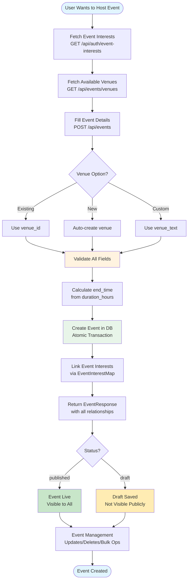

### Event Request Workflow

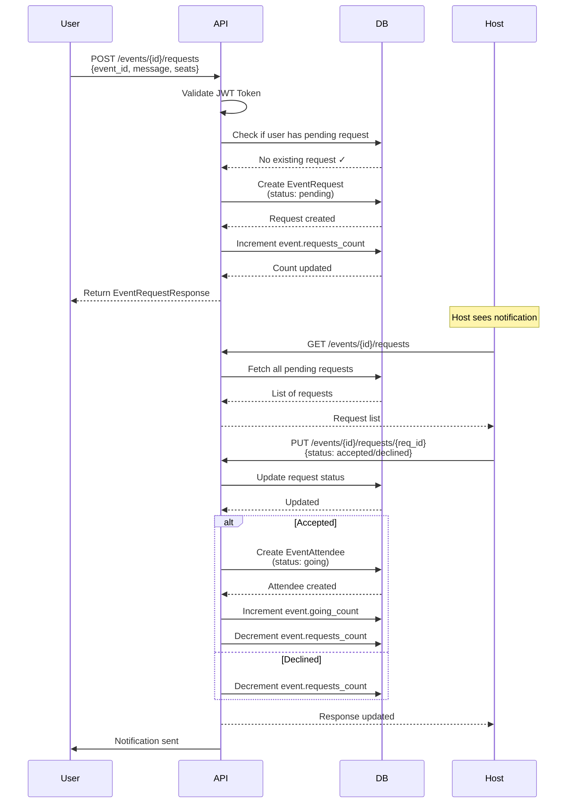

### Venue Management Flow

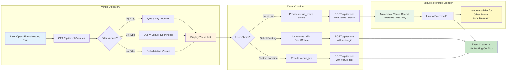

**Note**: Venues are reference data only—the platform does not manage physical venue bookings. Multiple events can use the same venue simultaneously without conflicts. Event capacity is controlled by `Event.max_capacity`, not the venue's capacity field.

### Soft Delete & Visibility Rules

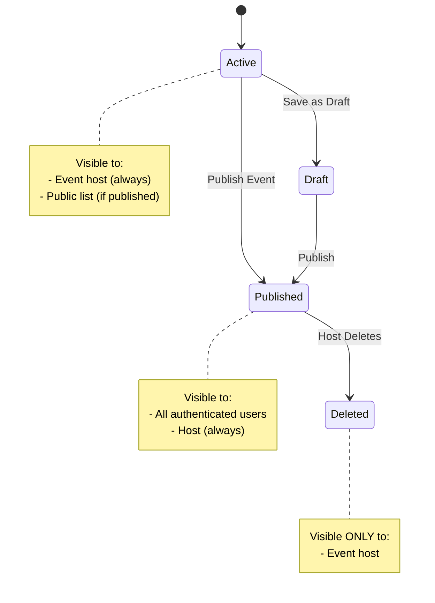

### Authentication & Authorization Flow

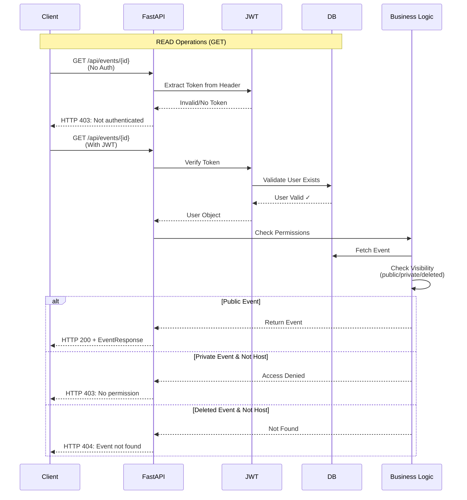

---

## Models

### Venue
- **Purpose**: Reference data for physical locations to avoid duplicating location details
- **Key Fields**: uuid, name, address, city, venue_type, capacity, latitude, longitude, metadata
- **Relationships**: One-to-many with Event
- **Soft Delete**: is_active flag
- **Important Notes**:
  - The platform does **not** create or manage physical venues—venues are reference data only
  - The `capacity` field in Venue is informational only; the actual capacity for an event is stored in `Event.max_capacity`
  - Multiple events can use the same venue simultaneously—there are no booking restrictions or conflicts
  - The venue table exists solely to avoid duplicating location details when multiple events share the same physical location

### Event
- **Purpose**: Core event model with comprehensive hosting features
- **Key Fields**: 
  - Identity: uuid, slug, title, description
  - Scheduling: start_time, end_time (derived from duration_hours)
  - Venue: venue (FK) or venue_text
  - Capacity & Pricing: max_capacity, going_count, requests_count, is_paid, ticket_price, gst_number
  - Restrictions: allowed_genders, allow_plus_one
  - Media: cover_images (1-3 URLs)
  - Status: status, is_public, is_active
- **Status Options**: draft, published, cancelled, completed, postponed
- **Gender Options**: all, male, female, non_binary
- **Relationships**: 
  - Many-to-one with User (host)
  - Many-to-one with Venue
  - Many-to-many with EventInterest (via EventInterestMap)
  - One-to-many with EventRequest, EventInvite, EventAttendee

### EventInterestMap
- **Purpose**: Many-to-many mapping between events and interests
- **Key Fields**: event, event_interest, created_at, updated_at
- **Note**: Timestamps on M2M for analytics tracking

### EventRequest
- **Purpose**: User requests to join events with approval workflow
- **Key Fields**: uuid, event, requester, status, message, host_message, seats_requested
- **Status Options**: pending, accepted, declined, cancelled, expired
- **Business Rules**: One pending request per user per event

### EventInvite
- **Purpose**: Host invitations to users with expiration handling
- **Key Fields**: uuid, event, host, invited_user, status, invite_type, message, expires_at
- **Status Options**: pending, accepted, declined, expired
- **Invite Types**: direct, share_link

### EventAttendee
- **Purpose**: Tracking event attendees and their payment/check-in status
- **Key Fields**: uuid, event, user, request, status, ticket_type, seats, is_paid, price_paid, platform_fee, checked_in_at
- **Ticket Types**: standard, vip, early_bird, premium, general, group, couple, family, student, senior_citizen, disabled, other (default: general)
- **Status Options**: going, not_going, maybe, checked_in, cancelled

### CapacityReservation
- **Purpose**: Temporary holds on event seats during payment process
- **Key Fields**: reservation_key, event, user, seats_reserved, consumed, expires_at

---

## FastAPI Endpoints

### Event Operations

**POST** `/api/events`
- Create new event with all ERD fields
- **Auth**: Required (JWT)
- **Venue Options**:
  - `venue_id`: Use existing venue
  - `venue_create`: Auto-create venue inline
  - `venue_text`: Custom venue text
- **Duration**: Uses `duration_hours` (float) - automatically calculates end_time
- **Returns**: EventResponse with all relationships

**GET** `/api/events`
- List events with filtering, search, and pagination
- **Query Params**: host_id, venue_id, status, is_public, is_paid, allowed_genders, event_interest_id, search, offset, limit
- **Auth**: Required (JWT)
- **Returns**: Paginated list with total count

**GET** `/api/events/{event_id}`
- Get event details by ID
- **Auth**: Required (JWT)
- **Permissions**: Public events visible to all, private to host only
- **Returns**: EventResponse with all fields

**PUT** `/api/events/{event_id}`
- Update event fields
- **Auth**: Required (JWT)
- **Permission**: Event host or admin only
- **Returns**: Updated EventResponse

**DELETE** `/api/events/{event_id}`
- Soft delete event (sets is_active=False)
- **Auth**: Required (JWT)
- **Permission**: Event host or admin only
- **Returns**: HTTP 204 No Content

### Venue Operations

**GET** `/api/events/venues`
- List venues with filtering
- **Query Params**: city, venue_type, offset, limit
- **Auth**: Required (JWT)
- **Returns**: Paginated venue list

**POST** `/api/events/venues`
- Create new venue (admin/host only)
- **Auth**: Required (JWT)
- **Returns**: VenueResponse

**GET** `/api/events/venues/{venue_id}`
- Get venue by ID
- **Auth**: Required (JWT)
- **Returns**: VenueResponse

### Request Operations

**GET** `/api/events/{event_id}/requests`
- List requests for an event (host only)
- **Auth**: Required (JWT)
- **Permission**: Event host only
- **Returns**: List of EventRequestResponse

**POST** `/api/events/{event_id}/requests`
- Submit request to join event
- **Auth**: Required (JWT)
- **Returns**: EventRequestResponse

**PUT** `/api/events/{event_id}/requests/{request_id}`
- Approve/decline request
- **Auth**: Required (JWT)
- **Permission**: Event host only
- **Returns**: EventRequestResponse

---

## Event Creation Sequence Diagram

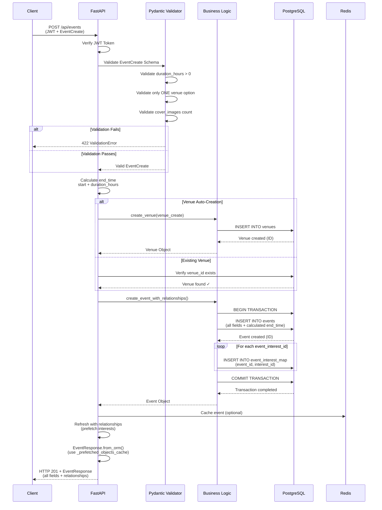

---

## Pydantic Schemas

All schemas are in `events/schemas.py`:

### Request Schemas
- `EventCreate`: Create event with duration_hours, venue options, all ERD fields
- `EventUpdate`: Partial event updates
- `VenueCreate`: Venue creation
- `VenueUpdate`: Venue updates
- `EventRequestSubmit`: Submit request to event
- `EventInviteCreate`: Create invitation

### Response Schemas
- `EventResponse`: Full event with all relationships
- `VenueResponse`: Venue details
- `EventRequestResponse`: Request details
- `EventInviteResponse`: Invite details
- `EventAttendeeResponse`: Attendee details
- `PaginatedResponse`: Generic pagination wrapper

### Validation Features
- `model_validator`: Cross-field validation (venue options)
- `field_validator`: Individual field validation
- `from_orm`: ORM-to-Pydantic conversion with prefetch support

---

## Business Logic

### Event Creation Workflow
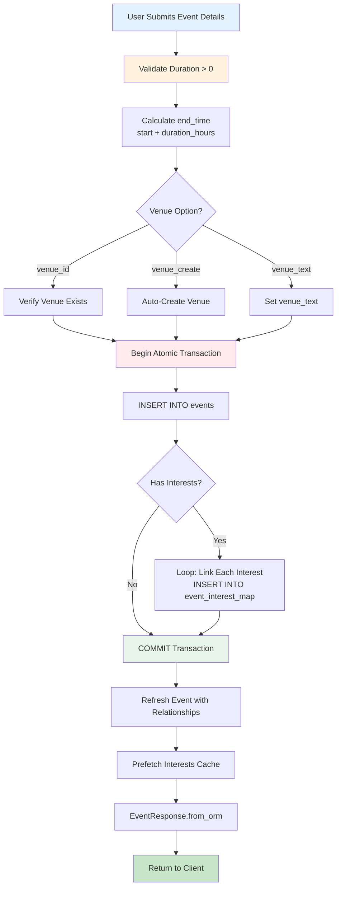

### Venue Management Pattern
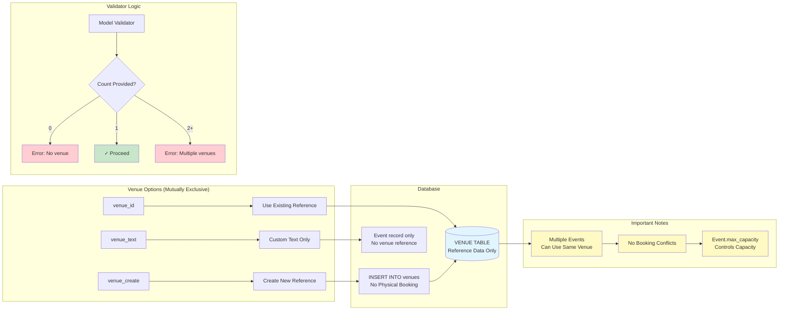

**Key Points**:
- Venues are **reference data only**—the platform does not create or manage physical venues
- The venue table exists to avoid duplicating location details when multiple events share the same location
- Multiple events can reference the same venue simultaneously without any booking restrictions
- Event capacity is controlled by `Event.max_capacity`, not `Venue.capacity` (which is informational only)

### Soft Delete Behavior
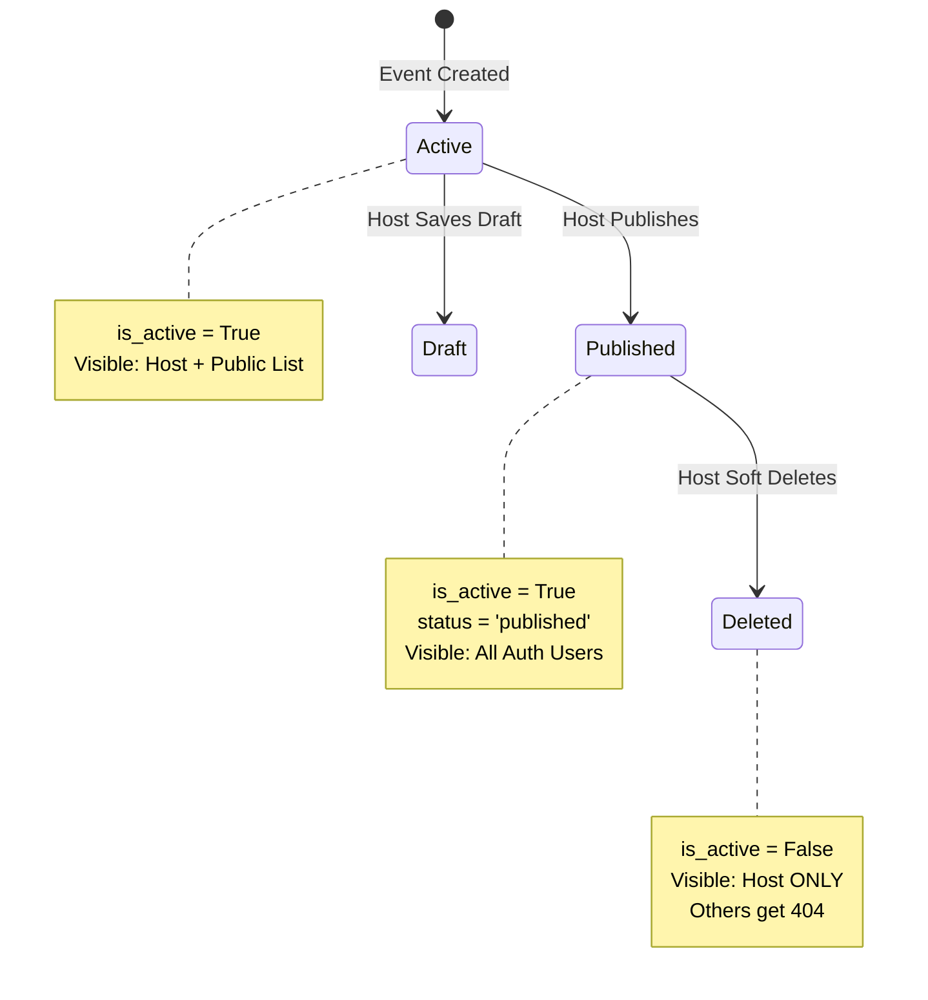

### Duration Calculation Logic

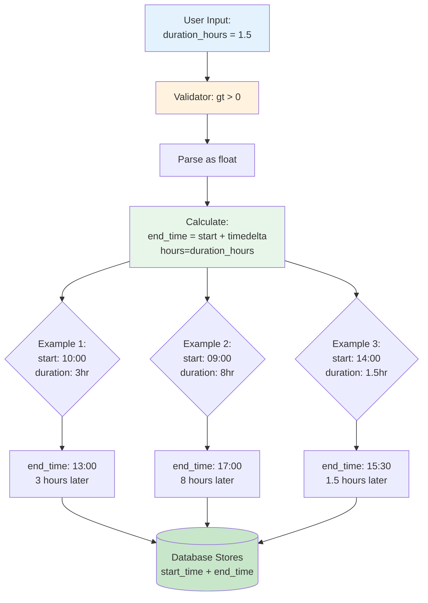

---

## Admin Interface

Comprehensive Django admin configuration in `admin.py`:

### EventAdmin
- **List Display**: title, host, venue, start_time, status, capacity, price, is_active
- **Filters**: status, is_active, is_public, is_paid, allowed_genders, start_time, created_at
- **Fieldsets**: Organized by Basic Info, Venue, Schedule, Capacity & Pricing, GST, Restrictions, Media, Status, Statistics
- **Readonly Fields**: uuid, slug, going_count, requests_count, duration_display
- **Inlines**: Interests, Images, Attendees, Requests, Invites, Reservations
- **Actions**: Bulk publish, cancel, activate, deactivate, complete
- **Features**: 
  - Duration display (calculated from start/end)
  - Capacity percentage with color coding
  - Revenue tracking
  - Status badges
  - Host/venue clickable links

### Key Admin Features
- Duration calculated automatically: shows "X hr" or "X.X hr" format
- Capacity info with fill percentage and color coding
- Revenue tracking aggregated from attendees
- Bulk operations for status management
- Inline editing of relationships
- Comprehensive filtering and search

---

## Validation & Security

### Authentication Flow Diagram

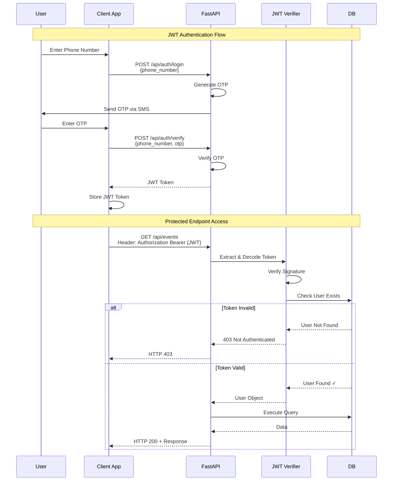

### Authorization Matrix

```mermaid
graph TD
    subgraph "Event Visibility Rules"
        A[Request: GET /events/{id}] --> B{User Authenticated?}
        B -->|No| C[HTTP 403: Not Authenticated]
        B -->|Yes| D{Event Status?}
        
        D -->|is_active = False| E{Is Host?}
        E -->|Yes| F[HTTP 200: Return Event]
        E -->|No| G[HTTP 404: Not Found]
        
        D -->|is_active = True| H{is_public?}
        H -->|Yes| F
        H -->|No| I{Is Host?}
        I -->|Yes| F
        I -->|No| J[HTTP 403: No Permission]
    end
    
    subgraph "Event Modification Rules"
        K[Request: PUT/DELETE /events/{id}] --> L{JWT Valid?}
        L -->|No| C
        L -->|Yes| M{Is Host?}
        M -->|Yes| N[HTTP 200/204: Success]
        M -->|No| J
    end
    
    style C fill:#ffcdd2
    style G fill:#ffcdd2
    style J fill:#ffcdd2
    style F fill:#c8e6c9
    style N fill:#c8e6c9
```

### Input Validation Rules

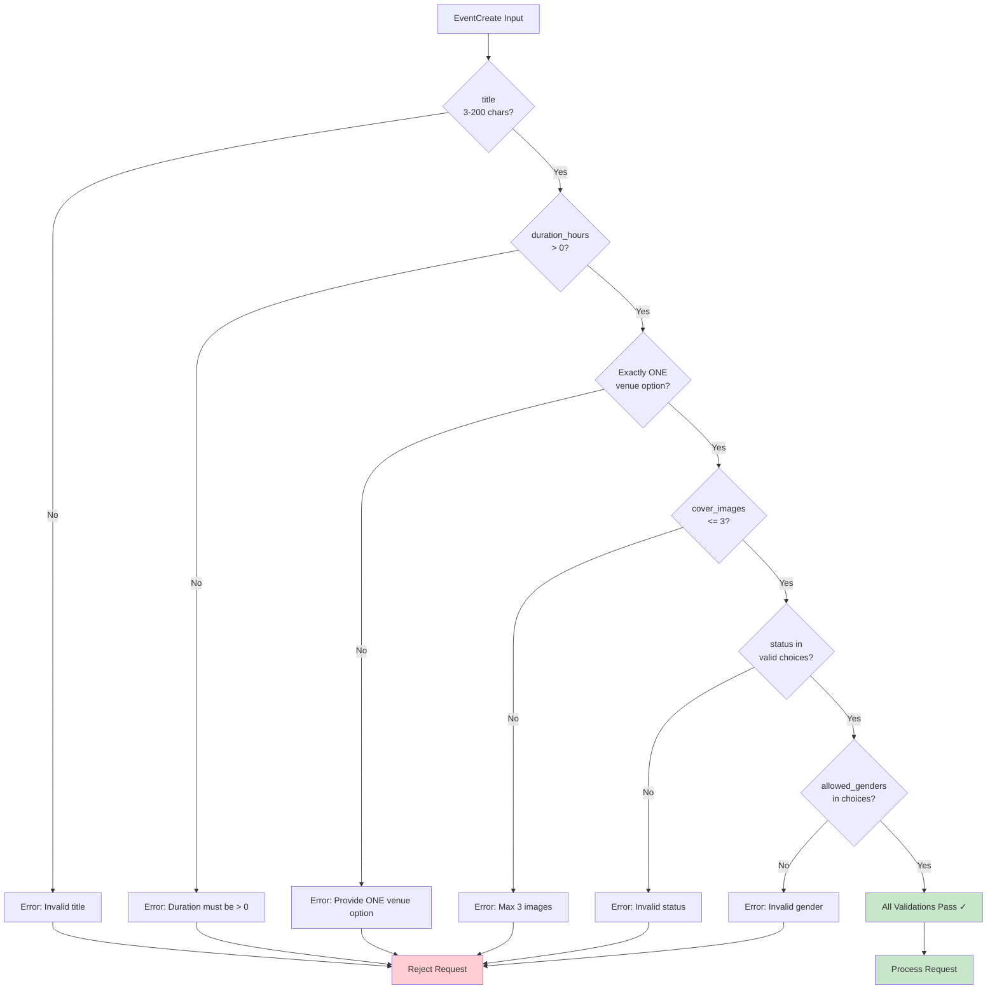

---

## Performance Optimizations

### Query Optimization Strategy

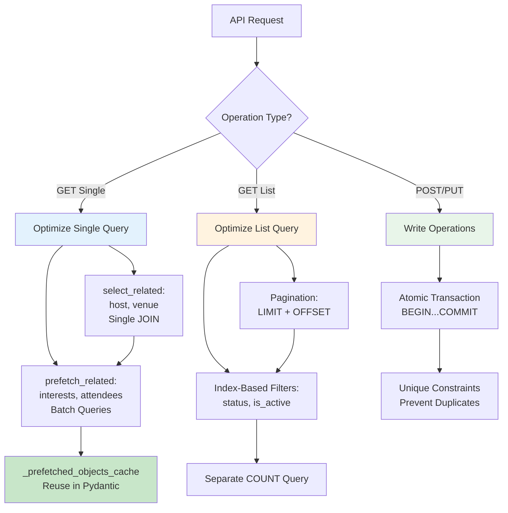

---

## Testing

### API Testing Results
All CRUD operations tested via curl:
- ✅ Create: paid/free events, all venue options, duration_hours
- ✅ Read: list, single, with filters and search
- ✅ Update: partial updates, field validation
- ✅ Delete: soft delete with permission checks
- ✅ Venue operations: list, create, filter by city
- ✅ Validation: error messages, edge cases

### Test Coverage
- Model creation and validation
- Permission checks
- Business logic validation
- Edge cases and error handling

---

## Usage Examples

### Create Event

```bash
curl -X POST http://localhost:8000/api/events \
  -H "Content-Type: application/json" \
  -H "Authorization: Bearer YOUR_JWT_TOKEN" \
  -d '{
    "title": "Workshop",
    "description": "Learn something",
    "event_interest_ids": [1, 2],
    "venue_create": {
      "name": "New Venue",
      "address": "123 Main St",
      "city": "Mumbai",
      "venue_type": "indoor",
      "capacity": 50
    },
    "start_time": "2025-12-30T10:00:00Z",
    "duration_hours": 3.5,
    "max_capacity": 50,
    "is_paid": true,
    "ticket_price": 500.00,
    "allowed_genders": "all"
  }'
```

### List Events

```bash
curl -X GET "http://localhost:8000/api/events?status=published&is_paid=true&limit=10" \
  -H "Authorization: Bearer YOUR_JWT_TOKEN"
```

### Update Event

```bash
curl -X PUT http://localhost:8000/api/events/1 \
  -H "Authorization: Bearer YOUR_JWT_TOKEN" \
  -d '{"title": "Updated Title", "max_capacity": 100}'
```

### Delete Event

```bash
curl -X DELETE http://localhost:8000/api/events/1 \
  -H "Authorization: Bearer YOUR_JWT_TOKEN"
```

---

## Migration Notes

**Important**: Event creation API changed from `end_time` to `duration_hours`
- Old API required explicit `end_time` datetime
- New API uses `duration_hours` (float) - more intuitive
- Database still stores both `start_time` and `end_time`
- Update operations still support `end_time` for precision

---

## Architecture Decisions

### Why duration_hours in API but end_time in DB?
- **UX**: Users think in duration (2 hours), not end time
- **DB**: Queries/filters work better with explicit start/end
- **Separation**: API UX vs database schema concerns
- **Compatibility**: Admin and reports use start/end_time

### Why EventInterestMap with timestamps?
- Tech debt: Should be simple ManyToManyField
- Currently allows analytics on when interests are added
- Can refactor to ManyToManyField later without DB changes

### Why three venue options?
- Existing venue: reuse and standardization
- Auto-create: convenience for new venues
- Custom text: flexibility for temporary locations
- Validator ensures only one option used

---

## Complete Event Lifecycle Diagram

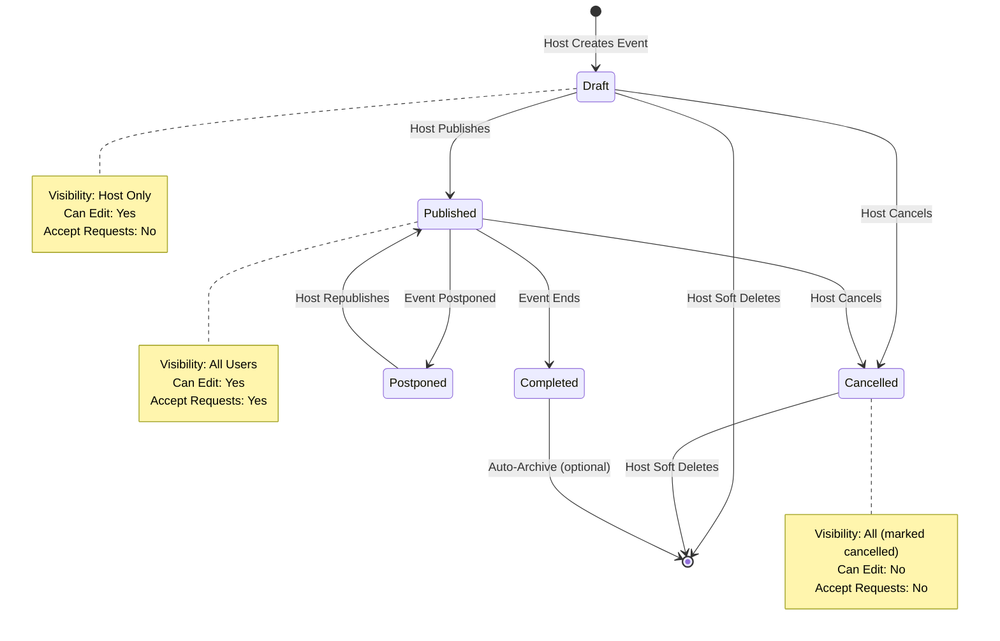

---

## Error Handling Flow

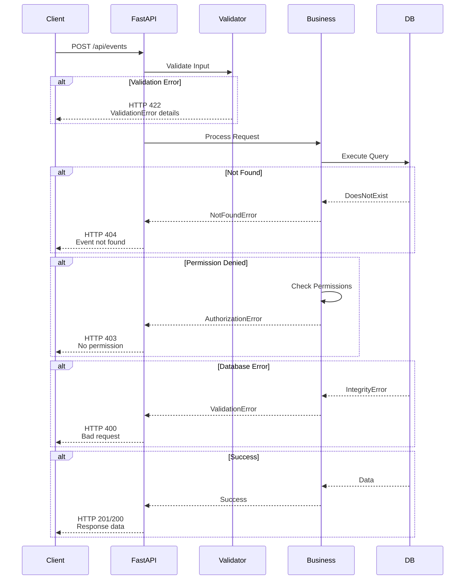

---

## Complete API Reference

### Event Endpoints Summary

| Method | Endpoint | Auth | Purpose |
|--------|----------|------|---------|
| POST | `/api/events` | ✅ Required | Create event with duration_hours |
| GET | `/api/events` | ✅ Required | List events with filters |
| GET | `/api/events/{id}` | ✅ Required | Get single event |
| PUT | `/api/events/{id}` | ✅ Required | Update event (host only) |
| DELETE | `/api/events/{id}` | ✅ Required | Soft delete (host only) |

### Venue Endpoints Summary

| Method | Endpoint | Auth | Purpose |
|--------|----------|------|---------|
| GET | `/api/events/venues` | ✅ Required | List venues with filters |
| POST | `/api/events/venues` | ✅ Required | Create venue |
| GET | `/api/events/venues/{id}` | ✅ Required | Get single venue |

### Request Endpoints Summary

| Method | Endpoint | Auth | Purpose |
|--------|----------|------|---------|
| GET | `/api/events/{id}/requests` | ✅ Required | List requests (host only) |
| POST | `/api/events/{id}/requests` | ✅ Required | Submit request |
| PUT | `/api/events/{id}/requests/{req_id}` | ✅ Required | Approve/decline (host only) |

---

## Development Notes

### Key Implementation Details
- All async operations use `sync_to_async` wrapper for Django ORM
- Pydantic v2 uses `model_dump()` instead of `.dict()`
- Prefetch optimization via `_prefetched_objects_cache`
- UUID conversion handled by `@field_validator`
- Duration calculation: `end_time = start_time + timedelta(hours=duration_hours)`

### Testing Strategy
- Manual curl testing for all CRUD operations
- Verify authentication and authorization on every endpoint
- Test validation errors with invalid inputs
- Confirm soft delete visibility rules
- Validate venue auto-creation workflow

---

## Future Enhancements

### Potential Improvements
- Refactor EventInterestMap to simple ManyToManyField
- Add batch operations for bulk updates
- Implement event duplication/cloning
- Add recurring event support
- Enhance filtering with date ranges
- Add popularity/trending algorithms

### Performance Optimizations
- Redis caching for frequently accessed events
- Elasticsearch for advanced search
- Database read replicas for scaling
- CDN for cover images
- GraphQL API layer option