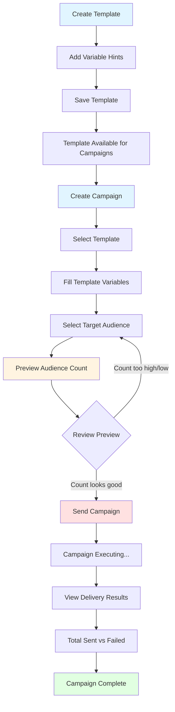

# Admin & Marketing Notification Usage Guide

**For Non-Technical Users: CEOs, Marketing Teams, Operations Managers**

This guide explains how to use the Loopin notification system to send push notifications to your users. No technical knowledge required—just follow the steps and use common business sense.

---

## 📊 Campaign Lifecycle Flowchart



**Key Milestones:**
1. **Templates** = Message blueprints (reusable)
2. **Campaigns** = Actual sends to users
3. **Preview** = Safety check before sending
4. **Send** = One-time execution (cannot be undone)
5. **Results** = Delivery tracking and analytics

---

## 1. Big-Picture: What This System Does

### What Is It?

The notification system lets you send targeted push notifications to specific groups of users based on their profile information, behavior, and preferences. Think of it as your marketing and engagement engine.

### Why Does It Exist?

**Business Problems It Solves:**
- **Engagement**: Re-engage inactive users
- **Retention**: Remind users about incomplete profiles
- **Marketing**: Promote events to interested users
- **Communication**: Send targeted messages without spamming everyone
- **Personalization**: Reach the right users with the right message at the right time

### What You Can Do

✅ Send personalized notifications to specific user segments  
✅ Track who received messages and who didn't  
✅ Reuse message templates across multiple campaigns  
✅ Ensure message consistency and brand voice  
✅ Maintain audit trail for compliance and analysis

### The Two Main Concepts

**1. Templates** = Message blueprints
- Define the notification text, title, and structure
- Reusable across multiple campaigns
- Like a form letter that you can use many times

**2. Campaigns** = Actual message sends
- One campaign = one notification send to a group of users
- Uses a template and fills in the specific details
- Like mailing out letters using that form letter template

---

## 2. Notification Templates: Creating Your Message Blueprint

### What Is a Template?

A template is a reusable message format. Instead of typing the same message over and over, you create it once and reuse it for multiple campaigns.

**Real-World Analogy**: Think of a template like a form letter. You write the structure once, and then you can personalize it with different names, events, or details for each campaign.

### Step-by-Step: Creating a Template

#### Step 1: Go to Template Management

Navigate to: **Notifications → Notification Templates** in the admin panel.

Click **"Add Notification Template"** to create a new template.

#### Step 2: Fill in Basic Information

**Name** 🔹 *Required*
- Give your template a clear, descriptive name
- Example: "Profile Completion Reminder"
- This helps you identify the template later

**Key** 🔹 *Required, Auto-generated*
- A URL-friendly version of the name
- Example: "profile_completion_reminder"
- Usually auto-generated from the name, but you can customize it

#### Step 3: Write Your Notification Content

**Title** 🔹 *Required*
- The short headline users see (max 200 characters)
- This appears at the top of the push notification
- Example: "Complete Your Profile to Join Events!"

**Body** 🔹 *Required*
- The main message text users read
- Can include variables like `{{name}}` or `{{event_name}}`
- Example: "Hi {{name}}, complete your profile to unlock exclusive events in {{city}}!"

**Using Variables in Title and Body:**
- Variables are placeholders that get replaced with real values when you create a campaign
- Format: `{{variable_name}}` (two curly braces around the variable name)
- Common variables: `{{name}}`, `{{event_name}}`, `{{city}}`, `{{host_name}}`
- Variables are case-sensitive: `{{name}}` is different from `{{Name}}`

**Example with Variables:**
```
Title: "New Event: {{event_name}}"
Body: "Hi {{name}}, check out {{event_name}} by {{host_name}} happening in {{city}}!"
```

When you create a campaign, you'll fill in:
- `{{name}}` → "John"
- `{{event_name}}` → "Summer Music Festival"
- `{{host_name}}` → "Music Lovers"
- `{{city}}` → "Bangalore"

#### Step 4: Configure Navigation

**Target Screen** 🔹 *Required*
- Where users go when they tap the notification
- Options: `home`, `profile`, `event_detail`, `ticket_detail`, etc.
- Example: If you're promoting an event, use `event_detail`

**Notification Type** 🔹 *Required*
- Categorizes the notification
- Options: `system`, `promotional`, `reminder`, `event_update`, etc.
- Example: Use `promotional` for marketing campaigns

#### Step 5: Add Variable Hints (Help Text)

**What Are Variable Hints?**

Variable hints are help text that explains what each variable means. They help marketing team members understand what value to provide when creating campaigns.

**How to Add Hints:**

Below the main template form, you'll see a section called **"Variable Hints"**. For each variable in your title or body:

1. Click **"Add another Variable Hint"**
2. Enter the **Variable Name** (without braces): e.g., `event_name`
3. Enter the **Help Text**: e.g., "Name of the event being promoted"
4. Save

**Example:**
- Variable: `event_name`
- Help Text: "Enter the full name of the event, e.g., 'Summer Music Festival 2025'"

- Variable: `city`
- Help Text: "The city where the event is happening, e.g., 'Bangalore' or 'Mumbai'"

**Why This Matters:** When marketing team creates campaigns, they'll see this help text next to each variable field, making it clear what to enter.

#### Step 6: Save Your Template

Click **"Save"** to create your template.

**Fields Generated Automatically:**
- **UUID**: Unique identifier (you don't need to know this)
- **Version**: Starts at 1 (increments when template content changes)
- **Required Variables**: Automatically detected from your title and body
- **Created At / Updated At**: Timestamps for tracking

### 🔒 Understanding Template Immutability (Locking)

**What Does "Locked Template" Mean?**

Once a template is used in at least one campaign (even if that campaign is just a draft), the template becomes **locked** (immutable). This means you cannot change the content fields:
- Title
- Body
- Target screen
- Notification type

**Why Do Templates Lock?**

**Business Reason**: Once a campaign references a template, we need to preserve exactly what that template said at that time. This ensures:
- Historical campaigns always show the exact message that was sent
- Analytics and reporting are accurate
- Compliance and audit requirements are met

**Real-World Analogy**: Think of it like publishing an ad in a newspaper. Once published, you can't change what was printed retroactively. Historical campaigns are like past newspaper issues—they must remain exactly as they were.

**Visual Indicator:**

When viewing a template in admin:
- 🔓 **Green badge "✓ Editable"** = Template can be modified
- 🔒 **Orange badge "🔒 LOCKED"** = Template is used in campaigns and cannot be modified

**What Can You Do With a Locked Template?**

- ✅ Still use it in new campaigns
- ✅ Add or edit variable hints
- ✅ Activate or deactivate it
- ❌ Cannot change title, body, target_screen, or notification_type

**If You Need to Change a Locked Template:**

You have two options:
1. **Create a new template** with the updated content (recommended for major changes)
2. **Wait until the template is no longer used** (not recommended, as campaigns remain in history)

### 🔁 Understanding Template Versioning

**What Is Versioning?**

Each template has a version number (starts at 1). When you make meaningful content changes (title, body, target_screen, or notification_type), the version increments automatically.

**When Does Version Increase?**

- Version increments when you modify template content (if template is not locked)
- Version does NOT increment for minor changes like variable hints or activation status

**How Campaigns Use Versions:**

When you create a campaign and select a template, the system automatically captures the template's version number at that moment. This creates an **immutable snapshot**:

- Campaign stores: `template_id = 5` and `template_version = 2`
- Even if the template later updates to version 3, the campaign will always reference version 2
- This ensures historical accuracy and audit compliance

**Business Value of Versioning:**

- **Analytics**: Track which template versions perform best
- **Audits**: Know exactly what message was sent in any campaign
- **Trust**: Users can verify what message they received
- **Rollbacks**: If needed, you can identify which version was used

**Example Scenario:**

1. You create Template v1: "Welcome {{name}}!"
2. You create Campaign A using Template v1
3. You update template to v2: "Welcome {{name}} to Loopin!"
4. You create Campaign B using Template v2
5. Campaign A always shows "Welcome {{name}}!" (v1)
6. Campaign B always shows "Welcome {{name}} to Loopin!" (v2)

---

## 3. Variables & Placeholders: Making Messages Personal

### What Are Variables?

Variables are placeholders in your template that get replaced with real values when you send a campaign. They make messages personal and dynamic.

**Format**: `{{variable_name}}` (always use two curly braces)

### Common Variables

| Variable | Example Value | Use Case |
|----------|---------------|----------|
| `{{name}}` | "John", "Priya" | User's name |
| `{{event_name}}` | "Summer Music Festival" | Event being promoted |
| `{{city}}` | "Bangalore", "Mumbai" | Location-based targeting |
| `{{host_name}}` | "Music Lovers" | Event host/organizer name |
| `{{date}}` | "January 15, 2025" | Event date |

### Where Do Variable Values Come From?

When you create a campaign, the system automatically shows you input fields for each variable in the selected template. You fill these in manually.

**Example Flow:**
1. Template has: "Hi {{name}}, check out {{event_name}}!"
2. System detects two variables: `name` and `event_name`
3. Campaign form shows two fields:
   - `{{ name }}` (with help text from variable hints)
   - `{{ event_name }}` (with help text from variable hints)
4. You fill in:
   - `name` → "John"
   - `event_name` → "Summer Music Festival"
5. User receives: "Hi John, check out Summer Music Festival!"

### Variable Hints: Helping Your Team

**What Are Variable Hints?**

Variable hints are help text that explains what each variable means and what format to use. They appear next to variable input fields in the campaign form.

**Why They Matter:**

- Marketing team members may not know what `{{event_name}}` should contain
- Prevents mistakes like entering "123" instead of "Summer Music Festival"
- Ensures consistency across campaigns

**Best Practices for Variable Hints:**

- Be specific: "Enter the full event name as shown on the event page"
- Include examples: "e.g., 'Summer Music Festival 2025'"
- Mention format: "Use title case, no special characters"

**Example Hints:**

```
Variable: event_name
Help Text: "Enter the exact event name as it appears on the event page. Example: 'Summer Music Festival 2025'"

Variable: city
Help Text: "Enter the city name in title case. Example: 'Bangalore' or 'Mumbai'"

Variable: name
Help Text: "This will be automatically replaced with each user's name. Leave as {{name}} in template."
```

---

## 4. Notification Campaigns: Sending Messages to Users

### What Is a Campaign?

A campaign is one notification send to a specific group of users. It combines:
- A template (the message format)
- Variable values (personalization)
- Audience selection (who receives it)
- Execution results (who got it, who didn't)

**Key Point**: Each campaign can be sent **only once**. Once sent, it's permanent and cannot be modified or re-sent.

### Campaign Basics

#### Name 🔹 *Required*

- Give your campaign a clear, descriptive name
- This helps you identify it later in reports
- Example: "Profile Completion Reminder - Bangalore Users"
- Best Practice: Include the target audience or purpose in the name

#### Description *Optional*

- Add notes about why this campaign exists
- Useful for team communication and future reference
- Example: "Reminding users in Bangalore who haven't completed their profiles to finish setup so they can join events"

### Template Selection

#### Selecting a Template

1. In the campaign form, find **"Template Selection"** section
2. Use the dropdown to select a template
3. Once selected, **template variable fields automatically appear** below

**What Happens Automatically:**

- System detects all variables in the template (e.g., `{{name}}`, `{{event_name}}`)
- Creates input fields for each variable
- Shows help text from variable hints (if configured)
- Captures the template version at campaign creation (for audit trail)

**Template Version Snapshot:**

When you save a campaign, the system automatically captures:
- Which template was used (`template_id`)
- What version of that template (`template_version`)

**Why This Matters:**

- If the template changes later, your campaign will always reference the exact version it was created with
- Ensures historical accuracy
- Enables analytics and audits

**Example:**

1. You create Campaign A using Template "Welcome Message" v1
2. Someone updates the template to v2
3. Campaign A will always show v1 content (the version it was created with)
4. New campaigns will use v2

### Filling Template Variables

#### Step-by-Step

1. **Select Template**: Choose your template from the dropdown
2. **Variables Appear**: System automatically shows fields for each variable
3. **Fill Values**: Enter appropriate values for each variable
4. **Check Help Text**: Read the variable hints for guidance

**Example:**

Template: "Hi {{name}}, check out {{event_name}} in {{city}}!"

Fields shown:
- `{{ name }}` → Enter: "User" (or use {{name}} if it's user-specific)
- `{{ event_name }}` → Enter: "Summer Music Festival"
- `{{ city }}` → Enter: "Bangalore"

**Important Notes:**

- All variable fields are required (you must fill them all)
- Values are case-sensitive: "Bangalore" is different from "bangalore"
- Use consistent formatting across campaigns (e.g., always use title case for cities)

---

## 5. Audience Selection: Who Receives Your Message

### Understanding Audience Logic

**Critical Rule**: All filters use **AND logic**, except event interests which use **OR logic**.

**What This Means:**

- **AND Logic**: User must match ALL selected filters
- **OR Logic**: User must match ANY selected interest

**Final Formula:**
```
(ALL selected filters) AND (ANY selected interests)
```

### Real-World Example

**Scenario**: You want to send a notification to:
- Users in Bangalore
- Who have completed their profile
- Who are interested in Music OR Dance events

**Result**: Users who are:
- In Bangalore **AND**
- Have completed profile **AND**
- (Interested in Music **OR** interested in Dance)

**This Means**: A user in Bangalore with a complete profile who likes only Music will receive it. A user in Mumbai with a complete profile who likes Music will NOT receive it (wrong city).

### Available Filters

#### 1. Profile Completed

**Options:**
- **All users (don't filter)** = Include everyone, regardless of profile completion
- **Yes - Only users with complete profiles** = Users who have filled all required fields
- **No - Only users with incomplete profiles** = Users who haven't completed their profile

**When to Use:**
- "Yes" → For event recommendations (complete profiles = active users)
- "No" → For profile completion reminders

#### 2. Verified Status

**Options:**
- **All users (don't filter)** = Include verified and unverified users
- **Yes - Only verified users** = Users whose profiles have been verified
- **No - Only unverified users** = Users who haven't been verified yet

**When to Use:**
- "Yes" → For important communications (verified = trusted users)
- "No" → For verification reminders

#### 3. Active Status

**Options:**
- **All users (don't filter)** = Include active and inactive users
- **Yes - Only active users** = Users who are currently active on the platform
- **No - Only inactive users** = Users who haven't been active recently

**When to Use:**
- "Yes" → For ongoing engagement
- "No" → For re-engagement campaigns

#### 4. Location

**Options:**
- Empty field = Include all locations
- Enter location name = Include users in that location (partial match)

**Examples:**
- "Bangalore" → Includes "Bangalore", "Bangalore North", "Bangalore South"
- "Mumbai" → Includes "Mumbai", "Mumbai Suburbs"

**When to Use:**
- Location-based event promotions
- Regional announcements
- City-specific engagement campaigns

**Important**: Leave empty if you want to include all locations.

#### 5. Event Interests

**Options:**
- Empty = Include all interests
- Select one or more interests = Include users with ANY selected interest

**Available Interests:**
- Art & Culture
- Business
- Comedy
- Dance
- Education
- Entertainment
- Fashion
- Fitness
- Food & Drink
- Gaming
- Health & Wellness
- Music
- Networking
- Outdoor
- Photography
- Sports
- Technology
- Travel
- Volunteering
- Workshop

**Logic**: Uses **OR** (not AND)

**Example:**
- Select "Music" and "Dance"
- Includes users who like Music OR Dance OR both

**When to Use:**
- Event recommendations based on interests
- Interest-based promotions
- Personalized content delivery

#### 6. Has Attended Event

**Options:**
- **All users (don't filter)** = Include everyone
- **Yes - Only users who have attended events** = Users with attendance history
- **No - Only users who have never attended events** = New users or inactive attendees

**When to Use:**
- "Yes" → For exclusive content for active users
- "No" → For encouraging first-time attendance

#### 7. Has Active Devices

**Options:**
- **All users (default: active devices only)** = System defaults to active devices
- **Yes - Only users with active devices** = Users with registered mobile devices
- **No - Only users without active devices** = Users without devices (rare)

**Important**: Push notifications require active devices. If a user doesn't have an active device, they won't receive the notification even if they match other criteria.

**When to Use:**
- Usually leave as default (active devices only)
- "No" option is rarely used (mainly for data analysis)

### Negative Filters: Excluding Users

**What Are Negative Filters?**

Negative filters let you exclude specific groups of users. This is powerful for targeting users who haven't done something.

**Common Use Cases:**

1. **Incomplete Profiles**
   - Filter: "No - Only users with incomplete profiles"
   - Use: Profile completion reminders

2. **Never Attended Events**
   - Filter: "No - Only users who have never attended events"
   - Use: Encouraging first-time attendance

3. **Unverified Users**
   - Filter: "No - Only unverified users"
   - Use: Verification reminders

**Example Campaign:**

**Goal**: Remind users in Bangalore with incomplete profiles to finish setup

**Filters:**
- Location: "Bangalore"
- Profile Completed: "No - Only users with incomplete profiles"
- Verified: "All users (don't filter)"
- Active: "Yes - Only active users"
- Event Interests: (leave empty)
- Has Attended Event: "All users (don't filter)"
- Has Active Devices: (default)

**Result**: Active users in Bangalore who haven't completed their profile

---

## 6. Preview & Safety Controls: Checking Before Sending

### What Is Audience Preview?

Before sending a campaign, you can preview how many users match your audience selection. This is a **mandatory safety check** that prevents mistakes.

### Why Preview Is Mandatory

**Safety Reasons:**
- Prevents accidentally sending to everyone (could be thousands of users)
- Allows you to refine audience if count is too high or too low
- Gives you confidence before sending
- Required by the system—you cannot send without previewing first

### How to Preview

1. After selecting template, variables, and audience, scroll to **"Audience Preview"** section
2. Click **"Preview Audience"** button
3. System calculates how many users match your criteria
4. Review the count

### Understanding Preview Results

**Preview Count** = Number of users who will receive the notification

**What to Look For:**
- ✅ **Reasonable number** (matches your expectation)
- ⚠️ **Too high** (e.g., 50,000 users when you expected 500) → Refine filters
- ⚠️ **Too low** (e.g., 5 users when you expected 500) → Check filters
- ⚠️ **Zero users** → No users match criteria, adjust filters

### When to Adjust Your Audience

**If Count Is Too High:**

- Add more specific filters (e.g., add location filter)
- Use negative filters to exclude groups
- Narrow event interests
- Target only verified or active users

**If Count Is Too Low:**

- Remove restrictive filters
- Check if location filter is too specific
- Expand event interests (add more options)
- Consider removing "verified only" or "active only" filters

**If Count Is Zero:**

- Check all filters—one might be too restrictive
- Try removing filters one by one to identify the issue
- Verify that users with those criteria actually exist

### Preview Best Practices

1. **Always Preview** before sending (mandatory anyway)
2. **Verify Count** matches your expectation
3. **Adjust if Needed** before proceeding
4. **Document Expectations** in campaign description for future reference

---

## 7. Sending, Tracking & Results: What Happens When You Send

### What Happens When You Click "Send"

1. **System Validates**:
   - Campaign has been previewed (mandatory)
   - Template is selected
   - All template variables are filled
   - Audience count is within limits (max 10,000 users)

2. **Campaign Status Changes**:
   - Status changes from "draft" or "previewed" to "sending"
   - This prevents duplicate sends

3. **Notifications Are Sent**:
   - System processes users in batches (100 at a time)
   - Each user receives a push notification
   - Notifications are also saved in the in-app inbox

4. **Results Are Tracked**:
   - System counts successful sends
   - System counts failed sends
   - Errors are logged for investigation

5. **Campaign Completes**:
   - Status changes to "sent"
   - Campaign becomes immutable (cannot be modified)
   - Results are finalized

### Campaign Can Only Be Sent Once

**Critical Rule**: Each campaign can be executed only once. This is a safety feature.

**What This Means:**
- Once you click "Send" and it succeeds, you cannot send the same campaign again
- Even if some notifications failed, the campaign status becomes "sent"
- To send to the same audience again, you must create a new campaign

**Why This Exists:**
- Prevents accidental duplicate sends (annoying to users)
- Ensures accurate analytics (each campaign = one send)
- Maintains audit trail integrity

**If You Need to Re-send:**
1. Create a new campaign (copy settings from the old one)
2. Select the same template
3. Use the same audience filters
4. Send again

### Understanding Campaign Results

After sending, you'll see the following results:

#### Total Sent ✅

- Number of notifications successfully delivered
- These users received the push notification
- Green indicator in admin interface

#### Total Failed ❌

- Number of notifications that failed to send
- Common reasons:
  - User's device not registered
  - Device deactivated
  - OneSignal delivery failure
- Red indicator in admin interface

#### Success Rate

- Calculated as: (Total Sent / (Total Sent + Total Failed)) × 100
- Example: 950 sent, 50 failed = 95% success rate
- Displayed as a percentage in admin interface

### Execution Records: Proof of Delivery

**What Are Execution Records?**

Each notification sent in a campaign creates an **execution record**. This is proof that the notification was attempted and shows the delivery status.

**What Each Record Contains:**

- **User Profile**: Who the notification was sent to
- **Sent Successfully**: ✅ Yes or ❌ No
- **Error Message**: Details if delivery failed
- **Delivered At**: Timestamp when notification was delivered
- **OneSignal Response**: Technical details (for debugging)

**Why This Matters:**

- **Accountability**: You can see exactly who received what
- **Error Visibility**: Failed deliveries show error messages
- **Compliance**: Complete audit trail for regulations
- **Trust**: Users can verify they received specific notifications

### Viewing Results

1. Go to the campaign detail page
2. Scroll to **"Execution Records"** section
3. See list of all notifications sent
4. Filter by success/failure if needed
5. Click on individual records for details

**Example View:**

| User | Status | Delivered At |
|------|--------|--------------|
| John Doe | ✅ Success | 2025-01-10 14:30:00 |
| Jane Smith | ✅ Success | 2025-01-10 14:30:01 |
| Bob Wilson | ❌ Failed | - (Device not registered) |

### Campaign Statuses Explained

| Status | Meaning | What You Can Do |
|--------|---------|-----------------|
| **Draft** | Created but not previewed | Edit, Preview, Delete, Cancel |
| **Previewed** | Audience previewed, ready to send | Edit, Send, Cancel |
| **Scheduled** | Scheduled for future send (future feature) | Edit, Cancel |
| **Sending** | Currently being executed | Wait (cannot modify) |
| **Sent** | Successfully completed | View results only (cannot modify) |
| **Cancelled** | Cancelled before sending | View only (cannot modify) |
| **Failed** | Execution failed (rare) | View errors only (cannot modify) |

**Key Point**: Once status is "sent", "sending", "cancelled", or "failed", the campaign is **immutable** (locked). You cannot edit it or send it again.

---

## 8. Common Workflows: Real-World Examples

### Workflow 1: Profile Completion Reminder

**Goal**: Remind users in Bangalore who haven't completed their profiles

**Steps:**

1. **Create Template** (if not exists):
   - Name: "Profile Completion Reminder"
   - Title: "Complete Your Profile"
   - Body: "Hi {{name}}, complete your profile to join exciting events in {{city}}!"
   - Variables: `name`, `city`
   - Add hints:
     - `name`: "User's name (auto-filled per user)"
     - `city`: "City name, e.g., 'Bangalore'"

2. **Create Campaign**:
   - Name: "Profile Completion - Bangalore"
   - Template: Select "Profile Completion Reminder"
   - Variables:
     - `{{ name }}`: Leave as template variable (auto-filled per user)
     - `{{ city }}`: "Bangalore"
   - Audience:
     - Location: "Bangalore"
     - Profile Completed: "No - Only users with incomplete profiles"
     - Active: "Yes - Only active users"
     - Others: Leave as "All users (don't filter)"

3. **Preview**: Check audience count (e.g., 250 users)

4. **Send**: If count looks good, click "Send"

5. **Track**: Monitor results (e.g., 240 sent, 10 failed)

### Workflow 2: Event Promotion to Music Lovers

**Goal**: Promote a music event to users interested in music

**Steps:**

1. **Use Existing Template**: "Event Promotion" (if exists)

2. **Create Campaign**:
   - Name: "Summer Music Fest - Music Interest Users"
   - Template: "Event Promotion"
   - Variables:
     - `{{ event_name }}`: "Summer Music Festival"
     - `{{ host_name }}`: "Music Lovers"
     - `{{ city }}`: "Mumbai"
   - Audience:
     - Event Interests: Select "Music" (and optionally "Entertainment")
     - Location: "Mumbai" (if location-specific)
     - Profile Completed: "Yes - Only users with complete profiles"
     - Others: Defaults

3. **Preview**: Check count (e.g., 1,500 users interested in Music in Mumbai)

4. **Send**: Execute campaign

5. **Track**: Review delivery results

### Workflow 3: Re-engagement Campaign

**Goal**: Re-engage users who haven't attended any events

**Steps:**

1. **Create Template**:
   - Name: "First Event Reminder"
   - Title: "Your First Event Awaits!"
   - Body: "Hi {{name}}, discover amazing events in {{city}}. Find your perfect match!"

2. **Create Campaign**:
   - Audience:
     - Has Attended Event: "No - Only users who have never attended events"
     - Location: (optional, or leave empty for all locations)
     - Active: "Yes - Only active users" (or "No" for inactive users)

3. **Preview & Send**

---

## 9. Best Practices & Tips

### Template Best Practices

✅ **Do:**
- Use clear, descriptive template names
- Add helpful variable hints
- Test templates with sample values before using in campaigns
- Keep messages concise (users read notifications quickly)
- Use consistent formatting (title case, punctuation)

❌ **Don't:**
- Use jargon or technical terms
- Make messages too long (users scan quickly)
- Forget to add variable hints (confuses team)
- Create duplicate templates (reuse existing ones)

### Campaign Best Practices

✅ **Do:**
- Give campaigns clear, descriptive names
- Always preview before sending
- Start with small audiences for testing
- Document campaign purpose in description
- Review results after sending

❌ **Don't:**
- Send without previewing
- Create campaigns with zero expected audience
- Forget to fill template variables
- Send the same campaign multiple times (create new instead)

### Audience Selection Tips

✅ **Do:**
- Start broad, then narrow down
- Use preview to validate audience size
- Combine multiple filters for precision
- Use negative filters to exclude unwanted users
- Test with small audiences first

❌ **Don't:**
- Use too many restrictive filters (might get zero users)
- Forget that event interests use OR logic
- Ignore preview count warnings
- Assume all users have active devices

### Common Mistakes to Avoid

1. **Sending Without Preview**: Always preview first
2. **Too Broad Audience**: Sending to everyone wastes resources
3. **Zero Audience**: Check filters if preview shows zero
4. **Missing Variables**: Fill all template variables
5. **Duplicate Sends**: Don't try to re-send campaigns (create new)
6. **Ignoring Results**: Review failed sends for issues

---

## 10. Troubleshooting

### Problem: Preview Shows Zero Users

**Possible Causes:**
- Filters too restrictive (e.g., location "Bangalore" + interest "Music" + verified only)
- No users match the combination of filters
- Location name misspelled

**Solution:**
- Remove one filter at a time to identify the issue
- Check if users with those criteria actually exist
- Verify location spelling (try partial matches)

### Problem: Preview Count Seems Wrong

**Possible Causes:**
- Misunderstanding of filter logic (AND vs OR)
- Event interests using OR when expecting AND

**Solution:**
- Review audience logic section
- Remember: ALL filters = AND, Interests = OR
- Adjust filters accordingly

### Problem: Many Failed Sends

**Possible Causes:**
- Users don't have active devices
- Devices deactivated
- OneSignal delivery issues

**Solution:**
- Check execution records for error messages
- Filter audience by "Has Active Devices: Yes"
- Contact technical team if OneSignal issues

### Problem: Template Variables Not Appearing

**Possible Causes:**
- Template not selected
- Template has no variables
- Form needs refresh

**Solution:**
- Select template first
- Variables appear automatically after selection
- Refresh page if needed

### Problem: Cannot Edit Template

**Possible Causes:**
- Template is locked (used in campaigns)
- Template is read-only after first use

**Solution:**
- Create a new template with updated content
- Locked templates cannot be edited (by design)

---

## 11. Frequently Asked Questions

### Q: Can I send the same campaign twice?

**A:** No. Each campaign can only be sent once. If you need to send to the same audience again, create a new campaign.

### Q: What happens if I preview and the count is too high?

**A:** Refine your audience filters to narrow down the audience, then preview again until you're satisfied with the count.

### Q: Can I edit a campaign after sending?

**A:** No. Once a campaign is sent, it becomes immutable (locked). This ensures historical accuracy and audit compliance.

### Q: What if some notifications fail to send?

**A:** Check the execution records to see error messages. Common causes: users without active devices or OneSignal delivery issues. Failed sends are logged for investigation.

### Q: How do I know which template version was used?

**A:** The campaign detail page shows the `template_version` field. This is automatically captured when you create the campaign.

### Q: Can I use the same template in multiple campaigns?

**A:** Yes! Templates are reusable. One template can be used in many campaigns.

### Q: What's the difference between template and campaign?

**A:** Template = message blueprint (reusable). Campaign = actual send to users (one-time).

### Q: Why do templates lock after first use?

**A:** To preserve historical accuracy. Once a campaign references a template, we need to ensure it always shows the exact message that was sent.

### Q: How many users can I send to in one campaign?

**A:** Maximum 10,000 users per campaign (configurable). Use preview to check your audience size.

### Q: What if I want to send to more than 10,000 users?

**A:** Split into multiple campaigns with different filters (e.g., by location or interest).

---

## 12. Getting Help

### When to Contact Technical Team

- System errors or bugs
- Unexpected behavior
- OneSignal delivery issues
- Template creation problems
- Campaign execution failures

### Where to Find Information

- **This Guide**: Step-by-step usage instructions
- **Django Admin**: Interface for creating templates and campaigns
- **Execution Records**: Detailed delivery logs
- **Audit Logs**: System activity history

### Quick Reference Links

- **Templates**: `/django/admin/notifications/notificationtemplate/`
- **Campaigns**: `/django/admin/notifications/campaign/`
- **Notifications**: `/django/admin/notifications/notification/`
- **Execution Records**: View from campaign detail page

---

## Summary: Key Takeaways

1. **Templates** = Reusable message blueprints (locked after first use)
2. **Campaigns** = One-time sends to specific audiences
3. **Preview** = Mandatory safety check before sending
4. **Variables** = Placeholders that personalize messages
5. **Audience Logic** = ALL filters (AND) + Interests (OR)
6. **One-Time Send** = Each campaign can only be sent once
7. **Track Results** = Review sent/failed counts and execution records
8. **Always Preview** = Check audience count before sending

**Remember**: When in doubt, start with a small test campaign, preview carefully, and expand gradually.

---

*Last Updated: January 2025*
