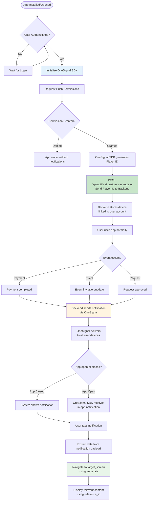

# Push Notifications Integration Guide - Frontend Developer Guide

**For Mobile Developers: Flutter (Dart) for Android & Swift for iOS**

This guide explains how to integrate push notifications into your mobile app using OneSignal and the Loopin Backend API. Follow this guide exactly to ensure notifications work correctly.

**Platforms Supported:**
- **Android**: Flutter (Dart)
- **iOS**: Swift (Native iOS)

---

## Important Rules

1. **Backend is source of truth** - Use only fields returned by the API
2. **Do not invent request/response fields** - Use exactly what Swagger shows
3. **Do not skip device registration** - App will not receive notifications without registering device
4. **Always send player ID after login** - Device must be registered when user authenticates
5. **Handle permission denial gracefully** - App should work even if user denies push permissions
6. **Use Swagger UI as reference** - https://loopinbackend-g17e.onrender.com/api/docs
7. **OneSignal SDK handles push delivery** - Your app only needs to register device with backend
8. **Explain APIs from frontend usage only** - Do not explain backend implementation
9. **Platform-specific code** - This guide provides guidance for both Flutter/Dart (Android) and Swift (iOS)

---

## Overview

### What Is This System?

The push notification system allows your app to receive notifications when important events happen, even when the app is closed. Examples include:
- Payment confirmations
- Event invitations
- Request approvals
- Event cancellations
- Ticket confirmations

### How It Works

1. **Your app** initializes OneSignal SDK and gets a unique player ID for the device
2. **Your app** sends this player ID to the Loopin Backend API to register the device
3. **Backend** stores the device registration linked to the user's account
4. **Backend** sends notifications via OneSignal when events occur
5. **OneSignal** delivers the notification to all registered devices for that user
6. **Your app** receives the notification and navigates to the appropriate screen

### Who Does What?

- **Frontend (Your App)**: Initializes OneSignal, gets player ID, registers device with backend, handles notification taps for navigation
- **Backend (Loopin API)**: Stores device registrations, sends notifications when events occur, links notifications to user accounts
- **OneSignal**: Generates player IDs, delivers push notifications to devices, handles delivery infrastructure

---

## Complete Notification Flow

### End-to-End Flow Diagram



### Step-by-Step Explanation

#### Step 1: App Launch & OneSignal Initialization
When your app launches and the user is authenticated, you need to initialize the OneSignal SDK. This happens automatically and generates a unique identifier called a "player ID" for this specific device.

#### Step 2: Permission Request
Your app must ask the user for permission to send push notifications. On iOS, this is mandatory. On Android, permissions may vary by version. If the user denies permission, your app should continue to work normally - just without push notifications.

#### Step 3: Get Player ID
Once OneSignal is initialized and permissions are granted, the OneSignal SDK provides a player ID. This is a unique string that identifies this specific device. The same device will have the same player ID until the app is uninstalled or the device is reset.

#### Step 4: Register Device with Backend
Your app must send the player ID to the Loopin Backend API. This associates the device with the user's account. **This is critical** - without registration, the backend doesn't know which devices belong to which user and cannot send notifications.

#### Step 5: Backend Stores Device
The backend stores the device registration in the database, linking the player ID to the user's profile. One user can have multiple devices (iPhone, iPad, Android phone, etc.), and all will receive notifications.

#### Step 6: Event Occurs
When something happens that requires a notification (payment succeeds, event is cancelled, invitation received, etc.), the backend automatically triggers a notification.

#### Step 7: Backend Sends via OneSignal
The backend sends the notification to OneSignal's API with the user's registered player IDs. OneSignal handles the actual delivery infrastructure.

#### Step 8: OneSignal Delivers
OneSignal delivers the notification to all registered devices for that user. This happens whether the app is open or closed.

#### Step 9: Device Receives
- **If app is closed**: The operating system shows a system notification that the user can see
- **If app is open**: The OneSignal SDK receives the notification data and can be handled in your app code

#### Step 10: User Taps & Navigation
When the user taps the notification, your app opens and receives the notification data. You extract the navigation information (target_screen, reference_id, metadata) and navigate to the appropriate screen.

---

## API Integration Details

### 1. Device Registration

This is the most important API call. You must call this endpoint after the user logs in and OneSignal provides a player ID.

#### Endpoint Details

**Endpoint:** `POST /api/notifications/devices/register`

**Method:** POST

**Authentication:** Required (JWT token in Authorization header)

**Content-Type:** `application/json`

#### Required Headers

```
Authorization: Bearer <JWT_TOKEN>
Content-Type: application/json
```

#### Request Payload

```json
{
  "onesignal_player_id": "abc123-def456-ghi789-xyz012",
  "platform": "ios"
}
```

**Field Explanations:**
- `onesignal_player_id` (string, required): The player ID obtained from OneSignal SDK. This is a unique identifier for this device.
- `platform` (string, required): Either `"ios"` or `"android"`. Use `"ios"` for iOS devices and `"android"` for Android devices.

#### Response Payload (Success)

```json
{
  "success": true,
  "message": "Device registered successfully",
  "device_id": 123
}
```

**Field Explanations:**
- `success` (boolean): Always `true` on success
- `message` (string): Human-readable message indicating what happened
- `device_id` (integer, optional): Internal device ID assigned by backend (not needed by frontend)

#### Response Payload (Error)

**400 Bad Request:**
```json
{
  "detail": "Platform must be 'ios' or 'android'"
}
```

**401 Unauthorized:**
```json
{
  "detail": "Not authenticated"
}
```

**403 Forbidden:**
```json
{
  "detail": "Device registration is only available for customer accounts. Admin accounts cannot register devices."
}
```

**404 Not Found:**
```json
{
  "detail": "User profile not found. Please complete your profile first."
}
```

#### Important Notes

- **Call this endpoint every time the app launches** after user login. If the device is already registered, the backend will update it (not create a duplicate).
- **Call this endpoint after user logs in** - device registration is linked to the user's account, so it must happen after authentication.
- **Store player ID locally** - You'll need it for device deactivation if the user logs out.
- **Handle errors gracefully** - If registration fails, log the error but don't block app functionality.

---

### 2. Device Deactivation

Use this endpoint when the user logs out or wants to stop receiving notifications on this device.

#### Endpoint Details

**Endpoint:** `DELETE /api/notifications/devices/{player_id}`

**Method:** DELETE

**Authentication:** Required (JWT token in Authorization header)

**Content-Type:** None required for DELETE

#### Required Headers

```
Authorization: Bearer <JWT_TOKEN>
```

#### URL Parameters

- `player_id` (string, path parameter): The OneSignal player ID for the device to deactivate. This is the same value you sent during registration.

#### Request Payload

None required for DELETE request.

#### Response Payload (Success)

```json
{
  "success": true,
  "message": "Device deactivated successfully",
  "device_id": 123
}
```

#### Response Payload (Error)

**401 Unauthorized:**
```json
{
  "detail": "Not authenticated"
}
```

**404 Not Found:**
```json
{
  "detail": "Device not found or does not belong to this user"
}
```

#### Important Notes

- **Call this on logout** - Prevents notifications from being sent to devices after the user logs out
- **User can only deactivate their own devices** - Backend validates ownership
- **This is optional** - If you don't call this, the device remains registered but the user won't receive notifications if they're not logged in

---

## Notification Payload Structure

When your app receives a notification (either as a system notification or in-app), the notification payload contains important data for navigation and displaying content.

### Payload Fields Explained

#### Standard Push Notification Fields

Every notification from OneSignal contains these standard fields:

**`title`** (string)
- The notification title shown to the user
- Example: "Booking Confirmed!" or "Payment Successful"
- This is displayed in the notification banner/alert

**`body`** (string)
- The notification message shown to the user
- Example: "Your spot at Summer Concert is locked. View your ticket now."
- This is the main notification text

#### Custom Data Fields (in `data` object)

The backend sends custom data in the notification payload's `data` field. This contains navigation and reference information.

**`type`** (string)
- The notification type category
- Examples: `"payment_success"`, `"event_invite"`, `"event_request"`, `"event_cancelled"`
- Use this to determine what kind of notification this is
- Can be used for analytics or filtering

**`route` or `target_screen`** (string)
- **This is the most important field for navigation**
- Tells your app which screen to navigate to when the user taps the notification
- Common values:
  - `"ticket_detail"` - Navigate to ticket details screen
  - `"event_detail"` - Navigate to event details screen
  - `"event_details"` - Navigate to event details screen (alternate)
  - `"profile"` - Navigate to user profile screen
  - `"check_in"` - Navigate to check-in scanner screen
  - `"payment_retry"` - Navigate to payment retry screen
- **You must implement navigation logic based on this field**

**`event_id`** (integer, optional)
- The ID of the event related to this notification
- Present in event-related notifications (invites, cancellations, updates)
- Use this to fetch event details: `GET /api/events/{event_id}`
- **Use this to display event-specific content on the target screen**

**`payment_order_id`** (integer, optional)
- The ID of the payment order related to this notification
- Present in payment-related notifications
- Use this to fetch payment details: `GET /api/payments/orders/{payment_order_id}`
- **Use this to display payment-specific content**

**`ticket_id`** (integer, optional)
- The ID of the attendance record (ticket) related to this notification
- Present in ticket confirmation notifications
- Use this to fetch ticket details
- **Use this to display ticket-specific content**

**`invite_id`** (integer, optional)
- The ID of the event invitation related to this notification
- Present in invitation-related notifications
- Use this to fetch invitation details if needed

**`request_id`** (integer, optional)
- The ID of the event request related to this notification
- Present in request-related notifications
- Use this to fetch request details if needed

#### Complete Payload Example

Here's what a complete notification payload looks like when received:

```json
{
  "notification": {
    "title": "Booking Confirmed!",
    "body": "Your spot at Summer Concert is locked. View your ticket now."
  },
  "data": {
    "type": "payment_success",
    "route": "ticket_detail",
    "event_id": 456,
    "payment_order_id": 789,
    "ticket_id": 101
  }
}
```

### How to Use Notification Data for Navigation

#### Step 1: Extract Data When Notification Received

When OneSignal delivers a notification to your app, extract the `data` object from the payload.

#### Step 2: Check `route` or `target_screen` Field

Look at the `route` (or `target_screen`) field to determine which screen to navigate to. This is your navigation instruction.

#### Step 3: Navigate to Target Screen

Based on the route value, navigate to the appropriate screen in your app:
- If `route` is `"ticket_detail"` → Navigate to ticket detail screen
- If `route` is `"event_detail"` → Navigate to event detail screen
- If `route` is `"profile"` → Navigate to profile screen
- And so on...

#### Step 4: Use Reference IDs to Load Content

Once on the target screen, use the reference IDs from the data object to fetch and display content:
- If `event_id` is present → Fetch event details using `GET /api/events/{event_id}`
- If `payment_order_id` is present → Fetch payment details using `GET /api/payments/orders/{payment_order_id}`
- If `ticket_id` is present → Fetch ticket details using the appropriate endpoint

#### Example Navigation Flow

1. User taps notification: "Booking Confirmed!"
2. App extracts: `route: "ticket_detail"`, `event_id: 456`, `ticket_id: 101`
3. App navigates to: Ticket Detail Screen
4. App fetches: Ticket details using `ticket_id: 101`
5. App displays: Ticket information for event 456

---

## Platform-Specific Integration

### Android (Flutter/Dart)

#### Step 1: Add OneSignal Flutter SDK

Add the OneSignal Flutter package to your `pubspec.yaml`:

```yaml
dependencies:
  onesignal_flutter: ^5.0.0
```

#### Step 2: Initialize OneSignal in Your App

Initialize OneSignal in your app's main entry point (usually `main.dart`). Do this after user authentication:

```dart
import 'package:onesignal_flutter/onesignal_flutter.dart';

Future<void> initializeOneSignal(String userId) async {
  // Replace with your OneSignal App ID
  OneSignal.shared.setAppId("YOUR_ONESIGNAL_APP_ID");
  
  // Request permission for notifications
  OneSignal.shared.promptUserForPushNotificationPermission();
  
  // Wait for player ID
  String? playerId = await OneSignal.shared.getDeviceState()?.userId;
  
  if (playerId != null) {
    // Call backend registration endpoint
    await registerDeviceWithBackend(playerId, 'android');
  }
}
```

#### Step 3: Register Device with Backend

Create a function to call the backend registration endpoint:

```dart
Future<void> registerDeviceWithBackend(String playerId, String platform) async {
  final response = await http.post(
    Uri.parse('https://your-backend-url/api/notifications/devices/register'),
    headers: {
      'Authorization': 'Bearer $jwtToken', // Your JWT token
      'Content-Type': 'application/json',
    },
    body: jsonEncode({
      'onesignal_player_id': playerId,
      'platform': platform,
    }),
  );
  
  if (response.statusCode == 200) {
    print('Device registered successfully');
  } else {
    print('Device registration failed: ${response.body}');
  }
}
```

#### Step 4: Handle Notification Received

Set up a handler for when notifications are received (both foreground and background):

```dart
OneSignal.shared.setNotificationOpenedHandler((OSNotificationOpenedResult result) {
  // Extract data from notification
  final data = result.notification.additionalData;
  
  // Get route for navigation
  final route = data?['route'] ?? data?['target_screen'];
  final eventId = data?['event_id'];
  final ticketId = data?['ticket_id'];
  
  // Navigate based on route
  if (route == 'ticket_detail' && ticketId != null) {
    Navigator.pushNamed(context, '/ticket-detail', arguments: {'ticketId': ticketId});
  } else if (route == 'event_detail' && eventId != null) {
    Navigator.pushNamed(context, '/event-detail', arguments: {'eventId': eventId});
  }
  // Add more route handlers as needed
});
```

#### Step 5: Handle Foreground Notifications

For notifications received while app is open, set a handler:

```dart
OneSignal.shared.setNotificationWillShowInForegroundHandler((OSNotificationReceivedEvent event) {
  // Show in-app notification or handle as needed
  // Notification data is in event.notification
  final data = event.notification.additionalData;
  // Handle notification display
});
```

#### Where to Call Registration

- **After user login**: Call device registration immediately after successful authentication
- **On app launch**: Check if user is already logged in, and if so, register device
- **When player ID changes**: OneSignal may regenerate player IDs; re-register when this happens

#### Important Notes for Flutter/Dart

- **Permissions**: Android 13+ requires runtime permission for notifications. Handle permission denial gracefully.
- **Background handling**: Use background message handler for notifications when app is closed
- **Player ID storage**: Store player ID locally so you can deactivate device on logout
- **Error handling**: Network failures during registration should be retried but not block app functionality

---

### iOS (Swift)

#### Step 1: Add OneSignal SDK

Add OneSignal SDK to your project using CocoaPods, SPM, or Carthage:

**CocoaPods:**
```ruby
pod 'OneSignalXCFramework', '>= 5.0.0'
```

**Swift Package Manager:**
Add OneSignal package: https://github.com/OneSignal/OneSignal-iOS-SDK

#### Step 2: Configure Capabilities

In Xcode:
1. Select your project target
2. Go to "Signing & Capabilities"
3. Add "Push Notifications" capability
4. Add "Background Modes" capability and enable "Remote notifications"

#### Step 3: Initialize OneSignal in Your App

Initialize OneSignal in your `AppDelegate.swift` or `App.swift` (SwiftUI):

```swift
import OneSignal
import UserNotifications

func application(_ application: UIApplication, didFinishLaunchingWithOptions launchOptions: [UIApplication.LaunchOptionsKey: Any]?) -> Bool {
    
    // Replace with your OneSignal App ID
    OneSignal.setAppId("YOUR_ONESIGNAL_APP_ID")
    
    // Request notification permissions
    OneSignal.promptForPushNotifications { response in
        if response {
            // Permissions granted, get player ID
            if let playerId = OneSignal.getDeviceState()?.userId {
                registerDeviceWithBackend(playerId: playerId, platform: "ios")
            }
        }
    }
    
    return true
}
```

#### Step 4: Register Device with Backend

Create a function to call the backend registration endpoint:

```swift
func registerDeviceWithBackend(playerId: String, platform: String) {
    guard let url = URL(string: "https://your-backend-url/api/notifications/devices/register") else {
        return
    }
    
    var request = URLRequest(url: url)
    request.httpMethod = "POST"
    request.setValue("Bearer \(jwtToken)", forHTTPHeaderField: "Authorization")
    request.setValue("application/json", forHTTPHeaderField: "Content-Type")
    
    let body: [String: Any] = [
        "onesignal_player_id": playerId,
        "platform": platform
    ]
    
    request.httpBody = try? JSONSerialization.data(withJSONObject: body)
    
    URLSession.shared.dataTask(with: request) { data, response, error in
        if let error = error {
            print("Device registration failed: \(error)")
            return
        }
        
        if let httpResponse = response as? HTTPURLResponse, httpResponse.statusCode == 200 {
            print("Device registered successfully")
        }
    }.resume()
}
```

#### Step 5: Handle Notification Tapped

Set up notification opened handler to navigate when user taps notification:

```swift
OneSignal.setNotificationOpenedHandler { result in
    // Extract data from notification
    guard let additionalData = result?.notification?.additionalData else {
        return
    }
    
    // Get route and reference IDs
    let route = additionalData["route"] as? String ?? additionalData["target_screen"] as? String
    let eventId = additionalData["event_id"] as? Int
    let ticketId = additionalData["ticket_id"] as? Int
    
    // Navigate based on route
    DispatchQueue.main.async {
        if let route = route {
            if route == "ticket_detail", let ticketId = ticketId {
                // Navigate to ticket detail screen
                // Example: navigationController?.pushViewController(TicketDetailViewController(ticketId: ticketId), animated: true)
            } else if route == "event_detail", let eventId = eventId {
                // Navigate to event detail screen
                // Example: navigationController?.pushViewController(EventDetailViewController(eventId: eventId), animated: true)
            }
            // Add more route handlers as needed
        }
    }
}
```

#### Step 6: Handle Foreground Notifications

For notifications received while app is in foreground:

```swift
OneSignal.setNotificationWillShowInForegroundHandler { notification, completion in
    // Display in-app notification or handle as needed
    // Call completion with the notification
    completion(notification)
}
```

#### Where to Call Registration

- **In AppDelegate**: After app launches and user is authenticated
- **After login**: Immediately after successful login in your login view controller
- **On app become active**: Re-register if needed when app comes to foreground

#### Important Notes for iOS

- **Permissions are mandatory**: iOS requires explicit user permission for push notifications. Handle denial gracefully.
- **Background notifications**: Enable background modes in capabilities
- **APNs setup**: OneSignal handles APNs configuration, but ensure your app has proper certificates
- **Player ID timing**: Player ID may not be available immediately - wait for OneSignal callback
- **Privacy**: Add notification usage description to Info.plist if needed

---

## Common Mistakes & Troubleshooting

### Mistake 1: Forgetting to Send Player ID to Backend

**Problem:** App receives player ID from OneSignal but never sends it to the backend registration endpoint. Result: No notifications are received.

**Symptoms:**
- OneSignal SDK initializes successfully
- Player ID is obtained
- But notifications never arrive

**Solution:**
- Always call `POST /api/notifications/devices/register` after getting player ID
- Add logging to verify registration endpoint is being called
- Check backend logs to confirm device registration is successful

**Prevention:**
- Create a helper function that always registers device after OneSignal initialization
- Add registration call in your authentication success handler
- Log registration success/failure for debugging

---

### Mistake 2: Handling Permission Denial Incorrectly

**Problem:** App crashes or stops working when user denies push notification permissions.

**Symptoms:**
- App crashes on permission denial
- App shows errors when permissions are denied
- App becomes unusable if notifications are required

**Solution:**
- Always handle permission denial gracefully
- Check permission status before trying to get player ID
- Allow app to function normally even without notifications
- Optionally show a message explaining why notifications are helpful, but don't block app usage

**Example Handling:**
```dart
// Flutter example
OneSignal.shared.promptUserForPushNotificationPermission().then((response) {
  if (response) {
    // Permission granted - proceed with registration
  } else {
    // Permission denied - app continues without notifications
    print('User denied notification permissions');
  }
});
```

---

### Mistake 3: Duplicate Device Registrations

**Problem:** App registers the same device multiple times, creating unnecessary API calls.

**Symptoms:**
- Multiple registration API calls for same player ID
- Increased API load
- Unnecessary network usage

**Solution:**
- Check if device is already registered before calling registration endpoint
- Store player ID locally and check if it has changed before re-registering
- Backend handles duplicates gracefully, but avoid unnecessary calls
- Register device once per app session, not on every screen load

**Best Practice:**
- Register device only when:
  - User logs in for the first time in this session
  - Player ID changes (rare, but possible)
  - App launches and user is already authenticated (once per session)

---

### Mistake 4: Not Handling Notification Navigation Correctly

**Problem:** Notifications are received but tapping them doesn't navigate to the correct screen, or shows wrong content.

**Symptoms:**
- Notification tapped but app goes to wrong screen
- Target screen opens but shows wrong event/payment/ticket
- Navigation fails or shows errors

**Solution:**
- Always extract `route` (or `target_screen`) from notification data
- Use `route` value to determine which screen to navigate to
- Extract reference IDs (`event_id`, `payment_order_id`, `ticket_id`) from data
- Pass reference IDs to target screen to fetch and display correct content
- Test all notification types to ensure navigation works correctly

**Example Navigation Logic:**
```dart
// Flutter example
void handleNotificationTap(Map<String, dynamic> data) {
  final route = data['route'] ?? data['target_screen'];
  final eventId = data['event_id'];
  final ticketId = data['ticket_id'];
  final paymentOrderId = data['payment_order_id'];
  
  switch (route) {
    case 'ticket_detail':
      if (ticketId != null) {
        Navigator.pushNamed(context, '/ticket-detail', arguments: {'ticketId': ticketId});
      }
      break;
      
    case 'event_detail':
      if (eventId != null) {
        Navigator.pushNamed(context, '/event-detail', arguments: {'eventId': eventId});
      }
      break;
      
    case 'profile':
      Navigator.pushNamed(context, '/profile');
      break;
      
    default:
      // Navigate to home or notifications list
      Navigator.pushNamed(context, '/home');
  }
}
```

---

### Mistake 5: Not Handling App States Correctly

**Problem:** App doesn't handle notifications correctly when app is closed, in background, or in foreground.

**Symptoms:**
- Notifications work when app is closed but not when open
- Navigation doesn't work from foreground notifications
- Notifications are received but not displayed when app is open

**Solution:**
- Set up separate handlers for:
  - **App closed**: System notification → user taps → app opens → handle notification
  - **App in background**: Notification received → user taps → app comes to foreground → handle notification
  - **App in foreground**: Notification received → show in-app notification → handle tap
- Test all three scenarios
- Ensure notification data is accessible in all states

---

### Mistake 6: Not Registering Device After User Login

**Problem:** Device registration happens before user login, or doesn't happen at all after login.

**Symptoms:**
- Notifications are not received even though permissions are granted
- Device registration fails with 401 Unauthorized
- Backend doesn't have device registered for user

**Solution:**
- **Always register device AFTER user login**, not before
- Device registration requires JWT authentication token
- Call registration endpoint in your login success handler
- Store authentication token before calling registration endpoint

**Correct Flow:**
1. User enters credentials
2. App calls login API
3. App receives JWT token
4. App stores JWT token
5. App initializes OneSignal (if not already done)
6. App gets player ID from OneSignal
7. App calls device registration API with JWT token and player ID

---

### Mistake 7: Using Wrong Platform Value

**Problem:** Sending incorrect `platform` value in device registration request.

**Symptoms:**
- Registration fails with 400 Bad Request
- Error message: "Platform must be 'ios' or 'android'"

**Solution:**
- Always use exactly `"ios"` or `"android"` (lowercase, no quotes in actual JSON)
- Don't use `"iOS"`, `"Android"`, `"IOS"`, or other variations
- Detect platform correctly in your code:
  - iOS: Use `"ios"`
  - Android: Use `"android"`

**Platform Detection Examples:**

Flutter/Dart:
```dart
import 'dart:io';

String getPlatform() {
  if (Platform.isIOS) {
    return 'ios';
  } else if (Platform.isAndroid) {
    return 'android';
  }
  return 'android'; // Default
}
```

Swift (iOS):
```swift
let platform = "ios" // Always iOS for Swift apps
```

---

### Mistake 8: Not Handling Network Errors

**Problem:** App doesn't handle network failures during device registration, causing crashes or blocking app functionality.

**Symptoms:**
- App crashes when registration API call fails
- App becomes unusable if registration fails
- User stuck on loading screen if registration times out

**Solution:**
- Always wrap API calls in try-catch (or equivalent error handling)
- Handle network errors gracefully - don't block app functionality
- Retry registration on failure, but with exponential backoff
- Log errors for debugging but allow app to continue
- Consider queueing registration for retry if initial attempt fails

**Example Error Handling:**
```dart
// Flutter example
Future<void> registerDeviceSafely(String playerId, String platform) async {
  try {
    await registerDeviceWithBackend(playerId, platform);
  } catch (e) {
    print('Registration failed: $e');
    // Retry after delay, or queue for later
    // Don't block app functionality
  }
}
```

---

### Troubleshooting Checklist

If notifications are not working, check these in order:

1. **OneSignal Initialization**
   - [ ] OneSignal SDK is properly initialized
   - [ ] Correct OneSignal App ID is configured
   - [ ] OneSignal initialization happens after app launch

2. **Permissions**
   - [ ] User granted push notification permissions
   - [ ] Permission request is handled correctly
   - [ ] App works normally even if permissions denied

3. **Player ID**
   - [ ] Player ID is successfully obtained from OneSignal
   - [ ] Player ID is not null or empty
   - [ ] Player ID is a valid string (usually UUID-like)

4. **Authentication**
   - [ ] User is logged in before device registration
   - [ ] JWT token is valid and not expired
   - [ ] JWT token is included in Authorization header

5. **Device Registration**
   - [ ] Registration API endpoint is called with correct URL
   - [ ] Request payload contains correct `onesignal_player_id` and `platform`
   - [ ] Registration API returns 200 status code
   - [ ] Registration response shows `success: true`

6. **Backend Configuration**
   - [ ] Backend has correct OneSignal credentials configured
   - [ ] Backend can send notifications (check backend logs)
   - [ ] User profile exists and is complete

7. **Notification Reception**
   - [ ] Notification handlers are set up correctly
   - [ ] App handles notifications in all states (closed, background, foreground)
   - [ ] Notification data extraction works correctly

8. **Navigation**
   - [ ] Route extraction from notification data works
   - [ ] Navigation to target screens works
   - [ ] Reference IDs are used correctly to fetch content

---

## Best Practices

### 1. Register Device at the Right Time

- ✅ Register immediately after successful login
- ✅ Register once per app session (not on every screen)
- ✅ Re-register if player ID changes (monitor OneSignal callbacks)
- ❌ Don't register before user login (will fail authentication)
- ❌ Don't register on every app launch if already registered in this session

### 2. Handle All App States

- ✅ Set up notification handlers for app closed state
- ✅ Set up notification handlers for app in background state
- ✅ Set up notification handlers for app in foreground state
- ✅ Test navigation from all three states

### 3. Store Player ID Locally

- ✅ Store player ID in local storage after obtaining it
- ✅ Use stored player ID for device deactivation on logout
- ✅ Compare stored player ID with current player ID to detect changes

### 4. Implement Robust Error Handling

- ✅ Handle network failures gracefully
- ✅ Handle API errors (400, 401, 403, 404, 500) appropriately
- ✅ Retry failed registrations with exponential backoff
- ✅ Never block app functionality due to notification failures

### 5. Test Thoroughly

- ✅ Test with permissions granted
- ✅ Test with permissions denied
- ✅ Test with multiple devices per user
- ✅ Test notification navigation from all app states
- ✅ Test with network failures and retries
- ✅ Test device deactivation on logout

### 6. User Experience

- ✅ Show clear permission request explanation before asking
- ✅ Handle permission denial gracefully (app still works)
- ✅ Provide settings to manage notification preferences (future feature)
- ✅ Show in-app notification badge/count
- ✅ Mark notifications as read when user views them

---

## Common Mistakes & How to Avoid Them

### Mistake 1: Forgetting to Send Player ID to Backend

**Problem**: App initializes OneSignal and gets player ID, but never sends it to backend. Result: No notifications received.

**Solution**: 
- Always call the device registration API after successful login
- Store player ID locally and verify it was sent to backend
- Check backend response to confirm registration succeeded

**How to Detect**:
- Check backend logs for device registration requests
- Verify device appears in backend admin panel (if accessible)
- Test by triggering a notification and checking if it arrives

### Mistake 2: Registering Device Before User Login

**Problem**: App tries to register device before user is authenticated. Result: API returns 401 Unauthorized.

**Solution**:
- Only register device after successful authentication
- Wait for JWT token to be available before making registration API call
- Handle 401 errors gracefully and retry after login

**How to Detect**:
- Check API response status code (should be 200, not 401)
- Check error message in response body
- Verify JWT token is included in Authorization header

### Mistake 3: Not Handling Permission Denial

**Problem**: App crashes or shows errors when user denies push notification permissions.

**Solution**:
- Always check permission status before requesting
- Handle permission denial gracefully (app should still work)
- Show helpful message explaining why permissions are needed
- Allow user to enable permissions later from settings

**How to Detect**:
- Test by denying permissions during app setup
- Check for crashes or error messages
- Verify app continues to function normally

### Mistake 4: Duplicate Device Registrations

**Problem**: App registers the same device multiple times, creating duplicate records.

**Solution**:
- Register device only once per app session
- Check if device is already registered before registering again
- Backend handles duplicates gracefully (updates existing record), but avoid unnecessary calls

**How to Detect**:
- Check backend logs for multiple registration requests with same player ID
- Monitor network requests to see if registration is called multiple times
- Verify device count in backend (should be one per device, not multiple)

### Mistake 5: Not Extracting Notification Data Correctly

**Problem**: App receives notification but can't extract route or reference IDs, so navigation fails.

**Solution**:
- Always extract `data` field from notification payload
- Parse `route` field for navigation target
- Extract `reference_id` and other metadata fields
- Handle missing or malformed data gracefully

**How to Detect**:
- Test notification navigation - does it go to correct screen?
- Check console logs for data extraction errors
- Verify route and reference_id are present in notification payload

### Mistake 6: Not Handling All App States

**Problem**: Notifications work when app is open, but fail when app is closed or in background.

**Solution**:
- Set up notification handlers for all three app states:
  - App closed (notification tap opens app)
  - App in background (notification tap brings app to foreground)
  - App in foreground (notification appears as in-app banner)
- Test navigation from all three states

**How to Detect**:
- Test by sending notification when app is closed
- Test by sending notification when app is in background
- Verify navigation works correctly in all cases

### Mistake 7: Not Deactivating Device on Logout

**Problem**: User logs out but device remains registered, so they continue receiving notifications.

**Solution**:
- Always call device deactivation API when user logs out
- Store player ID locally so you can deactivate it on logout
- Clear locally stored player ID after successful deactivation

**How to Detect**:
- Log out and verify device deactivation API is called
- Check backend logs for deactivation request
- Test by logging out and confirming no notifications arrive

### Mistake 8: Using Wrong Platform Value

**Problem**: App sends "iOS" or "Android" instead of "ios" or "android" (case-sensitive).

**Solution**:
- Always use lowercase: "ios" or "android"
- Don't use platform names like "iOS", "Android", "iPhone", etc.
- Validate platform value before sending to API

**How to Detect**:
- Check API response - should be 200, not 400
- Check error message if registration fails
- Verify platform value matches exactly: "ios" or "android"

---

## Troubleshooting Guide

### Issue: Notifications Not Received

**Checklist**:
1. ✅ User is logged in (authentication required)
2. ✅ Device registration API was called and returned success
3. ✅ Push notification permissions are granted
4. ✅ OneSignal SDK is initialized correctly
5. ✅ Player ID was obtained from OneSignal
6. ✅ Backend has correct OneSignal credentials configured
7. ✅ User profile exists and is complete
8. ✅ Test notification was sent from backend

**Debug Steps**:
1. Check OneSignal dashboard to see if notification was sent
2. Check backend logs for device registration and notification sending
3. Verify player ID in backend matches player ID in app
4. Test with a simple notification to isolate the issue
5. Check device status in backend (should be active)

### Issue: Notification Received But Navigation Doesn't Work

**Checklist**:
1. ✅ Notification handler is set up correctly
2. ✅ Data field is extracted from notification payload
3. ✅ Route field is present in notification data
4. ✅ Navigation logic handles the route correctly
5. ✅ Reference IDs are extracted and used correctly

**Debug Steps**:
1. Log the entire notification payload to see what data is received
2. Verify route value matches your app's route names
3. Check if reference_id is present and valid
4. Test navigation manually with hardcoded values
5. Verify navigation works when app is in different states

### Issue: Device Registration Fails

**Checklist**:
1. ✅ User is authenticated (JWT token is valid)
2. ✅ Player ID is not empty or null
3. ✅ Platform value is exactly "ios" or "android" (lowercase)
4. ✅ Network connection is available
5. ✅ API endpoint URL is correct

**Debug Steps**:
1. Check API response status code and error message
2. Verify JWT token is included in Authorization header
3. Check request payload matches API requirements exactly
4. Test API call with a tool like Postman to isolate frontend issues
5. Check backend logs for registration attempts

### Issue: Duplicate Notifications

**Checklist**:
1. ✅ Device is registered only once per session
2. ✅ Notification handler is set up only once
3. ✅ App doesn't have multiple notification listeners

**Debug Steps**:
1. Check if device registration is called multiple times
2. Verify notification handler is not registered multiple times
3. Check for multiple OneSignal initialization calls
4. Review app lifecycle to ensure handlers aren't duplicated

### Issue: Notifications Work on One Device But Not Another

**Checklist**:
1. ✅ Both devices are registered with backend
2. ✅ Both devices have push permissions granted
3. ✅ Both devices have valid player IDs
4. ✅ User account is the same on both devices

**Debug Steps**:
1. Check device registration status for both devices in backend
2. Verify both player IDs are active in backend
3. Test sending notification to specific player ID from OneSignal dashboard
4. Check if one device has different notification settings

---

## Summary

### Key Takeaways

1. **Device Registration is Required**: Your app must register the device with the backend after login. Without registration, no notifications will be received.

2. **OneSignal SDK is Essential**: OneSignal SDK handles all push notification delivery. Your app only needs to initialize it and get the player ID.

3. **Backend Handles Everything Else**: The backend stores device registrations, sends notifications when events occur, and manages the notification system. Your app just needs to register and receive.

4. **Navigation is Your Responsibility**: When a notification is received, your app must extract the route and reference IDs from the notification data and navigate to the appropriate screen.

5. **Handle All App States**: Notifications can arrive when the app is closed, in background, or in foreground. Your app must handle all three cases.

6. **Permissions Matter**: Push notification permissions are required for notifications to work. Handle permission denial gracefully.

7. **Test Thoroughly**: Test with permissions granted and denied, test navigation from all app states, test with multiple devices, and test error scenarios.

### Quick Reference

**Device Registration Endpoint**: `POST /api/notifications/devices/register`
- Requires: JWT authentication, player ID, platform
- Returns: Success status and device ID

**Device Deactivation Endpoint**: `DELETE /api/notifications/devices/{player_id}`
- Requires: JWT authentication, player ID in URL
- Returns: Success status

**Notification Data Fields**:
- `title`: Notification title (display in notification)
- `body`: Notification message (display in notification)
- `data.type`: Notification type (for filtering/handling)
- `data.route`: Target screen for navigation
- `data.event_id`: Event ID (if notification is event-related)
- `data.payment_order_id`: Payment order ID (if notification is payment-related)
- `data.reference_id`: Generic reference ID for related object

**Platform Values**: Use exactly "ios" or "android" (lowercase, no spaces)

**OneSignal Setup**: Follow OneSignal documentation for SDK initialization and permission requests

---

## Additional Resources

- **OneSignal Documentation**: https://documentation.onesignal.com/
- **OneSignal Flutter SDK**: https://documentation.onesignal.com/docs/flutter-sdk-setup
- **OneSignal iOS SDK**: https://documentation.onesignal.com/docs/ios-sdk-setup
- **Backend API Documentation**: https://loopinbackend-g17e.onrender.com/api/docs
- **Backend Notification Module Docs**: See `notifications/docs/README.md` for backend implementation details

---

## Support

If you encounter issues not covered in this guide:

1. Check the troubleshooting section above
2. Review the common mistakes section
3. Verify your implementation matches the examples in this guide
4. Check backend logs and OneSignal dashboard for errors
5. Contact the backend team with specific error messages and steps to reproduce

**Remember**: The notification system is designed to never block your app's functionality. If notifications fail, your app should continue to work normally. Notifications are a convenience feature, not a critical requirement.