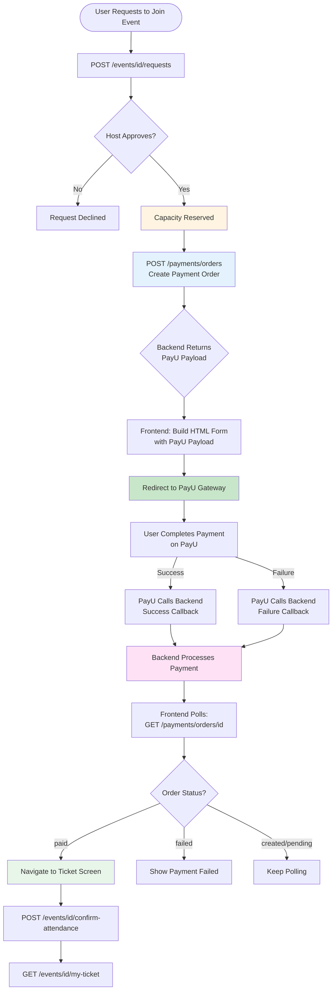
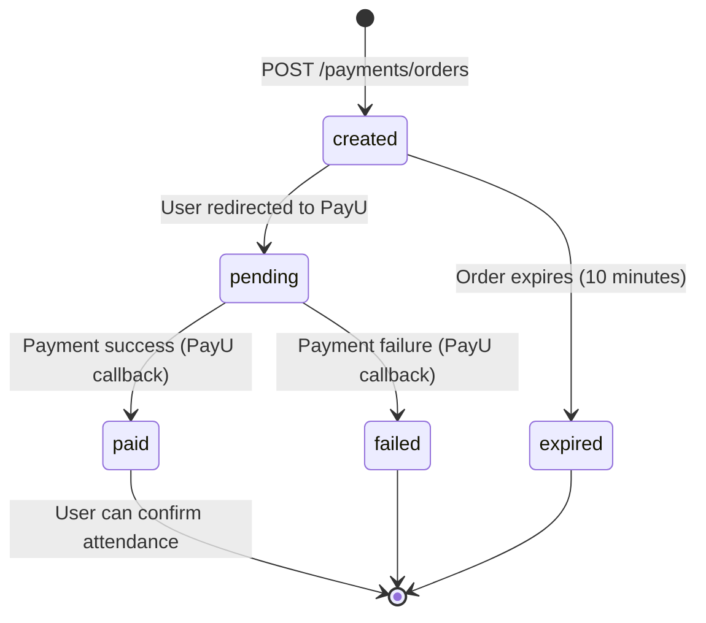

# PayU Payment Integration Guide - Frontend Developer Guide

**For Android Developers Using Flutter (Dart)**

This guide explains how to integrate PayU payment processing into your Flutter mobile app. Follow this guide exactly. Do not invent fields or add business logic on the frontend.

---

## Important Rules

1. **Backend is source of truth** - Use only fields returned by the API
2. **Do not invent request/response fields** - Use exactly what Swagger shows
3. **Do not add business logic on frontend** - Backend handles all calculations
4. **Use Swagger UI as reference** - https://loopinbackend-g17e.onrender.com/api/docs
5. **Flutter models must match Swagger responses** - Field names and types must be exact
6. **Payment is backend-only** - Never generate hashes or store payment secrets on frontend
7. **Explain APIs from frontend usage only** - Do not explain backend implementation

---

## Overview

### Payment Flow for Paid Events

The payment flow for paid events works as follows:

1. **User requests to join event** → `POST /events/{event_id}/requests`
2. **Host approves request** → Creates capacity reservation (seats are held)
3. **User initiates payment** → `POST /payments/orders` (creates payment order)
4. **Backend returns PayU redirect payload** → Frontend receives payment data
5. **Frontend redirects to PayU** → User completes payment on PayU gateway
6. **PayU redirects back** → Callbacks handled by backend (not frontend)
7. **Frontend polls/checks order status** → `GET /payments/orders/{order_id}`
8. **Payment success** → User can confirm attendance and view ticket

### Key Concepts

- **Payment Order**: Created before payment, tracks payment status
- **Capacity Reservation**: Holds seats temporarily while user completes payment
- **PayU Redirect**: Frontend redirects user to PayU payment page
- **Callbacks**: PayU sends success/failure callbacks to backend (not frontend)
- **Order Status**: Frontend must check order status after redirect

---

## Section 1: Payment Flow Charts

### Complete Payment Flow (Paid Events)



### Payment Order Status Flow



---

## Section 2: API Endpoints

### 2.1 Create Payment Order

**Endpoint:** `POST /payments/orders`

**When to Call:**
- After host approves user's request to join a paid event
- When user taps "Pay Now" or "Complete Payment" button
- Only for paid events (`event.is_paid == true`)
- Must have valid capacity reservation (from approved request)

**Screen:** Event Details Screen (after request accepted) or Payment Screen

**Request:**
```http
POST /api/payments/orders
Authorization: Bearer {token}
Content-Type: application/json

{
  "event_id": 123,
  "amount": 549.00,
  "reservation_key": "550e8400-e29b-41d4-a716-446655440000"
}
```

**Request Fields:**
- `event_id` (integer, required): Event ID for which payment is being made
- `amount` (decimal, required): Total payment amount (includes base price + platform fee)
- `reservation_key` (string, optional): Capacity reservation key from approved request

**How to Get Amount:**
- **Do not calculate on frontend** - Backend calculates exact amount
- Get amount from event details: `event.ticket_price` (this is base price)
- Backend adds platform fee automatically
- Frontend should send the amount shown in the UI (which should match backend calculation)
- If mismatch, backend returns error with correct amount

**How to Get Reservation Key:**
- When host approves request, response includes `reservation_key` (if event is paid)
- Store this key temporarily until payment completes
- Send this key when creating payment order

**Success Response (HTTP 201):**
```json
{
  "success": true,
  "message": "Payment order created successfully",
  "data": {
    "order": {
      "id": 456,
      "order_id": "ORD_20241201120000_123_a1b2c3d4",
      "event_id": 123,
      "amount": "549.00",
      "currency": "INR",
      "status": "created",
      "expires_at": "2024-12-01T12:10:00Z"
    },
    "payu_redirect": {
      "payu_url": "https://secure.payu.in/_payment",
      "payload": {
        "key": "merchant_key",
        "txnid": "ORD_20241201120000_123_a1b2c3d4",
        "amount": "549.00",
        "productinfo": "Event Ticket: Music Festival",
        "firstname": "John",
        "email": "john@example.com",
        "phone": "+1234567890",
        "surl": "https://api.example.com/payments/payu/success",
        "furl": "https://api.example.com/payments/payu/failure",
        "hash": "a1b2c3d4e5f6..."
      }
    }
  }
}
```

**Response Fields Explained:**
- `data.order.id`: Internal payment order ID
- `data.order.order_id`: Unique order identifier (used as transaction ID)
- `data.order.amount`: Payment amount as string
- `data.order.status`: Order status ("created")
- `data.order.expires_at`: Order expiry time (10 minutes from creation)
- `data.payu_redirect.payu_url`: PayU payment gateway URL
- `data.payu_redirect.payload`: Payment data for PayU redirect

**What to Do:**
1. Store `order_id` for later status checks
2. Extract `payu_redirect.payload` from response
3. Build HTML form with PayU payload fields
4. Auto-submit form to redirect user to PayU
5. Show loading state: "Redirecting to payment gateway..."

**Error Responses:**

**Event Not Paid:**
```json
{
  "detail": "This event does not require payment"
}
```
**Action:** Show error, should not happen if UI checks `event.is_paid` first

**Invalid Reservation:**
```json
{
  "detail": "Invalid or expired capacity reservation. Please request to join the event again."
}
```
**Action:** Show error, ask user to request to join event again

**Amount Mismatch:**
```json
{
  "detail": "Payment amount must match calculated total: 549.00 INR (base: 499.00 × 1 seats + platform fee)"
}
```
**Action:** Update UI with correct amount, retry payment

**Active Order Exists:**
```json
{
  "detail": "An active payment order already exists. Order ID: ORD_..."
}
```
**Action:** Use existing order ID to check status

---

### 2.2 Get Payment Order Status

**Endpoint:** `GET /payments/orders/{order_id}`

**When to Call:**
- After redirecting user to PayU (to check payment status)
- After user returns from PayU gateway (success/failure page)
- Periodically while payment is pending (polling)
- When user navigates to payment status screen

**Screen:** Payment Status Screen or Order Details Screen

**Request:**
```http
GET /api/payments/orders/{order_id}
Authorization: Bearer {token}
```

**Path Parameter:**
- `order_id` (string, required): Payment order ID from create order response

**Success Response (HTTP 200):**
```json
{
  "success": true,
  "message": "Payment order retrieved successfully",
  "data": {
    "id": 456,
    "order_id": "ORD_20241201120000_123_a1b2c3d4",
    "event_id": 123,
    "event_title": "Music Festival",
    "amount": "549.00",
    "currency": "INR",
    "status": "paid",
    "payment_provider": "payu",
    "provider_payment_id": "4028901234567890",
    "transaction_id": "TXN123456789",
    "failure_reason": null,
    "expires_at": "2024-12-01T12:10:00Z",
    "created_at": "2024-12-01T12:00:00Z",
    "updated_at": "2024-12-01T12:05:30Z"
  }
}
```

**Response Fields Explained:**
- `status` (string): Payment order status
  - `"created"`: Order created, payment not initiated
  - `"pending"`: Payment initiated, waiting for completion
  - `"paid"`: Payment successful ✅
  - `"failed"`: Payment failed ❌
  - `"expired"`: Order expired (10 minutes)
  - `"refunded"`: Payment refunded
- `provider_payment_id`: PayU payment ID (only if paid)
- `transaction_id`: Bank transaction ID (only if paid)
- `failure_reason`: Error message (only if failed)

**What to Do Based on Status:**

**Status: "paid" ✅**
1. Show success message: "Payment successful!"
2. Navigate to ticket screen or confirm attendance screen
3. Allow user to confirm attendance and view ticket
4. Stop polling

**Status: "failed" ❌**
1. Show error message: "Payment failed. Please try again."
2. Display `failure_reason` if available
3. Show "Retry Payment" button
4. Stop polling

**Status: "created" or "pending"**
1. Show "Payment in progress..." message
2. Continue polling (every 3-5 seconds)
3. Show loading indicator
4. Allow user to cancel and retry

**Status: "expired"**
1. Show error: "Payment session expired. Please try again."
2. Show "Create New Payment" button
3. Stop polling

**Polling Strategy:**
- Poll every 3-5 seconds after redirect
- Maximum 60 seconds of polling (12-20 attempts)
- Stop polling when status is "paid" or "failed"
- If timeout, show "Payment taking longer than expected" and allow manual refresh

**Error Responses:**

**Order Not Found:**
```json
{
  "detail": "Payment order ORD_... not found"
}
```
**Action:** Show error, ask user to create new payment order

**Permission Denied:**
```json
{
  "detail": "You don't have permission to access this payment order"
}
```
**Action:** Show error, user cannot access another user's order

---

## Section 3: PayU Redirect Implementation

### 3.1 Building the PayU Form

**Important:** Frontend must build an HTML form and auto-submit it to redirect to PayU.

**Flutter/Dart Implementation:**

```dart
// Example Flutter code (pseudo-code, adapt to your HTTP library)
import 'package:http/http.dart' as http;
import 'package:url_launcher/url_launcher.dart';

void redirectToPayU(Map<String, dynamic> payuPayload) async {
  // Build HTML form
  String htmlForm = '''
    <html>
      <head>
        <title>Redirecting to PayU...</title>
      </head>
      <body>
        <form id="payuForm" action="${payuPayload['payu_url']}" method="POST">
          ${payuPayload['payload'].entries.map((entry) => 
            '<input type="hidden" name="${entry.key}" value="${entry.value}">'
          ).join('\n')}
        </form>
        <script>
          document.getElementById('payuForm').submit();
        </script>
      </body>
    </html>
  ''';
  
  // For Flutter WebView
  // Use WebView widget to load HTML and auto-submit form
  
  // For Flutter App (recommended)
  // Use url_launcher or webview_flutter package
  // Build URL with query parameters and launch
}
```

**Alternative: Build URL with Query Parameters**

Some payment gateways allow GET redirects with query parameters. Check PayU documentation. If supported:

```dart
void redirectToPayU(Map<String, dynamic> payload) async {
  String baseUrl = payload['payu_url'];
  Map<String, String> params = Map<String, String>.from(payload['payload']);
  
  // Build query string
  String queryString = params.entries
    .map((e) => '${Uri.encodeComponent(e.key)}=${Uri.encodeComponent(e.value)}')
    .join('&');
  
  String url = '$baseUrl?$queryString';
  
  // Launch URL
  if (await canLaunch(url)) {
    await launch(url, forceWebView: false);
  }
}
```

**Important Notes:**
- **Never modify payload fields** - Send exactly as received from backend
- **Never generate hash** - Hash is generated by backend only
- **Use HTTPS** - PayU URL is always HTTPS
- **Handle redirect failure** - If redirect fails, show error and allow retry

---

### 3.2 Handling PayU Redirects

**After User Completes Payment on PayU:**

1. **PayU redirects to success/failure URL** → This goes to backend, not frontend
2. **Backend processes payment** → Updates order status
3. **Frontend must check order status** → Poll `GET /payments/orders/{order_id}`

**Important:** Frontend does NOT receive success/failure callbacks directly. Backend handles callbacks.

**User Returns to App:**

When user returns from PayU (after payment):
- App should automatically check payment order status
- Use stored `order_id` to call `GET /payments/orders/{order_id}`
- Show appropriate message based on status

**Flutter Implementation:**

```dart
// When app resumes or user returns from payment
Future<void> checkPaymentStatus(String orderId) async {
  try {
    final response = await http.get(
      Uri.parse('$baseUrl/api/payments/orders/$orderId'),
      headers: {'Authorization': 'Bearer $token'},
    );
    
    if (response.statusCode == 200) {
      final data = json.decode(response.body);
      final status = data['data']['status'];
      
      if (status == 'paid') {
        // Navigate to success screen
        Navigator.pushNamed(context, '/payment-success');
      } else if (status == 'failed') {
        // Navigate to failure screen
        Navigator.pushNamed(context, '/payment-failed');
      } else {
        // Keep polling
        Future.delayed(Duration(seconds: 3), () => checkPaymentStatus(orderId));
      }
    }
  } catch (e) {
    // Handle error
  }
}
```

---

## Section 4: Complete Payment Flow Example

### Step-by-Step Implementation

**Step 1: User Requests to Join Paid Event**

```dart
// POST /events/{event_id}/requests
final response = await http.post(
  Uri.parse('$baseUrl/api/events/$eventId/requests'),
  headers: {'Authorization': 'Bearer $token'},
  body: json.encode({'seats_requested': 1}),
);

// Store reservation_key if provided (for paid events)
final data = json.decode(response.body);
final reservationKey = data['data']['reservation_key']; // May be null for free events
```

**Step 2: Host Approves Request**

```dart
// Host approves (done by host, not attendee)
// Attendee receives notification
// Attendee's request status changes to 'accepted'
// reservation_key is now available if event is paid
```

**Step 3: Create Payment Order**

```dart
// POST /payments/orders
final orderResponse = await http.post(
  Uri.parse('$baseUrl/api/payments/orders'),
  headers: {
    'Authorization': 'Bearer $token',
    'Content-Type': 'application/json',
  },
  body: json.encode({
    'event_id': eventId,
    'amount': 549.00, // Get from event.ticket_price + platform fee (displayed in UI)
    'reservation_key': reservationKey, // From step 1
  }),
);

final orderData = json.decode(orderResponse.body);
final orderId = orderData['data']['order']['order_id'];
final payuPayload = orderData['data']['payu_redirect']['payload'];
final payuUrl = orderData['data']['payu_redirect']['payu_url'];

// Store orderId for status checks
await storage.write(key: 'current_order_id', value: orderId);
```

**Step 4: Redirect to PayU**

```dart
// Build and submit PayU form
await redirectToPayU({
  'payu_url': payuUrl,
  'payload': payuPayload,
});

// Show loading: "Redirecting to payment gateway..."
```

**Step 5: Check Payment Status (Polling)**

```dart
// After redirect or when app resumes
Future<void> pollPaymentStatus(String orderId) async {
  int attempts = 0;
  const maxAttempts = 20; // 20 attempts × 3 seconds = 60 seconds
  
  while (attempts < maxAttempts) {
    await Future.delayed(Duration(seconds: 3));
    
    final response = await http.get(
      Uri.parse('$baseUrl/api/payments/orders/$orderId'),
      headers: {'Authorization': 'Bearer $token'},
    );
    
    if (response.statusCode == 200) {
      final data = json.decode(response.body);
      final status = data['data']['status'];
      
      if (status == 'paid') {
        // Success! Stop polling
        Navigator.pushReplacementNamed(context, '/payment-success');
        return;
      } else if (status == 'failed') {
        // Failed! Stop polling
        Navigator.pushReplacementNamed(context, '/payment-failed');
        return;
      }
      // Continue polling for 'created' or 'pending'
    }
    
    attempts++;
  }
  
  // Timeout
  showDialog(
    context: context,
    builder: (context) => AlertDialog(
      title: Text('Payment Status'),
      content: Text('Payment is taking longer than expected. Please check manually.'),
      actions: [
        TextButton(
          onPressed: () => checkPaymentStatusManually(orderId),
          child: Text('Check Status'),
        ),
      ],
    ),
  );
}
```

**Step 6: Confirm Attendance (After Payment Success)**

```dart
// POST /events/{event_id}/confirm-attendance
final confirmResponse = await http.post(
  Uri.parse('$baseUrl/api/events/$eventId/confirm-attendance'),
  headers: {'Authorization': 'Bearer $token'},
  body: json.encode({'seats': 1}),
);

// Navigate to ticket screen
Navigator.pushNamed(context, '/ticket');
```

---

## Section 5: Error Handling

### Common Errors and Solutions

**Error 1: "Invalid or expired capacity reservation"**

**Cause:** Reservation expired or invalid

**Solution:**
1. Show error message
2. Ask user to request to join event again
3. Navigate back to event details screen

**Error 2: "Payment amount must match calculated total"**

**Cause:** Frontend sent wrong amount

**Solution:**
1. Extract correct amount from error message
2. Update UI with correct amount
3. Retry payment with correct amount

**Error 3: "An active payment order already exists"**

**Cause:** Previous payment order still active

**Solution:**
1. Extract existing order ID from error
2. Check status of existing order
3. If expired/failed, create new order
4. If pending, continue with existing order

**Error 4: Payment Status Stuck on "pending"**

**Cause:** PayU callback delayed or failed

**Solution:**
1. Continue polling (backend processes callbacks)
2. After 60 seconds, show manual refresh option
3. User can check status manually
4. Backend webhook will eventually process payment

**Error 5: Network Error During Redirect**

**Cause:** Internet connection lost

**Solution:**
1. Show error: "Failed to redirect to payment gateway"
2. Allow user to retry
3. Check internet connection

---

## Section 6: UI/UX Recommendations

### Payment Screen

**Before Payment:**
- Show event details (name, date, location)
- Show payment breakdown:
  - Base ticket price: ₹499.00
  - Platform fee: ₹50.00
  - **Total: ₹549.00**
- Show "Pay Now" button
- Show payment method (PayU)

**During Payment:**
- Show "Redirecting to payment gateway..." loading state
- Disable "Pay Now" button
- Show countdown: "Redirecting in 3... 2... 1..."

**After Redirect:**
- User completes payment on PayU
- User returns to app
- Show "Checking payment status..." loading state
- Poll order status in background

**Payment Success:**
- Show success message: "Payment successful! ✅"
- Show transaction ID
- Show "View Ticket" button
- Navigate to ticket screen

**Payment Failure:**
- Show error message: "Payment failed ❌"
- Show failure reason if available
- Show "Retry Payment" button
- Allow user to go back

### Status Indicators

**Order Status Badges:**
- `created`: Yellow badge "Payment Initiated"
- `pending`: Blue badge "Processing Payment..."
- `paid`: Green badge "Payment Successful ✅"
- `failed`: Red badge "Payment Failed ❌"
- `expired`: Gray badge "Expired"

---

## Section 7: Common Mistakes

### Mistake 1: Generating Hash on Frontend

**Wrong:**
```dart
// NEVER DO THIS
String hash = generatePayUHash(payload);
```

**Why Wrong:**
- Security risk - hash generation uses secret salt
- Backend generates hash, frontend should never generate it

**Correct:**
- Use hash from backend response
- Send payload exactly as received

### Mistake 2: Modifying PayU Payload

**Wrong:**
```dart
// NEVER DO THIS
payload['amount'] = '500.00'; // Changed amount
payload['hash'] = 'new_hash'; // Changed hash
```

**Why Wrong:**
- Hash verification will fail
- Payment will be rejected by PayU

**Correct:**
- Use payload exactly as received from backend
- Do not modify any fields

### Mistake 3: Not Handling Order Expiry

**Wrong:**
- Polling indefinitely
- Not checking expires_at

**Why Wrong:**
- Orders expire after 10 minutes
- Wasted API calls

**Correct:**
- Check `expires_at` timestamp
- Stop polling if expired
- Show "Session expired" message
- Allow user to create new order

### Mistake 4: Assuming Payment Success Immediately

**Wrong:**
```dart
// User returns from PayU → Assume payment success
Navigator.pushNamed(context, '/success');
```

**Why Wrong:**
- Payment processing takes time
- Status may still be "pending"
- Backend needs to process callback

**Correct:**
- Always check order status after redirect
- Poll status until confirmed
- Only navigate to success when status is "paid"

### Mistake 5: Not Storing Order ID

**Wrong:**
- Not storing order_id after creation
- Cannot check status later

**Why Wrong:**
- User closes app during payment
- Cannot check status when app reopens

**Correct:**
- Store order_id in local storage
- Check status on app resume
- Allow manual status check

---

## Section 8: Testing

### Test Scenarios

**Scenario 1: Successful Payment**
1. Create payment order
2. Redirect to PayU
3. Complete payment on PayU (use test card)
4. Return to app
5. Verify status changes to "paid"
6. Verify user can confirm attendance
7. Verify ticket is generated

**Scenario 2: Failed Payment**
1. Create payment order
2. Redirect to PayU
3. Cancel payment on PayU
4. Return to app
5. Verify status changes to "failed"
6. Verify error message shown
7. Verify user can retry payment

**Scenario 3: Payment Timeout**
1. Create payment order
2. Redirect to PayU
3. Wait 10+ minutes without completing payment
4. Return to app
5. Verify status is "expired"
6. Verify user can create new order

**Scenario 4: Network Interruption**
1. Start payment flow
2. Disconnect internet
3. Verify error handling
4. Reconnect internet
5. Verify payment can be retried

---

## Section 9: API Reference Summary

### Endpoints Used

| Endpoint | Method | Purpose | Auth Required |
|----------|--------|---------|---------------|
| `/payments/orders` | POST | Create payment order | Yes |
| `/payments/orders/{order_id}` | GET | Get order status | Yes |

### Response Status Values

| Status | Meaning | Action |
|--------|---------|--------|
| `created` | Order created, payment not started | Redirect to PayU |
| `pending` | Payment in progress | Poll status |
| `paid` | Payment successful ✅ | Navigate to ticket |
| `failed` | Payment failed ❌ | Show error, allow retry |
| `expired` | Order expired | Create new order |

---

## Final Reminders

1. **Backend handles all payment logic** - Frontend only redirects and checks status
2. **Never generate hashes** - Backend generates all security hashes
3. **Always check order status** - Don't assume payment success
4. **Handle all error cases** - Network, timeout, failure, expiry
5. **Store order_id** - For status checks and recovery
6. **Use exact payload from backend** - Don't modify any fields
7. **Poll status intelligently** - Stop after timeout or final status
8. **Show clear status messages** - Keep user informed
9. **Test all scenarios** - Success, failure, timeout, network errors
10. **Check Swagger for latest API** - API may change, always verify

---

**End of PayU Integration Guide**

